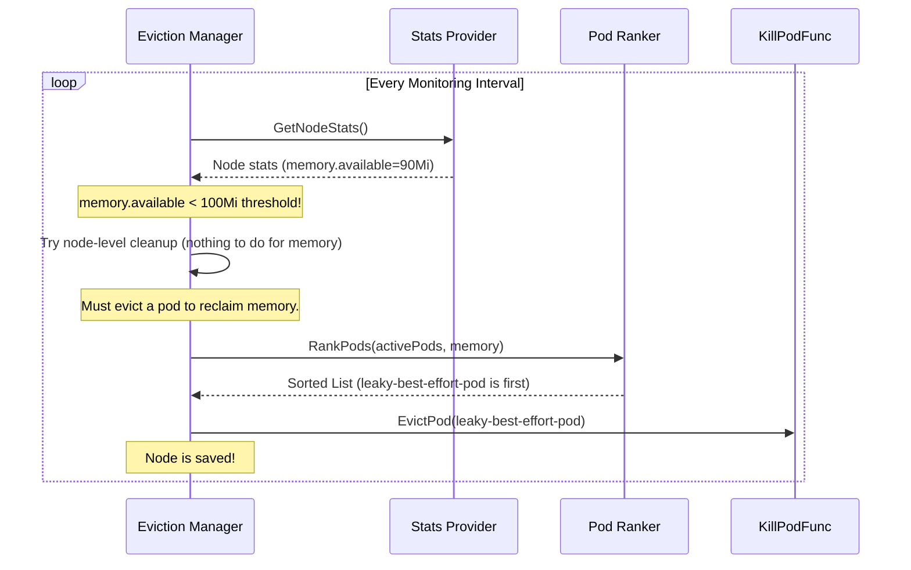

# Chapter 8: Eviction Manager

In the [previous chapter](07_container_manager__cm__.md), we learned how the [Container Manager (cm)](07_container_manager__cm__.md) acts as a strict landlord, using cgroups to enforce resource limits for each pod. This is great for keeping pods in line.

But what happens if, despite these limits, the node itself starts running out of a critical resource like memory or disk space? This could be due to many "well-behaved" pods adding up, or a process outside of Kubernetes' control consuming resources. If left unchecked, the node could become unstable, the Kubelet could crash, and all pods on it would die.

How does the Kubelet protect the node from this catastrophic failure? This is the crucial job of the **Eviction Manager**, the Kubelet's last line of defense.

### What's the Big Idea?

Imagine you are the captain of a cargo ship (the Node) sailing across a rough sea. Suddenly, you notice the ship is taking on water and starting to list dangerously—it's running out of buoyancy (a resource)!

You can't just let the ship sink. As the captain, you must take proactive measures to save it. You have a clear, pre-defined plan:
1.  **Monitor the Water Level:** You constantly watch the gauges that show how low the ship is sitting in the water. These are your **signals**.
2.  **Know the Danger Point:** You have a line painted on the hull—the Plimsoll line. If the water reaches this line, you must act. This is your **threshold**.
3.  **Jettison Cargo:** To regain buoyancy, you start throwing cargo (Pods) overboard. But you don't do it randomly. You throw the least valuable cargo first (like `BestEffort` pods) and save the most critical cargo (like `Guaranteed` pods) for last.

The **Eviction Manager** is this captain. It constantly monitors node resources (signals) like `memory.available` and `nodefs.available`. When a resource level drops below a configured `eviction-hard` threshold, it triggers an "eviction," a process of safely terminating pods to reclaim the scarce resource and prevent the node from failing.

### The Core Loop: Observe, Decide, Act

The Eviction Manager runs a continuous control loop called `synchronize` that performs these steps:

1.  **Observe:** It gathers the latest resource usage statistics for the entire node. How much memory is free? How much disk space is left?
2.  **Decide:** It compares these observed values against the eviction thresholds defined in the Kubelet's configuration. For example, a common threshold is `memory.available < 100Mi`. If any threshold is crossed, it's time to act.
3.  **Act:** If a threshold is met, the manager takes action:
    *   **Node-Level Cleanup:** First, it tries to free up resources without killing pods. For disk pressure, it can ask helpers to perform garbage collection on unused containers and images.
    *   **Pod Eviction:** If cleanup isn't enough, it must evict a pod. It gets a list of all active pods and ranks them for eviction. This ranking is the most critical part of the decision.

### Ranking Pods for Eviction: The Pecking Order

The Eviction Manager's ranking logic is designed to have the least impact on important workloads. The primary factors for sorting pods are:

1.  **Quality of Service (QoS) Class:** This is the most important factor.
    *   `BestEffort` pods are always considered first.
    *   `Burstable` pods are next.
    *   `Guaranteed` pods are last. Critical system pods are almost never evicted.
2.  **Resource Usage vs. Requests:** Within the `Burstable` and `Guaranteed` classes, pods that are using *more* of the scarce resource than they requested are prioritized for eviction. A pod using memory far above its request is a bigger problem than one staying within its requested amount.
3.  **Priority:** A pod's `priorityClassName` is also considered. Higher priority pods are less likely to be evicted.

For memory pressure, the final ranking looks like this:
1.  `BestEffort` pods.
2.  `Burstable` pods using more memory than requested, sorted by priority and then by how much memory they are using.
3.  `Guaranteed` pods, sorted by priority and then by memory usage.

This ensures that the pods causing the most pressure and having the lowest defined importance are terminated first.

### A Walkthrough: Saving a Node from Memory Pressure

Let's see the Eviction Manager in action. A `BestEffort` pod has a memory leak, causing available memory on the node to drop.

1.  **Monitoring**: The Eviction Manager's `synchronize` loop runs. It gets the latest node stats and sees that `memory.available` is now only 90Mi.
2.  **Threshold Met**: This value is less than the configured `memory.available < 100Mi` hard eviction threshold. The manager now has a "resource to reclaim": `memory`.
3.  **Attempt Cleanup**: The manager sees that for memory, there are no node-level cleanup tasks it can perform. It must evict a pod.
4.  **Rank the Pods**: It gets the list of all running pods and calls the `rankMemoryPressure` function. The leaky `BestEffort` pod is ranked at the top of the list, marked for eviction.
5.  **Evict the Pod**: The manager calls the `killPodFunc` with the leaky pod's details. The pod is terminated immediately (with a very short grace period for hard evictions).
6.  **Pressure Relieved**: The memory used by the leaky pod is freed. On its next run, the `synchronize` loop sees that available memory is now well above the threshold, and the node is stable again.

This flow is visualized below:



### A Peek at the Code

Let's look at the key data structures and functions that make this happen.

#### The `Threshold` API

In `eviction/api/types.go`, you can see how a single eviction rule is defined. It's a combination of the signal, a comparison operator, and the value to check against.

```go
// eviction/api/types.go

// Threshold defines a metric for when eviction should occur.
type Threshold struct {
	// Signal defines the entity that was measured.
	Signal Signal
	// Operator represents a relationship of a signal to a value.
	Operator ThresholdOperator
	// Value is the threshold the resource is evaluated against.
	Value ThresholdValue
	// GracePeriod represents the amount of time that a threshold must be met.
	GracePeriod time.Duration
}
```
A "hard eviction" threshold is simply one with a `GracePeriod` of `0`.

#### The `synchronize` Control Loop

The core logic lives in `eviction/eviction_manager.go`. The `synchronize` function is a high-level orchestration of the steps we described.

```go
// eviction/eviction_manager.go

// synchronize is the main control loop that enforces eviction thresholds.
func (m *managerImpl) synchronize(diskInfoProvider DiskInfoProvider, podFunc ActivePodsFunc) ([]*v1.Pod, error) {
	// 1. Get the latest stats for the node.
	summary, err := m.summaryProvider.Get(ctx, true)
	// ...
	
	// 2. Make observations from the stats.
	observations, statsFunc := makeSignalObservations(summary)

	// 3. Determine which thresholds have been met.
	thresholds := thresholdsMet(m.config.Thresholds, observations, false)
	// ... logic to handle grace periods ...

	if len(thresholds) == 0 {
		return nil, nil // No pressure, we're done.
	}

	// 4. Try to reclaim node-level resources first (like garbage collecting images).
	if m.reclaimNodeLevelResources(ctx, ...) {
		return nil, nil // Cleanup worked, no need to evict.
	}

	// 5. If we're still under pressure, rank pods and evict one.
	rank(activePods, statsFunc)
	// ... find the first pod in the ranked list and kill it ...
}
```
This function clearly shows the **Observe -> Decide -> Act** pattern.

#### Ranking Pods by Memory Pressure

The logic for how to sort pods is defined in `eviction/helpers.go`. The `rankMemoryPressure` function is a great example. It uses a `multiSorter` to apply several ranking criteria in order.

```go
// eviction/helpers.go

// rankMemoryPressure orders pods for eviction in response to memory pressure.
func rankMemoryPressure(pods []*v1.Pod, stats statsFunc) {
	orderedBy(
		// 1. Prioritize pods that exceed their memory requests.
		exceedMemoryRequests(stats),
		// 2. Then, sort by pod priority (lower priority first).
		priority,
		// 3. Finally, sort by the amount of memory used *above* the request.
		memory(stats),
	).Sort(pods)
}
```
This elegant composition of sorting functions perfectly implements the eviction policy: `BestEffort` pods have no requests, so they fail the first check. `Burstable` pods are then sorted by priority and how much they are "over-budget" on memory.

### Conclusion

The **Eviction Manager** is the Kubelet's critical safety mechanism that ensures node stability. By constantly monitoring resource availability and proactively terminating less-important pods when a resource becomes scarce, it prevents the node from crashing. It uses a sophisticated ranking system based on QoS, resource usage, and priority to make sure that evictions have the minimum possible impact on the most critical workloads. This self-preservation instinct is fundamental to Kubernetes' reputation for resilience and reliability.

This chapter concludes our tour through the major components of the Kubelet. From the [Pod Manager](01_pod_manager_.md) deciding what to run, to the [Pod Workers](02_pod_workers_.md) and [Container Runtime Manager](03_container_runtime_manager_.md) making it happen, to the managers for [Volumes](04_volume_manager_.md), [Health Probes](05_prober_manager_.md), [Status](06_status_manager_.md), and [Resources](07_container_manager__cm__.md)—we've seen how these specialized modules work together to make a Kubernetes node a powerful and robust part of a cluster. Congratulations on completing the journey

---

Generated by [AI Codebase Knowledge Builder](https://github.com/The-Pocket/Tutorial-Codebase-Knowledge)