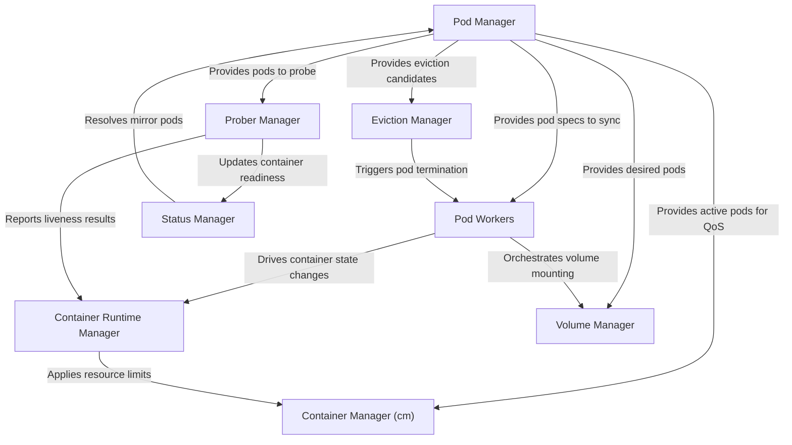

# Tutorial: kubelet

The Kubelet is the *main agent* running on each node in a Kubernetes cluster. Its primary responsibility is to make sure that *containers are running in a Pod* as expected. It acts as the local "manager" on the node, taking instructions from the central Kubernetes control plane. The Kubelet handles everything from **starting and stopping containers** using a container runtime (like containerd), **attaching storage volumes**, managing **CPU and memory resources**, and regularly **checking if containers are healthy**. It also reports the status of the pods and the node itself back to the main Kubernetes API server, so the cluster always knows what's happening on each machine.

**Source Repository:** [None](None)

## Chapters

1. [Pod Manager
](01_pod_manager_.md)
2. [Pod Workers
](02_pod_workers_.md)
3. [Container Runtime Manager
](03_container_runtime_manager_.md)
4. [Volume Manager
](04_volume_manager_.md)
5. [Prober Manager
](05_prober_manager_.md)
6. [Status Manager
](06_status_manager_.md)
7. [Container Manager (cm)
](07_container_manager__cm__.md)
8. [Eviction Manager
](08_eviction_manager_.md)

---

Generated by [AI Codebase Knowledge Builder](https://github.com/The-Pocket/Tutorial-Codebase-Knowledge)