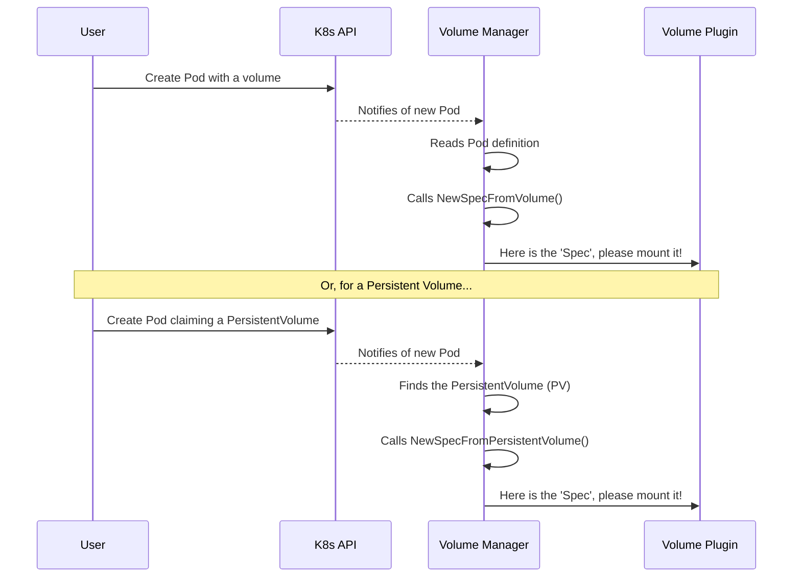

# Chapter 1: Volume Spec

Welcome to the Kubernetes volume subsystem! If you've ever wondered how Kubernetes connects your applications to storage—whether it's a simple temporary directory or a robust cloud disk—you're in the right place. In this first chapter, we'll explore a fundamental building block that makes this all possible: the **Volume Spec**.

### The Challenge: So Many Ways to Define a Volume

Imagine you're building an application. Sometimes, you need a temporary scratch space that lives and dies with your app. In Kubernetes, you might define this directly inside your Pod's configuration file.

Other times, you need durable storage that outlives your application, like a database. For this, an administrator might pre-create a `PersistentVolume` object, which you then claim for your app.

Here's the problem: Kubernetes now has two different ways a volume has been described.
1. As part of a `Pod`.
2. As a separate `PersistentVolume` object.

How can the underlying code, which has the job of actually attaching the storage, handle both of these without getting confused? It needs a single, consistent way to understand what volume is being requested.

### The Solution: A Universal Shipping Label

This is where the **`Spec`** comes in. The `Spec` is a standardized, internal data structure that represents a volume. Think of it like a universal shipping label.

No matter what kind of box you're shipping (a TV, a book, a laptop) or which store it came from (Amazon, Best Buy), the shipping company puts its own standard label on it. This label has all the essential information in a predictable format: address, weight, tracking number. This allows any worker in any warehouse to process the package correctly.

The `Volume Spec` is that universal label for Kubernetes volumes. It translates different API objects (like a `Pod`'s volume or a `PersistentVolume`) into a single, consistent format that all the storage-handling code (called volume plugins) can understand.

### What Does a Volume `Spec` Look Like?

Let's peek at the code to see this "universal label" in its simplest form. The `Spec` is a Go struct that holds a reference to the original Kubernetes API object.

---
**File:** `pkg/volume/plugins.go`
```go
// Spec is an internal representation of a volume.  All API
// volume types translate to Spec.
type Spec struct {
	Volume           *v1.Volume
	PersistentVolume *v1.PersistentVolume
	ReadOnly         bool
	// ... other fields for migration
}
```
---

This is beautifully simple! A `Spec` object will have one of two main fields filled in:

*   `Volume`: This will point to a `v1.Volume` if the volume was defined directly inside a Pod.
*   `PersistentVolume`: This will point to a `v1.PersistentVolume` if the volume is a standalone persistent volume.

This structure acts as a wrapper, giving us a single object (`Spec`) to pass around, no matter the source.

### Creating a `Spec`: The Translation Process

So how does Kubernetes create a `Spec`? It uses simple helper functions that act as translators.

If the volume comes from a `Pod`, this function is used:
---
**File:** `pkg/volume/plugins.go`
```go
// NewSpecFromVolume creates an Spec from an v1.Volume
func NewSpecFromVolume(vs *v1.Volume) *Spec {
	return &Spec{
		Volume: vs,
	}
}
```
---
**Input:** A `v1.Volume` object from a Pod definition.
**Output:** A new `Spec` object with the `Volume` field populated.

If the volume is a `PersistentVolume`, this function is used instead:
---
**File:** `pkg/volume/plugins.go`
```go
// NewSpecFromPersistentVolume creates an Spec from an v1.PersistentVolume
func NewSpecFromPersistentVolume(pv *v1.PersistentVolume, readOnly bool) *Spec {
	return &Spec{
		PersistentVolume: pv,
		ReadOnly:         readOnly,
	}
}
```
---
**Input:** A `v1.PersistentVolume` object and a read-only flag.
**Output:** A new `Spec` object with the `PersistentVolume` field populated.

### The Big Picture: How it All Fits Together

Let's visualize the entire flow. The goal is to take a user's request and deliver a standardized `Spec` to the code that does the real work.



As you can see, regardless of whether the user defined a volume directly in the Pod or used a `PersistentVolume`, the end result is the same: the **Volume Manager** creates a `Spec` and hands it to a **Volume Plugin**.

This is incredibly powerful. It means the developer of a storage plugin doesn't need to worry about where the volume definition came from. They just write code that understands the `Spec`. This decoupling makes the entire system cleaner, more modular, and easier to extend.

### Conclusion

You've just learned about the `Spec`, the most fundamental concept in the volume subsystem. It's the "universal shipping label" that standardizes how Kubernetes represents a volume internally.

To recap:
*   Kubernetes can define volumes in multiple ways (e.g., in a `Pod` or as a `PersistentVolume`).
*   The `Spec` acts as a common, internal format to represent any of these volumes.
*   This simplifies the system by allowing all other components to work with a single, predictable data structure.

Now that we understand what a `Spec` is, we can move on to the components that actually *use* it. In the next chapter, we'll explore the main interface that all storage drivers must implement.

Next up: [Chapter 2: VolumePlugin Interface](02_volumeplugin_interface_.md)

---

Generated by [AI Codebase Knowledge Builder](https://github.com/The-Pocket/Tutorial-Codebase-Knowledge)