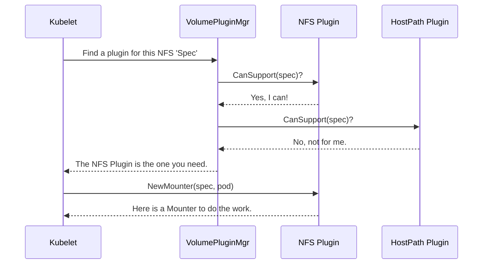

# Chapter 2: VolumePlugin Interface

In the [previous chapter](01_volume_spec_.md), we learned how Kubernetes uses a `Spec` as a universal "shipping label" for any volume request. This is great for creating a standard way to *describe* a volume.

But who actually *reads* that label and does the real work of connecting the storage to your container? That's where the `VolumePlugin` interface comes in.

### The Challenge: A World of Different Storage Systems

Kubernetes is incredibly flexible. It can work with all kinds of storage:
- Simple network file shares like **NFS**.
- Cloud provider disks like **AWS Elastic Block Store (EBS)** or **Google Persistent Disk**.
- Modern storage systems that use the **Container Storage Interface (CSI)**.
- Even a simple directory on the host machine (**HostPath**).

How can Kubernetes manage all these different technologies without turning into a tangled mess of custom code for each one? It needs a standard set of rules that every storage driver must follow.

### The Solution: The Universal Power Outlet

The `VolumePlugin` interface is the master blueprint for all storage types. Think of it like a **standard electrical outlet**.

Any appliance—a toaster, a lamp, a laptop charger—can plug into the same wall outlet. You don't need a special "toaster outlet" or "lamp outlet." This is possible because all appliance manufacturers agree to build their products with a standard plug.

The `VolumePlugin` interface is that standard for storage. It defines a contract, a set of methods that any storage driver (like for NFS or AWS) must implement. By fulfilling this contract, any storage system can "plug into" Kubernetes and be used by your pods.

This makes the system highly extensible. If a new storage technology comes along, its creators just need to build a new plugin that follows the `VolumePlugin` rules, and it will work with Kubernetes without any changes to Kubernetes' core code.

### The Core Contract: What Every Plugin Must Do

Let's look at the most essential parts of this "blueprint." The `VolumePlugin` is a Go interface, which is just a list of functions that a type must provide.

---
**File:** `pkg/volume/plugins.go`
```go
// VolumePlugin is an interface to volume plugins...
type VolumePlugin interface {
	// Init initializes the plugin.
	Init(host VolumeHost) error

	// GetPluginName returns the plugin's name.
	GetPluginName() string

	// CanSupport tests whether the plugin supports a given volume spec.
	CanSupport(spec *Spec) bool

	// NewMounter creates a new volume.Mounter.
	NewMounter(spec *Spec, podRef *v1.Pod) (Mounter, error)

	// NewUnmounter creates a new volume.Unmounter.
	NewUnmounter(name string, podUID types.UID) (Unmounter, error)
	// ... other methods
}
```
---

Let's break down the most important "prongs" of this universal plug:

*   `Init(host VolumeHost)`: The "power-on" switch. Kubernetes calls this once when it starts up to let the plugin get ready.
*   `GetPluginName()`: Every plugin needs a unique name, like `kubernetes.io/nfs` or `kubernetes.io/aws-ebs`. This is how Kubernetes tells them apart.
*   `CanSupport(spec *Spec)`: This is the "compatibility check." When Kubernetes gets a volume request (the `Spec`), it asks each plugin, "Can you handle this?" An NFS plugin would check if the `Spec` is for an NFS volume and say "Yes," while an AWS plugin would say "No."
*   `NewMounter(...)` and `NewUnmounter(...)`: These are the most critical methods. If a plugin says it *can* support a `Spec`, Kubernetes will then ask it to create a helper object responsible for the actual work of mounting or unmounting the volume. These helpers are called **Mounters** and **Unmounters**, which we will explore in a later chapter on [Mounter and Unmounter Interfaces](06_mounter_and_unmounter_interfaces_.md).

### An Example: The NFS Plugin

To make this concrete, let's see a simplified version of how the built-in NFS plugin fulfills this contract.

---
**File:** `pkg/volume/nfs/nfs.go`
```go
// nfsPlugin implements the VolumePlugin interface.
type nfsPlugin struct {
	host volume.VolumeHost
	// ... other fields
}

// GetPluginName returns the name of this plugin.
func (plugin *nfsPlugin) GetPluginName() string {
	return "kubernetes.io/nfs" // Our unique name!
}

// CanSupport checks if this plugin can handle the spec.
func (plugin *nfsPlugin) CanSupport(spec *spec) bool {
	// Is the `spec.Volume.NFS` field filled? If so, it's for me!
	return (spec.Volume != nil && spec.Volume.NFS != nil)
}

// NewMounter creates a helper to mount the NFS share.
func (plugin *nfsPlugin) NewMounter(spec *spec, pod *v1.Pod) (volume.Mounter, error) {
	// ... logic to create and return an nfsMounter
	return &nfsMounter{ /* ... */ }, nil
}
```
---

You can see how simple the contract is. The `nfsPlugin` provides its name and a clear `CanSupport` function that just checks if the `Spec` is for an NFS volume. If it is, Kubernetes knows this is the right plugin for the job.

### How It All Fits Together

Let's visualize the process. When a pod needs a volume, a component called the [VolumePluginMgr](04_volumepluginmgr_.md) (which manages all the plugins) finds the right one.



1.  The Kubelet needs to mount a volume and has a `Spec` that describes an NFS volume.
2.  It asks the `VolumePluginMgr` to find the correct plugin.
3.  The `VolumePluginMgr` goes through its list of registered plugins. It asks the `NFS Plugin`, which returns `true`. It asks the `HostPath Plugin`, which returns `false`.
4.  The `VolumePluginMgr` tells the Kubelet that the `NFS Plugin` is the correct one.
5.  The Kubelet then calls `NewMounter` on the `NFS Plugin`, which returns a specialized helper that knows how to run the `mount` command for an NFS share.

### More Than Just the Basics: Specialized Interfaces

The `VolumePlugin` interface is the base standard, but some storage systems have more advanced features. Kubernetes handles this by creating *more specific* interfaces that build upon the basic one.

For example, a plugin for a `PersistentVolume` needs to report what access modes it supports (e.g., `ReadWriteOnce`). It uses the `PersistentVolumePlugin` interface.

---
**File:** `pkg/volume/plugins.go`
```go
// PersistentVolumePlugin extends VolumePlugin for persistent data.
type PersistentVolumePlugin interface {
	VolumePlugin // It must do everything a regular VolumePlugin does...
	// ...and it must also do this:
	GetAccessModes() []v1.PersistentVolumeAccessMode
}
```
---
This is a powerful concept called **interface embedding**. It means a `PersistentVolumePlugin` is also a `VolumePlugin`, but with extra capabilities. Other specialized interfaces include:

*   `ProvisionableVolumePlugin`: For plugins that can create new volumes on demand.
*   `AttachableVolumePlugin`: For network storage that needs to be attached to a node before it can be mounted. We'll cover this in the [Attacher and Detacher Interfaces](05_attacher_and_detacher_interfaces_.md) chapter.
*   `ExpandableVolumePlugin`: For plugins that support resizing a volume.

### Conclusion

You've just learned about the `VolumePlugin` interface, the central contract that makes Kubernetes' storage system so modular and powerful.

To recap:
*   The `VolumePlugin` interface is a **standard blueprint** that all storage drivers must implement to "plug into" Kubernetes.
*   It's like a **universal power outlet** for storage, ensuring uniformity across diverse systems.
*   Key methods like `CanSupport` and `NewMounter` allow Kubernetes to find the right plugin for a job and ask it to prepare the volume.
*   Specialized interfaces extend the base `VolumePlugin` for drivers with more advanced features.

This model of in-tree plugins (plugins compiled into Kubernetes) served Kubernetes well for years. However, the modern approach is to move drivers *out* of Kubernetes for better maintainability and flexibility. This is achieved with a special `VolumePlugin` implementation that acts as a bridge to external drivers.

Next up, we'll explore the future of Kubernetes storage: the [Chapter 3: CSI (Container Storage Interface) Plugin](03_csi__container_storage_interface__plugin_.md).

---

Generated by [AI Codebase Knowledge Builder](https://github.com/The-Pocket/Tutorial-Codebase-Knowledge)