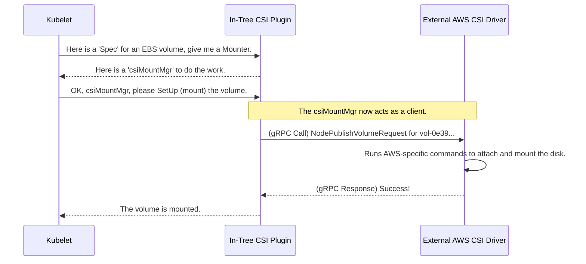

# Chapter 3: CSI (Container Storage Interface) Plugin

In the [previous chapter](02_volumeplugin_interface_.md), we learned about the `VolumePlugin` interface, which acts like a standard "power outlet" for all storage drivers built directly into Kubernetes. This system works, but it has a big limitation: What happens when a new storage technology is invented?

### The Challenge: Adding New Storage is Hard

Imagine every time you bought a new electronic device, you had to call an electrician to install a brand-new, custom power outlet in your wall. That would be slow, expensive, and a huge hassle.

This was the problem with the original "in-tree" `VolumePlugin` system. To add support for a new storage system, its code had to be added directly to Kubernetes's own source code. This meant storage vendors were tied to Kubernetes's release schedule, and the Kubernetes codebase grew larger and more complex with every new driver.

Kubernetes needed a way for anyone to create a storage driver that could plug in *without* changing Kubernetes itself.

### The Solution: The Universal Power Adapter

The **CSI (Container Storage Interface) Plugin** is the elegant solution to this problem. Instead of being a specific storage driver, it's a **universal adapter**.

Think of it like a travel adapter for your electronics. You have one adapter that plugs into the wall (Kubernetes). This adapter has a standard port on the other side. You can then attach different "tips" to that port for whatever device you have—a UK plug, an EU plug, etc. The adapter's job is just to bridge the connection.

The CSI plugin is that adapter. It implements the standard `VolumePlugin` interface, so Kubernetes knows how to talk to it. But on the other side, it speaks a universal protocol (called gRPC) to any external, third-party storage driver that also follows the CSI standard.

This is a game-changer. A storage company can now build a "CSI driver" (the tip for our adapter) and it will work with any version of Kubernetes that supports CSI. They don't need to touch Kubernetes code at all.

### The Parts of the System

This new model has two main components:

1.  **The In-Tree CSI `VolumePlugin`**: This is the "adapter" that lives inside Kubernetes. Its plugin name is `kubernetes.io/csi`. Its only job is to receive requests from Kubernetes and forward them to the correct external driver.
2.  **The External CSI Driver**: This is the "tip" built by the storage vendor (e.g., AWS EBS, Google Persistent Disk, NetApp). It's a separate program that runs on the node, typically as a container. It listens for commands from the in-tree CSI plugin and does the actual work of attaching and mounting storage.

### How Does Kubernetes Know Which Driver to Use?

When you define a volume, you now specify the CSI driver's name.

Let's look at a `PersistentVolume` definition that uses the AWS Elastic Block Store (EBS) CSI driver.

```yaml
apiVersion: v1
kind: PersistentVolume
metadata:
  name: my-ebs-volume
spec:
  capacity:
    storage: 10Gi
  accessModes:
    - ReadWriteOnce
  # This section is the key!
  csi:
    driver: ebs.csi.aws.com  # Tells Kubernetes to use the AWS EBS CSI driver
    volumeHandle: vol-0e39c878e5f29c41a # The ID of the actual EBS volume
```

When Kubernetes sees `spec.csi`, it knows this volume is for the universal CSI plugin.

The `csiPlugin` inside Kubernetes checks the `driver` field (`ebs.csi.aws.com`) and knows which external program to talk to. Let's see how simple its compatibility check is.

---
**File:** `pkg/volume/csi/csi_plugin.go`
```go
// CanSupport checks if the plugin can handle the given spec.
func (p *csiPlugin) CanSupport(spec *volume.Spec) bool {
	// If the spec has a `CSI` section, it's for me!
	return (spec.PersistentVolume != nil && spec.PersistentVolume.Spec.CSI != nil) ||
		(spec.Volume != nil && spec.Volume.CSI != nil)
}
```
---
This is beautiful. The CSI plugin doesn't care *which* driver it is (AWS, Google, etc.). It just checks if the volume is a CSI type and says, "Yes, I can handle that!"

### The Mounting Flow: A Bridge in Action

Let's trace the steps for mounting a CSI volume. This is where the "bridging" happens.



The in-tree `csiPlugin` doesn't contain any logic about AWS. It just forwards the request to the external `AWSDriver` using the standard CSI protocol.

Let's look at the code that makes this gRPC call. The `csiMountMgr` (the `Mounter` for the CSI plugin) gets a client that knows how to speak to the external driver and calls a standard function on it.

---
**File:** `pkg/volume/csi/csi_mounter.go`
```go
// SetUpAt mounts the volume.
func (c *csiMountMgr) SetUpAt(dir string, mounterArgs volume.MounterArgs) error {
	// Get the client that can talk to the external CSI driver
	csi, err := c.csiClientGetter.Get()
	if err != nil {
		// ... error handling ...
		return err
	}

	// ... gather volumeHandle, secrets, and other details ...

	// Make the remote call to the external driver!
	// This is the bridge in action.
	err = csi.NodePublishVolume(
		ctx,
		c.volumeID, // The actual volume handle like 'vol-0e39...'
		c.readOnly,
		//... other arguments
		dir, // The target path to mount to
	)
	return err
}
```
---
The `csi.NodePublishVolume` function is what sends the standardized request over to the external driver. This single function works for *any* CSI-compliant driver, making the system incredibly flexible.

The `csiClient` itself is an interface, defining the contract for what calls can be made.

---
**File:** `pkg/volume/csi/csi_client.go`
```go
// csiClient is an interface for making calls to a CSI driver.
type csiClient interface {
	NodeGetInfo(ctx context.Context) (string, int64, map[string]string, error)

	NodePublishVolume(
		ctx context.Context,
		volumeid string,
		// ... many other standard parameters
	) error

	NodeUnpublishVolume(
		ctx context.Context,
		volID string,
		targetPath string,
	) error

	// ... and many other standard functions like NodeStageVolume, etc.
}
```
---

Every external CSI driver must provide an implementation for this set of functions. This is the heart of the "Container Storage Interface" standard.

### Conclusion

The CSI plugin is the modern, flexible, and extensible way to handle storage in Kubernetes. It's a brilliant piece of design that solves the core problem of the old in-tree plugin system.

To recap:
*   The old "in-tree" plugin system required storage driver code to be part of Kubernetes itself, making it hard to extend.
*   The **CSI plugin** acts as a **universal adapter**, bridging Kubernetes to external, third-party storage drivers.
*   It uses a standard protocol (**gRPC**) to communicate, allowing any compliant driver to "plug in" to Kubernetes.
*   This decouples storage vendors from the Kubernetes release cycle, fostering a massive ecosystem of storage solutions.

Now that we've seen how individual plugins like NFS (in-tree) and CSI (out-of-tree) work, how does Kubernetes manage all of them? In the next chapter, we'll look at the component responsible for loading, initializing, and selecting the right plugin for the job.

Next up: [Chapter 4: VolumePluginMgr](04_volumepluginmgr_.md)

---

Generated by [AI Codebase Knowledge Builder](https://github.com/The-Pocket/Tutorial-Codebase-Knowledge)