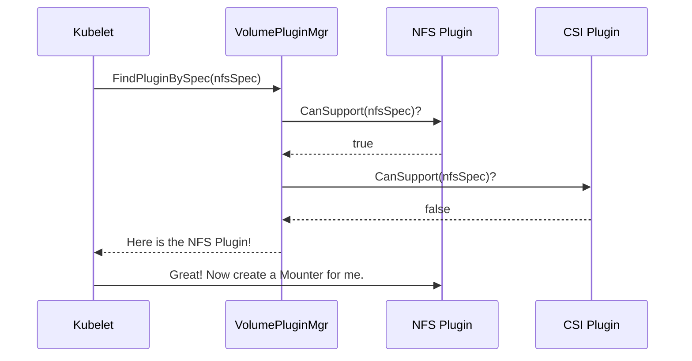

# Chapter 4: VolumePluginMgr

In our previous chapters, we've seen the building blocks of storage in Kubernetes:
*   The [Volume Spec](01_volume_spec_.md) is the universal label for a storage request.
*   The [VolumePlugin Interface](02_volumeplugin_interface_.md) is the standard "power outlet" that every storage driver implements.
*   The [CSI (Container Storage Interface) Plugin](03_csi__container_storage_interface__plugin_.md) is a special "adapter" for modern, external drivers.

We now have all these wonderful plugins—one for NFS, one for AWS, one for CSI, and so on. But when a new volume request arrives, who is in charge of looking through all of them to find the right one for the job?

### The Challenge: Finding the Right Tool in a Big Toolbox

Imagine you have a giant toolbox filled with every tool imaginable: a hammer, a screwdriver, a wrench, a saw. Someone hands you a screw and says, "Fasten this to the wall."

How do you find the right tool? You don't want to try every single one. You need a system. You'd quickly scan the tools, identify the screw, and know that you need a screwdriver.

Kubernetes faces the exact same problem. It has a "toolbox" full of `VolumePlugin` implementations. When the Kubelet gets a `Spec` for a new volume, it needs to find the one specific plugin that knows how to handle that type of storage.

### The Solution: The Plugin Manager

The **`VolumePluginMgr`** (Volume Plugin Manager) is Kubernetes's master organizer for storage drivers. It's the central registry that knows about every available `VolumePlugin`.

Let's go back to our analogy from the introduction. The `VolumePluginMgr` is like a universal remote control's "device search" function.
1.  **You tell it what you want:** "I need to control a Blu-ray player." (This is like the Kubelet giving it a `Spec` for a volume.)
2.  **It searches its database:** The remote scans through all its known codes for different brands and models. (This is like the `VolumePluginMgr` asking each registered plugin, "Can you handle this `Spec`?")
3.  **It finds the right one:** The remote finds the code for your specific brand of player. (The `VolumePluginMgr` finds the one plugin that returns `true`.)

The manager's job is simple but crucial: **load all the plugins and find the correct one when asked.**

### What Does the `VolumePluginMgr` Look Like?

At its core, the `VolumePluginMgr` is a simple structure that holds a list of all the plugins it knows about.

---
**File:** `pkg/volume/plugins.go`
```go
// VolumePluginMgr tracks registered plugins.
type VolumePluginMgr struct {
	// A map of all registered plugins, with the plugin name as the key.
	// For example: "kubernetes.io/nfs" -> nfsPlugin
	plugins map[string]VolumePlugin
	// ... other fields for dynamic discovery
	Host VolumeHost
}
```
---

The most important field is `plugins`, which is a map (like a dictionary or hash table). It stores each `VolumePlugin` using its unique name (e.g., `kubernetes.io/nfs`) as the key. This makes looking up plugins very fast and efficient.

### Step 1: Loading All the Plugins (Initialization)

When the Kubelet starts, one of its first jobs is to set up the `VolumePluginMgr`. It does this by calling the `InitPlugins` method, giving it a list of all the built-in storage drivers.

The `InitPlugins` method then loops through this list, initializes each plugin, and adds it to the internal `plugins` map.

---
**File:** `pkg/volume/plugins.go`
```go
// InitPlugins initializes each plugin.
func (pm *VolumePluginMgr) InitPlugins(plugins []VolumePlugin, host VolumeHost) error {
	pm.Host = host
	pm.plugins = map[string]VolumePlugin{} // Create an empty map

	for _, plugin := range plugins {
		name := plugin.GetPluginName()
		// ... error checking ...

		// Call the plugin's own Init function
		err := plugin.Init(host)
		if err != nil {
			// handle error and skip this plugin
			continue
		}

		// Add the initialized plugin to the manager's map!
		pm.plugins[name] = plugin
	}
	return nil
}
```
---

After this runs, our `VolumePluginMgr` is ready for action. Its `plugins` map is populated with all the storage drivers that are compiled into Kubernetes.

### Step 2: Finding the Right Plugin (The "Device Search")

This is the main event. A pod is scheduled, and the Kubelet needs to mount a volume for it. The Kubelet has a `Spec` object describing the volume. It now asks the `VolumePluginMgr` for help.

The Kubelet calls `FindPluginBySpec`, which performs the "device search." It iterates through every plugin in its map and calls the `CanSupport` method on each one.



Let's look at the simplified code that makes this happen.

---
**File:** `pkg/volume/plugins.go`
```go
// FindPluginBySpec looks for a plugin that can support a given spec.
func (pm *VolumePluginMgr) FindPluginBySpec(spec *Spec) (VolumePlugin, error) {
	var match VolumePlugin
	matchedPluginNames := []string{}

	// Loop through every registered plugin
	for _, plugin := range pm.plugins {
		// Ask the plugin if it can handle this spec
		if plugin.CanSupport(spec) {
			match = plugin
			matchedPluginNames = append(matchedPluginNames, plugin.GetPluginName())
		}
	}

	if len(matchedPluginNames) == 0 {
		return nil, ErrNoPluginMatched // "No device found"
	}
	if len(matchedPluginNames) > 1 {
		// This would be an error, like two plugins claiming the same volume type
		return nil, fmt.Errorf("multiple volume plugins matched")
	}

	return match, nil // Return the one and only match
}
```
---

This design is incredibly powerful. It completely decouples the Kubelet from the individual plugins. The Kubelet doesn't need to know anything about NFS or AWS or CSI. It just knows how to ask the `VolumePluginMgr`, "Who can handle this?"

### Finding Plugins with Special Powers

The manager also has helper functions to find plugins that implement more advanced interfaces. For example, some volumes can be "attached" to a node as a network device. These plugins implement the `AttachableVolumePlugin` interface.

The `VolumePluginMgr` provides a convenient `FindAttachablePluginBySpec` method. It works in two steps:
1.  It calls `FindPluginBySpec` to find the general-purpose plugin for the volume.
2.  It then checks if that plugin *also* happens to be an `AttachableVolumePlugin`.

This pattern keeps the logic clean and follows the principle of building upon simpler components.

### Conclusion

You've just learned about the `VolumePluginMgr`, the central coordinator that makes Kubernetes's modular storage system work.

To recap:
*   The `VolumePluginMgr` acts as a **central registry** for all available `VolumePlugin`s.
*   It's like a **universal remote's device search function**: it finds the right driver for any given storage request (`Spec`).
*   At startup, it **initializes** all plugins and stores them in a map.
*   Its main job is to use the `CanSupport` method to **find the one plugin** that can handle a specific volume.
*   This design elegantly **decouples** the Kubelet from the details of individual storage implementations.

Now that we understand how Kubernetes finds the correct plugin, we can start to explore the more complex actions these plugins can perform. For many types of network storage, a volume must first be "attached" to the node before it can be "mounted" into a container.

Next up, we'll dive into the interfaces that manage this two-step process: [Chapter 5: Attacher and Detacher Interfaces](05_attacher_and_detacher_interfaces_.md).

---

Generated by [AI Codebase Knowledge Builder](https://github.com/The-Pocket/Tutorial-Codebase-Knowledge)