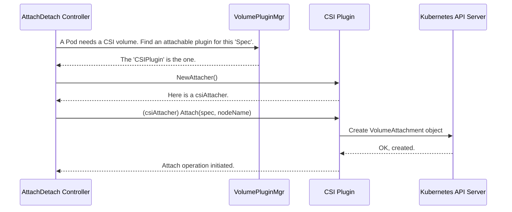

# Chapter 5: Attacher and Detacher Interfaces

In the [previous chapter](04_volumepluginmgr_.md), we learned how the `VolumePluginMgr` acts as a master organizer, finding the right plugin for any storage request. It's like finding the correct instruction manual for a piece of hardware.

But what do those instructions say? For many types of storage, especially network-attached ones, you can't just start using them. There's a preparatory step required, and that's what we'll explore in this chapter.

### The Challenge: Not All Storage is Created Equal

Imagine you have two ways of getting extra disk space for your computer:

1.  **A Local Folder:** You create a new directory on your computer's main hard drive. It's already there, part of the system. You can use it immediately.
2.  **A Network Drive:** You buy a Network-Attached Storage (NAS) device. Before you can see its folders on your computer, you must first connect your computer to it, probably by plugging in a network cable and configuring the connection. Only after this "attaching" step can you "mount" one of its folders to a drive letter like `Z:`.

Kubernetes volumes have this same distinction.
*   A `hostPath` volume is like the **local folder**. It's a directory that's already part of the node, so it's ready to be used by a container.
*   An AWS Elastic Block Store (EBS) volume is like the **network drive**. It's a separate virtual disk "floating" in the cloud. Before a pod can use it, the volume must first be "attached" to the specific Node (EC2 instance) where the pod is running.

This "attach" operation is a distinct, node-level step that must happen *before* the volume can be mounted into a pod's container.

### The Solution: A Special Contract for Attachable Volumes

Kubernetes handles this with a set of specialized interfaces. A `VolumePlugin` that manages network storage can declare that it has these extra capabilities by implementing the `AttachableVolumePlugin` interface.

Think of this as a professional certification. Any regular contractor can paint a room (`VolumePlugin`), but only one with an electrician's license (`AttachableVolumePlugin`) is allowed to wire a new outlet.

---
**File:** `pkg/volume/plugins.go`
```go
// AttachableVolumePlugin is for volumes that require attachment to a node.
type AttachableVolumePlugin interface {
	DeviceMountableVolumePlugin // We'll cover this in the next chapter
	NewAttacher() (Attacher, error)
	NewDetacher() (Detacher, error)
	// ... other methods
}
```
---

This interface is simple. It says, "If you are an attachable volume, you must know how to create two helpers:"

*   `NewAttacher()`: Returns an object that knows how to perform the attach operation.
*   `NewDetacher()`: Returns an object that knows how to undo the attach operation.

These helpers themselves implement the `Attacher` and `Detacher` interfaces.

---
**File:** `pkg/volume/plugins.go`
```go
// Attacher performs the work of attaching a volume to a node.
type Attacher interface {
	Attach(spec *Spec, nodeName types.NodeName) (string, error)
	WaitForAttach(spec *Spec, devicePath string, pod *v1.Pod, timeout time.Duration) (string, error)
	// ...
}

// Detacher performs the work of detaching a volume from a node.
type Detacher interface {
	Detach(volumeName string, nodeName types.NodeName) error
	// ...
}
```
---
*   **Attacher**: Its main job is to connect the volume described in the `spec` to the given `nodeName`.
*   **Detacher**: Its job is to disconnect the volume from the node.

### How It All Fits Together: The Attach-Detach Controller

This whole process is orchestrated by a special controller in Kubernetes called the **Attach-Detach Controller**. It watches for pods that need network volumes and manages this two-step process.

Let's see the flow for a CSI volume.



1.  The **Attach-Detach Controller** sees a pod scheduled on a node that needs a network volume.
2.  It asks the [VolumePluginMgr](04_volumepluginmgr_.md) to find a plugin that is `Attachable` and supports the volume `Spec`.
3.  The `VolumePluginMgr` finds the right plugin (e.g., the `CSIPlugin`).
4.  The controller gets a new `Attacher` from the plugin.
5.  The controller calls the `Attach` method on the `Attacher`.
6.  For CSI, the `csiAttacher`'s job is to create a `VolumeAttachment` object in Kubernetes. This object is a request that tells an external component (the `external-attacher`) to make the actual cloud API call to attach the disk.

This is a beautiful separation of concerns. The core Kubernetes controller doesn't need to know how to talk to AWS, Google Cloud, or any other provider. It just creates a standard Kubernetes object, and the specific CSI driver takes it from there.

### A Peek at the Code

Let's look at how the `CSIPlugin` provides an `Attacher`. It's incredibly simple.

---
**File:** `pkg/volume/csi/csi_plugin.go`
```go
// This file is conceptually part of csi_plugin.go.
// csiPlugin implements AttachableVolumePlugin.

func (plugin *csiPlugin) NewAttacher() (volume.Attacher, error) {
	// ... logic to create a client ...
	return &csiAttacher{
		plugin: plugin,
		k8s:    plugin.host.GetKubeClient(),
		// ...
	}, nil
}
```
---
When `NewAttacher` is called, it just creates and returns a `csiAttacher` object, which contains the logic for the CSI-specific attach process.

Now let's see a simplified version of what that `csiAttacher` does. Its main job is to create that `VolumeAttachment` resource.

---
**File:** `pkg/volume/csi/csi_attacher.go`
```go
func (c *csiAttacher) Attach(spec *volume.Spec, nodeName types.NodeName) (string, error) {
    // 1. Get volume details from the spec
	pvSrc, _ := getPVSourceFromSpec(spec)
    
    // 2. Create the VolumeAttachment object
	attachment := &storage.VolumeAttachment{
		ObjectMeta: metav1.ObjectMeta{
			Name: getAttachmentName(pvSrc.VolumeHandle, pvSrc.Driver, string(nodeName)),
		},
		Spec: storage.VolumeAttachmentSpec{
			NodeName: string(nodeName),
			Attacher: pvSrc.Driver,
			// ...
		},
	}

    // 3. Send it to the Kubernetes API
	_, err := c.k8s.StorageV1().VolumeAttachments().Create(context.TODO(), attachment, metav1.CreateOptions{})
    return "", err
}
```
---
This code simply defines a standard Kubernetes object and asks the API server to create it. That's it! The responsibility is now handed off to other parts of the system that are watching for these objects.

The `Detach` operation is the reverse: it finds the `VolumeAttachment` object and tells the API server to delete it.

### Conclusion

You've just learned about the critical preparatory step for using network-attached storage in Kubernetes.

To recap:
*   Network storage requires a two-step process: **attach** the volume to the node, then **mount** it into the pod.
*   The `AttachableVolumePlugin` interface identifies plugins that can handle this node-level attachment.
*   It provides `Attacher` and `Detacher` helpers to perform these operations.
*   For modern CSI plugins, "attaching" means creating a `VolumeAttachment` object, which declaratively asks for the volume to be connected to the node.

The volume is now attached to the node, like a network drive cabled to a server. But it's not yet available inside our application's container. That's the second step in the process, and it's handled by another set of interfaces.

Next up, we'll explore how Kubernetes makes the attached volume accessible to your pod: [Chapter 6: Mounter and Unmounter Interfaces](06_mounter_and_unmounter_interfaces_.md).

---

Generated by [AI Codebase Knowledge Builder](https://github.com/The-Pocket/Tutorial-Codebase-Knowledge)