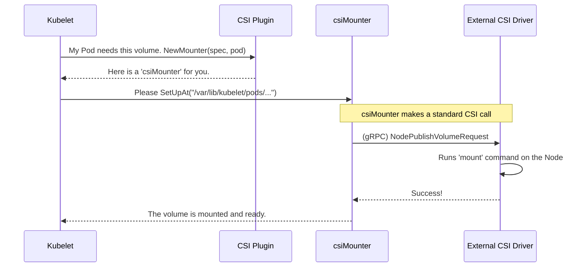

# Chapter 6: Mounter and Unmounter Interfaces

In the [previous chapter](05_attacher_and_detacher_interfaces_.md), we learned how Kubernetes uses an `Attacher` to connect a network volume to a specific node. This is like a delivery service bringing a large, crated package to your front door. The package is there, but you can't use its contents yet because it's still packed up.

How do we get from a connected-but-unusable volume to a folder that your application can read and write to? This is the final and most crucial step, handled by the `Mounter` and `Unmounter` interfaces.

### The Challenge: Unpacking the Box

Once a volume is attached to a node, it's like a raw disk drive connected to a computer. The operating system sees it, but applications can't use it. To make it useful, we need to perform a `mount` operation. This tells the OS: "Take this disk and make its contents appear at this specific directory path."

For example, on Linux, you might run a command like `mount /dev/sdb1 /data/my-app-data`. This makes the storage device `/dev/sdb1` available inside the `/data/my-app-data` directory.

Kubernetes needs a standard way to tell every `VolumePlugin` how to perform this final "unpacking" step for its specific storage type.

### The Solution: The Delivery and Cleanup Crew

This is where the `Mounter` and `Unmounter` interfaces come in. They are the specialists responsible for the last mile of storage delivery.

*   The **`Mounter`** is the delivery person who not only brings the package (the attached volume) to your door but also unpacks it and places its contents on a specific shelf in your house (mounts it into the pod's directory).
*   The **`Unmounter`** is the cleanup crew. When your pod is finished, it carefully packs everything back up (`unmounts` the directory) and prepares the volume to be taken away.

Every `VolumePlugin` must know how to create these two helpers. This responsibility is defined in the main `VolumePlugin` interface we saw earlier.

---
**File:** `pkg/volume/plugins.go`
```go
type VolumePlugin interface {
    // ... other methods
	
	// NewMounter creates a new volume.Mounter.
	NewMounter(spec *Spec, podRef *v1.Pod) (Mounter, error)

	// NewUnmounter creates a new volume.Unmounter.
	NewUnmounter(name string, podUID types.UID) (Unmounter, error)
}
```
---

### The `Mounter` and `Unmounter` Interfaces Defined

Let's look at the "instruction manual" for our delivery crew. These are the core functions they must provide.

The `Mounter` interface is responsible for setting up the volume.
---
**File:** `pkg/volume/volume.go`
```go
// Mounter interface provides methods to set up/mount the volume.
type Mounter interface {
	// SetUpAt prepares and mounts the volume to the
	// specified directory path.
	SetUpAt(dir string, mounterArgs MounterArgs) error

	// ... other methods like GetAttributes
}
```
---
*   `SetUpAt(dir string, ...)`: This is the primary command. It tells the `Mounter` to take its volume and make it available at the `dir` path. The `mounterArgs` include extra details, like file permissions, which we'll touch on later.

The `Unmounter` interface does the exact opposite.
---
**File:** `pkg/volume/volume.go`
```go
// Unmounter interface provides methods to cleanup/unmount the volumes.
type Unmounter interface {
	// TearDownAt unmounts the volume from the specified directory.
	TearDownAt(dir string) error

	// ... other methods
}
```
---
*   `TearDownAt(dir string)`: This command tells the `Unmounter` to clean up the mount at the given `dir`, effectively "packing the box" back up.

### How It All Fits Together

The Kubelet on each node orchestrates this process. After ensuring a volume is attached (if necessary), it gets a `Mounter` from the correct plugin and tells it to set up the volume.



1.  The **Kubelet** determines a pod needs a volume and uses the `VolumePluginMgr` to find the right plugin (e.g., `CSIPlugin`).
2.  It calls `NewMounter` on the plugin to get the specialized helper (`csiMounter`).
3.  The Kubelet calls `SetUpAt`, providing the target directory where the pod expects to see its data.
4.  The `csiMounter` translates this into a standard CSI call (`NodePublishVolume`) to the external driver.
5.  The **External CSI Driver** receives the request and executes the actual `mount` command on the node's operating system.
6.  Once done, the pod can start, and its container will see the storage at the specified path.

### A Deeper Look: The CSI Mounter in Action

Let's peek at the simplified code for the [CSI (Container Storage Interface) Plugin](03_csi__container_storage_interface__plugin_.md) to see this in action. Its `Mounter` is a struct called `csiMountMgr`.

The `SetUpAt` method is surprisingly simple at a high level. Its main job is to forward the request to the external driver.

---
**File:** `pkg/volume/csi/csi_mounter.go`
```go
// SetUpAt mounts the volume.
func (c *csiMountMgr) SetUpAt(dir string, mounterArgs volume.MounterArgs) error {
	// Get the client that can talk to the external CSI driver
	csi, err := c.csiClientGetter.Get()
	// ... error handling ...

	// Make the remote call to the external driver!
	// This is the bridge in action.
	err = csi.NodePublishVolume(
		ctx,
		c.volumeID, // The actual volume handle like 'vol-0e39...'
		c.readOnly,
		dir,        // The target path to mount to
        // ... other arguments
	)
	return err
}
```
---
This is the core of the `Mounter`. It doesn't contain any `mount` logic itself. It just packs the arguments into a standardized `NodePublishVolume` request and sends it to the real expert—the external storage driver.

The `TearDownAt` method for the `Unmounter` is the mirror image.

---
**File:** `pkg/volume/csi/csi_mounter.go`
```go
// TearDownAt unmounts the volume.
func (c *csiMountMgr) TearDownAt(dir string) error {
	// ... get the CSI client ...

	// Tell the external driver to unmount the volume from the directory.
	err := csi.NodeUnpublishVolume(ctx, c.volumeID, dir)
	if err != nil {
		return errors.New(log("Unmounter.TearDownAt failed: %v", err))
	}
	
	// ... clean up directories ...
	return nil
}
```
---
Again, it simply translates the request into a standard CSI call, `NodeUnpublishVolume`, and lets the external driver handle the OS-specific `umount` command.

### More Than Just Mounting: `MounterArgs`

The `MounterArgs` parameter in `SetUpAt` is very important. It carries extra instructions for the setup process. One of the most common is the `FsGroup`.

---
**File:** `pkg/volume/volume.go`
```go
// MounterArgs provides more easily extensible arguments to Mounter
type MounterArgs struct {
	// When FsUser/FsGroup is set, the ownership of the volume will be modified.
	FsGroup *int64
	// ... other fields like SELinuxLabel
}
```
---
This tells the `Mounter` that after mounting the volume, it should also change the ownership of the files and directories inside so that the pod's user can read and write to them. This ensures your application doesn't fail because of "Permission Denied" errors, a common problem for beginners.

### Conclusion

You've just learned about the `Mounter` and `Unmounter` interfaces, the final and most visible part of the volume lifecycle. They are responsible for making storage actually appear inside your container.

To recap:
*   An **attached** volume is connected to the node but not yet usable by a pod.
*   The **`Mounter`** interface defines the contract for the "last mile" step: performing the `mount` operation to make the volume accessible at a specific directory.
*   The **`Unmounter`** does the reverse, cleaning up the mount point when the pod is deleted.
*   This is like a delivery person who not only brings a package but also **unpacks it onto a shelf** for you.
*   For modern plugins like CSI, the `Mounter` simply acts as a bridge, sending a standard request to an external driver that does the real work.

We have now seen all the major pieces for managing a volume's lifecycle: the `Attacher` for connecting it to the node, and the `Mounter` for making it available to the pod. But who calls these pieces in the right order and handles errors and retries? That's the job of our next component.

Next up: [Chapter 7: OperationExecutor](07_operationexecutor_.md)

---

Generated by [AI Codebase Knowledge Builder](https://github.com/The-Pocket/Tutorial-Codebase-Knowledge)