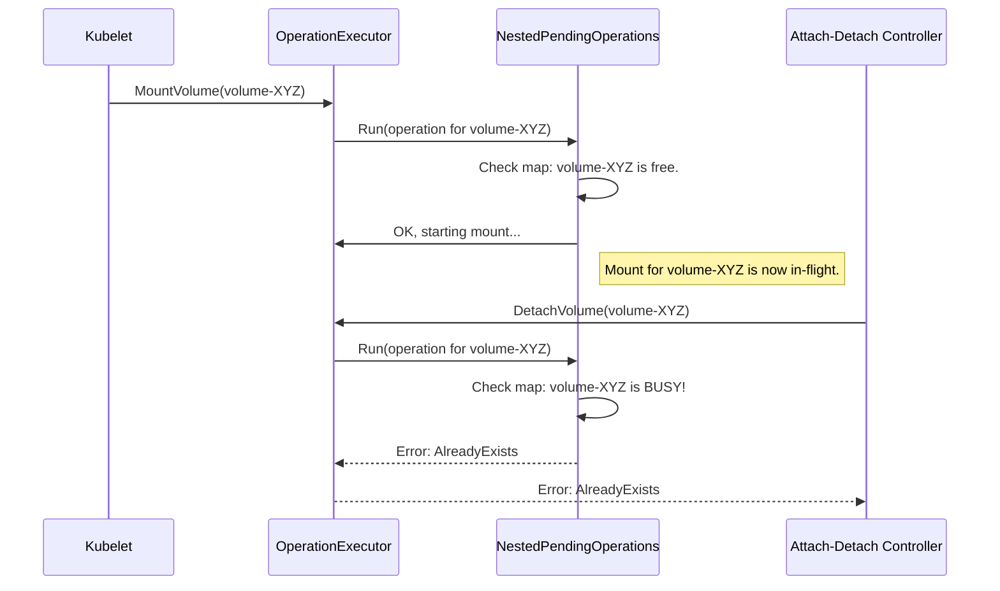

# Chapter 7: OperationExecutor

In the previous chapters, we've assembled our crew for managing storage. We have the [Attacher and Detacher Interfaces](05_attacher_and_detacher_interfaces_.md) to connect volumes to a node, and the [Mounter and Unmounter Interfaces](06_mounter_and_unmounter_interfaces_.md) to make them available inside a pod.

But who directs this crew? What happens if the Kubelet tries to `mount` a volume for a new pod at the *exact same time* the Attach-Detach controller decides to `detach` that same volume from the node? The result would be chaos, errors, and an unstable system. We need a conductor to orchestrate these actions safely.

### The Challenge: Preventing Collisions on the Runway

Imagine an airport with only one runway. If the air traffic controller goes on a coffee break, two planes might try to land at the same time, or one might try to take off while another is landing. It would be a disaster.

A volume on a Kubernetes node is like that single runway. At any given moment, multiple components might want to perform an action on it:
*   The Kubelet wants to **mount** it for a new pod.
*   The Kubelet wants to **unmount** it from a terminated pod.
*   A controller wants to **detach** it because no pods are using it anymore.

If these operations run concurrently on the same volume, they will interfere with each other and corrupt the volume's state. We need a mechanism to ensure that only one "plane" (operation) is on the "runway" (volume) at a time.

### The Solution: An Air Traffic Controller for Volumes

The **`OperationExecutor`** is the air traffic controller for all volume operations on a node. Its most important job is to prevent race conditions by serializing operations. It ensures that conflicting actions—like a `detach` and a `mount` for the same volume—don't run at the same time.

It maintains a queue of pending operations and ensures that for any single volume, operations happen one after another in a safe, predictable sequence. This keeps the volume's state consistent and the node stable.

### How the `OperationExecutor` Works

At its heart, the `OperationExecutor` provides a set of methods to trigger volume actions, such as `MountVolume`, `UnmountVolume`, `AttachVolume`, and `DetachVolume`.

When a component like the Kubelet wants to mount a volume, it doesn't call the volume plugin directly. Instead, it asks the `OperationExecutor` to do it.

---
**File:** `pkg/volume/util/operationexecutor/operation_executor.go`
```go
// OperationExecutor defines a set of operations for attaching, detaching,
// mounting, or unmounting a volume.
type OperationExecutor interface {
	// MountVolume mounts the volume to the pod specified in volumeToMount.
	MountVolume(
        waitForAttachTimeout time.Duration,
        volumeToMount VolumeToMount,
        //...
    ) error

	// UnmountVolume unmounts the volume from the pod...
	UnmountVolume(volumeToUnmount MountedVolume, ...) error

	// AttachVolume attaches the volume to the node...
	AttachVolume(logger klog.Logger, volumeToAttach VolumeToAttach, ...) error

	// DetachVolume detaches the volume from the node...
	DetachVolume(logger klog.Logger, volumeToDetach AttachedVolume, ...) error
}
```
---

The `OperationExecutor` then does two things:
1.  **It generates the actual work function:** It uses a helper called an `OperationGenerator` to create the function that will perform the real mount (calling the `Mounter`'s `SetUpAt` method, for example).
2.  **It safely executes the function:** It passes this work function to an internal scheduler that checks for conflicts.

If there's no conflicting operation currently running for that volume, the scheduler starts the function in the background. If there *is* a conflict, it immediately returns an `AlreadyExists` error, telling the caller, "The runway is busy, try again later."

### The Heart of the System: `NestedPendingOperations`

The real magic behind the `OperationExecutor` is a data structure called `NestedPendingOperations`. This is the brain of our air traffic controller. It's essentially a list that keeps track of every operation that is currently in-flight.

Let's trace a typical scenario to see how it prevents a collision.


1.  The Kubelet asks the `OperationExecutor` to `MountVolume` for "volume-XYZ".
2.  The `OperationExecutor` asks `NestedPendingOperations` to `Run` the mount function.
3.  `NestedPendingOperations` checks its internal list. The list is empty for "volume-XYZ", so it adds the mount operation to the list and starts it.
4.  A moment later, while the mount is still in progress, the Attach-Detach Controller asks to `DetachVolume` for the *same* volume, "volume-XYZ".
5.  The `OperationExecutor` asks `NestedPendingOperations` to `Run` the detach function.
6.  `NestedPendingOperations` checks its list and sees that an operation for "volume-XYZ" is *already running*.
7.  It immediately returns an `AlreadyExists` error without starting the detach.
8.  The Attach-Detach Controller receives the error and knows it must retry later, once the runway is clear.

Collision averted!

### A Look at the Code

Let's look at a simplified version of the `OperationExecutor`'s `AttachVolume` method. You can see how it delegates the safety check to `pendingOperations`.

---
**File:** `pkg/volume/util/operationexecutor/operation_executor.go`
```go
func (oe *operationExecutor) AttachVolume(
	logger klog.Logger,
	volumeToAttach VolumeToAttach,
	actualStateOfWorld ActualStateOfWorldAttacherUpdater) error {
	
    // 1. Prepare the function that will do the actual work.
	generatedOperations :=
		oe.operationGenerator.GenerateAttachVolumeFunc(
            logger, volumeToAttach, actualStateOfWorld)

    // 2. Ask NestedPendingOperations to run it safely.
	return oe.pendingOperations.Run(
		volumeToAttach.VolumeName,
		"" /* podName */,
		"" /* nodeName */,
		generatedOperations)
}
```
---
The `pendingOperations.Run` method is where the conflict check happens. Here's a simplified view of its logic:

---
**File:** `pkg/volume/util/nestedpendingoperations/nestedpendingoperations.go`
```go
func (grm *nestedPendingOperations) Run(...) error {
	grm.lock.Lock()
	defer grm.lock.Unlock()

	// Check if a conflicting operation exists for this volume.
	opExists, _ := grm.isOperationExists(opKey)
	if opExists {
		// Runway is busy! Return an error immediately.
		return NewAlreadyExistsError(opKey)
	}

	// Runway is clear. Add this operation to the list.
	grm.operations = append(grm.operations, operation{...})
	
    // Start the work in the background.
	go func() {
		defer grm.operationComplete(opKey, &detailedErr)
		generatedOperations.Run()
	}()

	return nil
}
```
---
This simple "check-then-run" logic is the core mechanism that brings order and stability to all volume operations on a node.

### Conclusion

You've just learned about the `OperationExecutor`, the unsung hero that acts as the conductor for Kubernetes volume management on a node.

To recap:
*   Performing volume operations like `mount` and `detach` at the same time on the same volume would cause chaos.
*   The **`OperationExecutor`** acts as an **air traffic controller**, serializing these operations to prevent conflicts.
*   It uses a data structure called **`NestedPendingOperations`** to keep track of in-flight actions for each volume.
*   If a new request comes in for a busy volume, the `OperationExecutor` returns an error, forcing the caller to retry later.
*   This ensures that the state of volumes on a node remains consistent, stable, and predictable.

We've now mounted a volume and made sure it's done safely. But there's one last common hurdle: file permissions. How does Kubernetes ensure that the user inside your container has the right to read and write to the files on the mounted volume? That's the job of our next component.

Next up: [Chapter 8: VolumeOwnershipChanger](08_volumeownershipchanger_.md)

---

Generated by [AI Codebase Knowledge Builder](https://github.com/The-Pocket/Tutorial-Codebase-Knowledge)