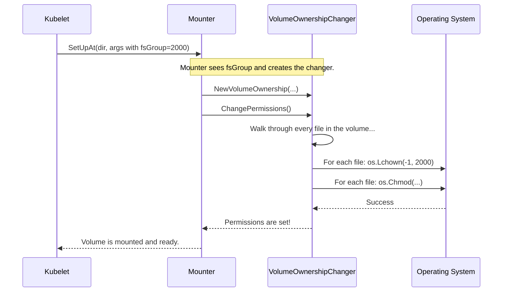

# Chapter 8: VolumeOwnershipChanger

In the [previous chapter](07_operationexecutor_.md), we saw how the `OperationExecutor` acts as an air traffic controller, safely orchestrating all the steps to get a volume attached and mounted. The volume is now connected and available on the node, ready for our pod to use.

But what if the pod tries to write a file and gets a "Permission Denied" error? The volume is mounted, but our application still can't use it. This is a common and frustrating problem, and it's exactly what the `VolumeOwnershipChanger` is designed to solve.

### The Challenge: The Wrong Keys for the New Office

Imagine you're moving into a new office space. The landlord gives you a key to the front door, and you successfully get inside. This is like our `Mounter` successfully mounting the volume.

But then you try to open the individual office doors, the supply closets, and the meeting rooms, only to find that your key doesn't work. The previous tenant's locks are still on all the doors. You're in the building, but you can't actually do any work.

This is what happens when a pod tries to use a volume with the wrong permissions. The volume might be owned by the `root` user on the host machine, but the application inside your container is running as a different, non-privileged user (e.g., user `1001`). The pod has access to the "building" (the mounted directory) but doesn't have the "keys" (permissions) to access the "rooms" (files and subdirectories) inside.

### The Solution: A Locksmith for Your Volume

The **`VolumeOwnershipChanger`** is Kubernetes's built-in locksmith. When a pod specifies a "group ID" it wants to use (called an `fsGroup` in its security settings), this component is responsible for re-keying all the "doors" in the new "office."

Its job is to walk through every single file and directory inside the mounted volume and recursively run two essential commands:
1.  `chown`: Changes the group ownership of the file to match the pod's `fsGroup`.
2.  `chmod`: Changes the permissions of the file to ensure the group can read, write, and execute as needed.

This process guarantees that when your application starts, it has the correct permissions to access everything inside the volume it needs.

### How It Gets Triggered: The `fsGroup` Setting

You don't call this locksmith yourself. It's an automatic service triggered by a setting in your pod's configuration. When you define a `securityContext` for your pod, you can specify an `fsGroup`.

```yaml
apiVersion: v1
kind: Pod
metadata:
  name: my-app
spec:
  containers:
  - name: my-app-container
    image: busybox
    command: [ "sleep", "3600" ]
    volumeMounts:
    - name: my-data
      mountPath: /data
  securityContext:
    fsGroup: 2000 # This is the key!
  volumes:
  - name: my-data
    # ... volume definition ...
```

When the [Mounter and Unmounter Interfaces](06_mounter_and_unmounter_interfaces_.md) component goes to set up this volume, it sees that `fsGroup: 2000` is set. As part of its setup process, it will invoke the `VolumeOwnershipChanger` to make sure everything inside the `/data` volume is owned by group ID `2000`.

### The Interface: A Simple Contract

The interface for our "locksmith" is straightforward. It really only has one main job to do.

---
**File:** `pkg/volume/volume.go`
```go
type VolumeOwnershipChanger interface {
	// AddProgressNotifier is for reporting on long-running operations.
	AddProgressNotifier(pod *v1.Pod, recorder record.EventRecorder) VolumeOwnershipChanger

	// ChangePermissions does the actual work of chown/chmod.
	ChangePermissions() error
}
```
---
*   `ChangePermissions()`: This is the command to start the work. When called, it begins the recursive process of changing ownership and permissions.
*   `AddProgressNotifier(...)`: Changing permissions on a volume with millions of small files can be very slow. This method allows Kubernetes to report a warning event if the process is taking too long.

### How It Works Under the Hood

Let's follow the locksmith on the job. The entire process is handled during the volume mount operation.



1.  The Kubelet asks the volume `Mounter` to set up the volume, passing along the `fsGroup` from the pod's spec.
2.  The `Mounter` sees the `fsGroup` and creates a `VolumeOwnershipChanger`.
3.  The `Mounter` calls `ChangePermissions()` on the changer.
4.  The `VolumeOwnershipChanger` starts walking the entire directory tree of the volume.
5.  For every file and directory it finds, it makes two system calls to the **Operating System**: `Lchown` to set the group ID and `Chmod` to set the right read/write permissions.
6.  Once the process is complete, the volume is ready for the pod.

Let's look at the Linux-specific code that does the real work. The main function simply calls a recursive helper.

---
**File:** `pkg/volume/volume_linux.go`
```go
func (vo *VolumeOwnership) ChangePermissions() error {
	// If fsGroup wasn't specified, there's nothing to do.
	if vo.fsGroup == nil {
		return nil
	}
	
	// Check if we can skip this for performance (more on this later).
	if skipPermissionChange(...) {
		return nil
	}
	
	// Start the recursive process.
	return vo.changePermissionsRecursively()
}
```
---

The real magic happens in a small helper function that is called for every single file.

---
**File:** `pkg/volume/volume_linux.go`
```go
// Simplified for clarity
func changeFilePermission(filename string, fsGroup *int64, readonly bool, info os.FileInfo) error {
	// Change the group ID of the file.
	// The '-1' means "don't change the user ID".
	os.Lchown(filename, -1, int(*fsGroup))

	// ... logic to figure out the right permissions (mask) ...

	// Set the file's permissions (mode).
	os.Chmod(filename, info.Mode()|mask)

	return nil
}
```
---
This small function is the heart of the `VolumeOwnershipChanger`. It's called potentially millions of times for large volumes, ensuring every single file is correctly configured for the pod.

### A Critical Optimization: `fsGroupChangePolicy`

Recursively changing permissions on a giant volume can be extremely slow and can delay your pod's startup by many minutes. To solve this, Kubernetes introduced an optimization called `fsGroupChangePolicy`.

You can set this in your pod's `securityContext`:

```yaml
  securityContext:
    fsGroup: 2000
    fsGroupChangePolicy: "OnRootMismatch" # The optimization!
```

*   **`Always`** (the default): The locksmith checks and re-keys every single door, every time. This is safe but can be slow.
*   **`OnRootMismatch`**: The locksmith does a quick check on just the main entrance (the top-level directory of the volume). If that door already has the correct lock (`fsGroup`) and permissions, it assumes all the other doors inside are also correct and **skips the entire recursive process**. This can speed up pod startup dramatically.

The `skipPermissionChange` function we saw earlier is the one that performs this quick check. If the policy is `OnRootMismatch` and the root directory's permissions are already correct, it returns `true`, and the whole slow process is avoided.

### Conclusion

You've just learned about the `VolumeOwnershipChanger`, the crucial component that solves "Permission Denied" errors by ensuring your pod can access its storage.

To recap:
*   Mounting a volume isn't enough; the pod's user needs the correct **permissions** to read and write files.
*   The `VolumeOwnershipChanger` acts like a **locksmith**, recursively running `chown` and `chmod` on the volume's contents to match the pod's `fsGroup`.
*   This process is triggered automatically when `fsGroup` is set in a pod's `securityContext`.
*   For performance, you can use `fsGroupChangePolicy: OnRootMismatch` to skip this process if the permissions are already correct, drastically improving startup times for large volumes.

Our volume is now mounted, its permissions are correct, and our application is running happily. But how do we monitor it? How much space is it using? Is it healthy? That's the job of our final component.

Next up: [Chapter 9: MetricsProvider](09_metricsprovider_.md)

---

Generated by [AI Codebase Knowledge Builder](https://github.com/The-Pocket/Tutorial-Codebase-Knowledge)