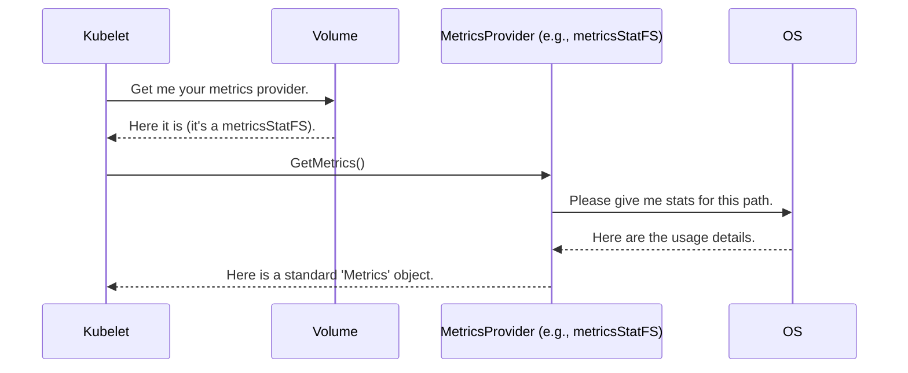

# Chapter 9: MetricsProvider

In the [previous chapter](08_volumeownershipchanger_.md), we saw how the `VolumeOwnershipChanger` acts like a locksmith, ensuring our pod has the correct permissions to use its storage. Our application is now running successfully, reading and writing data to its volume.

But our job as system operators isn't over. We need to monitor the application. How much disk space is it using? Is it about to run out of storage? Answering these questions is essential for keeping our services healthy.

### The Challenge: So Many Different Gauges

Imagine you're managing a fleet of vehicles. You have gas cars, diesel trucks, and electric vans. To know how far each one can go, you need to check a different type of gauge for each:
*   For the gas car, you look at the fuel needle.
*   For the diesel truck, you look at its fuel gauge.
*   For the electric van, you look at the battery percentage.

This would be a nightmare. You'd have to learn a different system for every vehicle. What you really want is a standard dashboard that always shows "Remaining Range," regardless of what's powering the vehicle.

Kubernetes faces the exact same problem with volumes. A volume could be:
*   A simple directory on the host (`hostPath`).
*   A network file share (`NFS`).
*   A raw block device from a cloud provider (`AWS EBS` in block mode).
*   A modern `CSI` volume.

Each of these storage types measures its capacity and usage in a different way. How can the Kubelet ask, "How much space is left?" without needing to know the specific details of every single volume type?

### The Solution: The Universal Dashboard

The **`MetricsProvider`** is the standard "dashboard" interface for all Kubernetes volumes. It provides a simple, consistent way for the Kubelet to ask for usage statistics, no matter the underlying storage technology.

Just like a car's dashboard, it gives you the essential information you need (`Metrics`) in a standard format. The underlying mechanics of how that information is calculated (the `MetricsProvider` implementation) can be wildly different, but the interface for the "driver" (the Kubelet) is always the same.

### The Contract: A Simple Request for Stats

The `MetricsProvider` interface is elegantly simple. It's a contract that says, "If you want to report metrics, you must provide this one function."

---
**File:** `pkg/volume/volume.go`
```go
// MetricsProvider exposes metrics related to a Volume.
type MetricsProvider interface {
	// GetMetrics returns the Metrics for the Volume.
	GetMetrics() (*Metrics, error)
}
```
---
That's it! Just one method, `GetMetrics()`. It returns a `Metrics` object, which is a standardized struct for holding all the usage data.

---
**File:** `pkg/volume/volume.go`
```go
// Metrics represents the used and available bytes of the Volume.
type Metrics struct {
	// Capacity represents the total capacity (bytes) of the volume's storage.
	Capacity *resource.Quantity

	// Available represents the storage space available (bytes).
	Available *resource.Quantity

	// Used represents the total bytes used by the Volume.
	Used *resource.Quantity

	// ... other fields for inodes (file counts) ...
}
```
---
This `Metrics` struct is the universal "dashboard readout." It gives the Kubelet everything it needs to know about the volume's health in a predictable format.

### Different Engines, Same Dashboard

The real power comes from the different implementations of the `MetricsProvider` interface. Each volume type can provide its own "engine" for calculating these stats.

Let's look at a few examples.

#### 1. The Standard Filesystem: `metricsStatFS`

For most volumes that are mounted as a regular directory (like `hostPath`, `emptyDir`, or `NFS`), getting stats is straightforward. Kubernetes can just ask the node's operating system.

The `metricsStatFS` provider does exactly this. It holds the path to the mounted volume and uses a standard OS system call (`statfs`) to get the data.

---
**File:** `pkg/volume/metrics_statfs.go`
```go
// metricsStatFS calculates space by stat'ing the filesystem path.
type metricsStatFS struct {
	path string // The directory path of the volume
}

// GetMetrics asks the OS for filesystem info.
func (md *metricsStatFS) GetMetrics() (*Metrics, error) {
	// fs.Info() is a helper that calls the OS's statfs command.
	available, capacity, usage, ... := fs.Info(md.path)
	
    // ... create and return a new Metrics object with the results ...
	return &Metrics{
		Available: resource.NewQuantity(available, ...),
		Capacity:  resource.NewQuantity(capacity, ...),
		Used:      resource.NewQuantity(usage, ...),
	}, nil
}
```
---
This is the most common and efficient way to get volume stats.

#### 2. The Raw Block Device: `metricsBlock`

What about a raw block volume? It's not formatted with a filesystem, so you can't ask the OS for usage stats. It's like a blank hard drive. How do you find its size?

The `metricsBlock` provider uses a clever trick. It opens the raw device file (e.g., `/dev/sdb`) and "seeks" to the very end. The final position it can seek to is the total size of the device.

---
**File:** `pkg/volume/metrics_block.go`
```go
// metricsBlock detects the size of a BlockMode Volume.
type metricsBlock struct {
	device string // The device path, e.g., /dev/sdb
}

// GetMetrics finds the size of the block device.
func (mb *metricsBlock) GetMetrics() (*Metrics, error) {
	dev, err := os.Open(mb.device)
	// ... error handling ...
	defer dev.Close()

	// Seek to the end of the file. The position is the size.
	size, err := dev.Seek(0, io.SeekEnd)
	
	return &Metrics{
		Capacity: resource.NewQuantity(size, ...),
	}, nil
}
```
---
This implementation is completely different from `metricsStatFS`, but it returns the *same standard `Metrics` object*. The Kubelet doesn't need to know or care about this difference.

#### 3. The "I Don't Know" Case: `MetricsNil`

What if a volume plugin is old and doesn't know how to report metrics? It can use the `MetricsNil` provider. This is a placeholder that simply returns a "not supported" error.

---
**File:** `pkg/volume/metrics_nil.go`
```go
// MetricsNil is for Volumes that do not support metrics.
type MetricsNil struct{}

// GetMetrics always returns a "not supported" error.
func (*MetricsNil) GetMetrics() (*Metrics, error) {
	return &Metrics{}, NewNotSupportedError()
}
```
---
This allows the system to function gracefully even if some volume types can't report stats.

### How It All Fits Together

The Kubelet periodically gathers stats for all the running pods on its node. For each volume, it performs a simple process.



1.  The **Kubelet** asks the `Volume` object for its `MetricsProvider`.
2.  The `Volume` returns the correct provider for its type (e.g., `metricsStatFS`).
3.  The Kubelet calls `GetMetrics()` on the provider.
4.  The provider does its specific work (e.g., calling the OS).
5.  It returns a standard `Metrics` object, which the Kubelet then exposes for monitoring systems like Prometheus to scrape.

### Conclusion: A Journey Completed

You've just learned about the `MetricsProvider`, the final piece of our puzzle. It provides a crucial, standardized way to monitor the health and capacity of our volumes.

To recap:
*   The **`MetricsProvider`** is a standard interface for getting usage statistics from a volume.
*   It's like a **universal car dashboard**, providing a consistent view (`Metrics`) regardless of the underlying storage technology.
*   Different implementations like **`metricsStatFS`** and **`metricsBlock`** handle the specific details for different volume types.
*   This data is essential for monitoring, alerting, and ensuring your applications don't run out of disk space.

Congratulations! You have journeyed through the core components of the Kubernetes volume subsystem. From the initial request (`Spec`), to finding the right driver (`VolumePluginMgr`), to connecting the storage (`Attacher`), making it usable (`Mounter`), ensuring permissions (`VolumeOwnershipChanger`), and finally, monitoring its usage (`MetricsProvider`). You now have a solid foundation for understanding how Kubernetes provides reliable, persistent storage to your applications.

---

Generated by [AI Codebase Knowledge Builder](https://github.com/The-Pocket/Tutorial-Codebase-Knowledge)