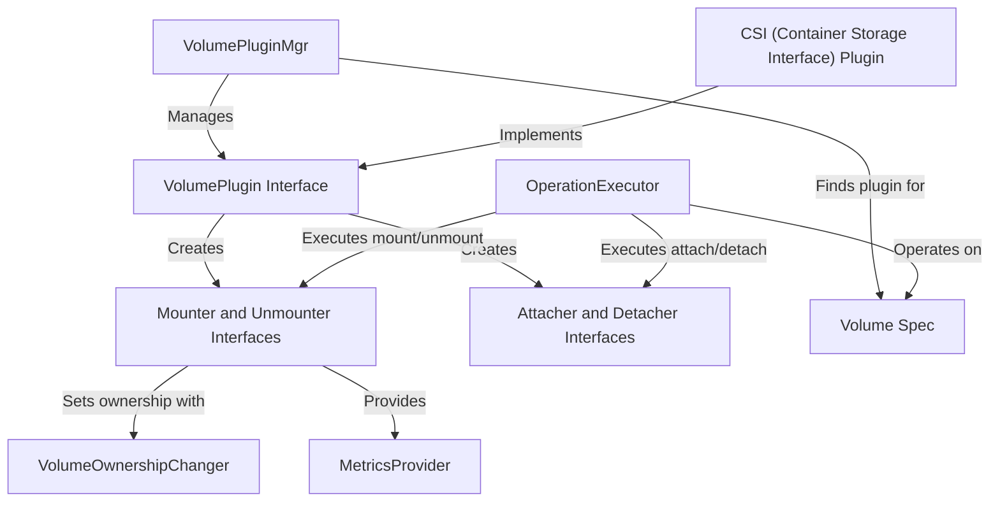

# Tutorial: volume

The `volume` project is the core storage layer for Kubernetes. It provides a flexible, **plugin-based system** that allows pods to use many different types of storage, from local directories on a node to sophisticated network and cloud-based storage systems. It manages the entire lifecycle of a volume for a pod: *attaching* the storage to the correct node, *mounting* it into the container's filesystem, and then cleaning everything up when the pod is destroyed. A key component is the **CSI (Container Storage Interface)**, which acts as a universal adapter, allowing third-party storage vendors to easily integrate with Kubernetes without modifying its core code.

**Source Repository:** [None](None)

## Chapters

1. [Volume Spec
](01_volume_spec_.md)
2. [VolumePlugin Interface
](02_volumeplugin_interface_.md)
3. [CSI (Container Storage Interface) Plugin
](03_csi__container_storage_interface__plugin_.md)
4. [VolumePluginMgr
](04_volumepluginmgr_.md)
5. [Attacher and Detacher Interfaces
](05_attacher_and_detacher_interfaces_.md)
6. [Mounter and Unmounter Interfaces
](06_mounter_and_unmounter_interfaces_.md)
7. [OperationExecutor
](07_operationexecutor_.md)
8. [VolumeOwnershipChanger
](08_volumeownershipchanger_.md)
9. [MetricsProvider
](09_metricsprovider_.md)

---

Generated by [AI Codebase Knowledge Builder](https://github.com/The-Pocket/Tutorial-Codebase-Knowledge)