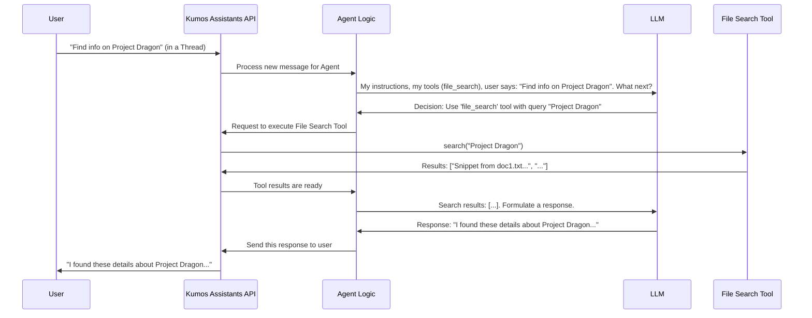

# Chapter 1: Agent & Tool Framework

Welcome to the `kumos-assistants-api`! This project helps you build powerful AI assistants. In this first chapter, we'll explore a foundational concept: the **Agent & Tool Framework**.

## What's the Big Idea?

Imagine you want an AI that can do more than just chat. What if you need it to look up information in your files, or perform calculations? A standard chatbot can't do that on its own. It needs special capabilities.

Let's take a simple use case: You have a collection of text documents, and you want an AI assistant that can search through these documents to find specific information. For example, you might ask, "Find all documents that mention 'Project Dragon'."

This is where the **Agent & Tool Framework** comes in. It's like setting up a workshop for a skilled craftsperson.
*   The **Agent** is like your skilled craftsperson (the AI).
*   The **Tools** are the specialized equipment in their toolkit (e.g., a "file search" tool, a "calculator" tool).

This framework defines these AI "agents": their instructions (what they are supposed to do), their overall capabilities, and the "tools" they can use. It empowers agents to perform complex tasks by giving them a structured way to access and use these tools.

## Meet the Agents and Their Tools

Let's break this down:

1.  **Agent**:
    *   An "agent" is essentially an AI program designed for a specific purpose.
    *   You give it a name (e.g., "Document Analyzer") and a set of instructions (e.g., "You are an expert at finding information in text files. When asked a question, search the available files and provide a summary of your findings.").
    *   The agent uses a Large Language Model (LLM) – like the ones from OpenAI or local ones like Ollama's `qwen3:4b` – as its "brain" to understand requests and formulate responses.

2.  **Tool**:
    *   A "tool" is a specific capability that an agent can use to perform an action. Think of it as a function or a program the agent can call.
    *   Examples of tools in `kumos-assistants-api` include:
        *   `file_search`: Allows the agent to search through files you've provided.
        *   `code_interpreter`: Allows the agent to (conceptually, for now) run code to perform calculations or data analysis. (In `kumos-assistants-api`, this is currently a mock for security, meaning it describes what it *would* do rather than actually running code).
        *   `create_specialist` (Agent Handoff): Allows an agent to pass a task to another, more specialized agent.

The framework connects the agent (with its instructions) to the tools. When the agent understands that a task requires a specific action (like searching files), it can use the appropriate tool.

## Solving Our Use Case: The Document Searching Assistant

Remember our goal? We want an AI assistant that can search documents for "Project Dragon." Here's how the Agent & Tool Framework helps:

1.  **Define the Agent**: We create an Assistant (which is our Agent) and tell `kumos-assistants-api` about it. We'll give it instructions like "You are a helpful assistant that can search documents."
2.  **Equip with Tools**: We'll specify that this assistant should have access to the `file_search` tool.
3.  **User Interaction**:
    *   You (the user) send a message to this assistant: "Find documents about 'Project Dragon'."
    *   The assistant, using its LLM brain and its instructions, realizes it needs to search files.
    *   It then uses the `file_search` tool provided by the framework to look for "Project Dragon."
    *   The tool returns a list of matching documents or snippets.
    *   The assistant then uses this information to give you an answer, like "I found three documents mentioning 'Project Dragon': doc1.txt, report.pdf, and notes.md."

## Creating an Agent with Tools: An Example

Let's see how you'd tell `kumos-assistants-api` to create an agent. You do this by making an API request. Here's an example, similar to the one in the main `README.md`:

```bash
curl -X POST http://localhost:3000/v1/assistants \
  -H "Authorization: Bearer sk-test-001" \
  -H "Content-Type: application/json" \
  -d '{
    "name": "Document Searcher",
    "instructions": "You are an AI assistant that helps find information in documents.",
    "model": "qwen3:4b",
    "tools": [{"type": "file_search"}]
  }'
```

Let's break down the `-d` (data) part:
*   `"name": "Document Searcher"`: This is the name we're giving our agent.
*   `"instructions": "You are an AI assistant that helps find information in documents."`: This tells the agent its primary role.
*   `"model": "qwen3:4b"`: This specifies which LLM the agent should use for its thinking process.
*   `"tools": [{"type": "file_search"}]`: This is crucial! It tells the system that this "Document Searcher" agent is equipped with the `file_search` tool.

When `kumos-assistants-api` receives this, it registers a new assistant ready to use the file search capability.

## Under the Hood: How Does It Work? (Conceptually)

When your "Document Searcher" agent receives a message like "Find info on Project Dragon," a sequence of events happens internally:

1.  **Message Received**: Your message goes into a "Thread" (a conversation).
2.  **Agent Awakens**: The Agent associated with this Thread is tasked to process the new message.
3.  **LLM Consultation**: The Agent sends your message, its instructions, and the list of its available tools to the [LLM Interaction Layer (Completer)](04_llm_interaction_layer__completer__.md). It essentially asks the LLM, "Based on my instructions and tools, what should I do with this message: 'Find info on Project Dragon'?"
4.  **Tool Selection**: The LLM, understanding the request and knowing the agent has `file_search`, might decide, "I need to use the `file_search` tool with the query 'Project Dragon'." It then tells the Agent framework this decision.
5.  **Tool Execution**: The [Run Execution Engine](03_run_execution_engine_.md) takes over. It calls the actual `file_search` tool with the parameters provided by the LLM (e.g., the search query).
6.  **Results Back to LLM**: The `file_search` tool returns its findings (e.g., a list of relevant file snippets). These results are given back to the LLM.
7.  **Formulate Response**: The LLM now uses these search results to craft a human-friendly answer.
8.  **Response to User**: The Agent sends this final answer back to you.

Here's a simplified diagram of this flow:



## Built-in and Custom Tools

`kumos-assistants-api` comes with a few built-in tools, as mentioned in the project's `README.md`:

*   **File Search (`file_search`)**: Searches files.
*   **Code Interpreter (`code_interpreter`)**: A mock tool that describes code execution.
*   **Agent Handoff (`create_specialist`)**: Allows one agent to delegate a task to a new, specialized agent.

The framework is also designed to be extensible. While you won't need to do this as a beginner user, developers can add new custom tools to the system. They would do this by writing some Rust code to define the tool's behavior and then registering it with the system's `ToolRegistry`.

Here's a highly simplified peek at what registering a custom tool might look like in the Rust code (you don't need to write this!):

```rust
// This is a conceptual snippet from the server's internal Rust code.
// It shows how a developer might add a new tool.

// Assume MyToolHandler is some code that defines what "my_custom_tool_name" does.
// use kumos_assistants_api::agents::tools::registry::ToolRegistry;
// use std::sync::Arc;
// struct MyToolHandler { /* ... details ... */ }
// impl MyToolHandler { /* ... methods to perform the tool's action ... */ }

// The ToolRegistry is like a master list of all available tools.
// let registry = ToolRegistry::new();

// A developer would add their new tool to this registry.
// registry.register_tool(
//   "my_custom_tool_name", // The name the LLM will use
//   Arc::new(MyToolHandler {}) // The code that actually does the work
// );
```
This `ToolRegistry` is what the [Run Execution Engine](03_run_execution_engine_.md) consults when an agent wants to use a specific tool. It looks up the tool by its name and then executes its associated code.

## Conclusion

You've just taken your first step into the `kumos-assistants-api` by understanding the **Agent & Tool Framework**. You've learned that:

*   **Agents** are AI entities with instructions and an LLM brain.
*   **Tools** are specific capabilities (like file search) that agents can use.
*   This framework allows agents to perform actions beyond simple chat, enabling them to tackle more complex tasks.
*   You can define an agent and equip it with tools through an API call, specifying its name, instructions, model, and the tools it can use.

This framework is the heart of making AI assistants truly helpful and interactive.

Now that we understand what Agents and Tools are, let's see how your requests to interact with them are actually received and understood by the `kumos-assistants-api` server. In the next chapter, we'll explore [API Request Handling & Routing](02_api_request_handling___routing_.md).

---

Generated by [AI Codebase Knowledge Builder](https://github.com/The-Pocket/Tutorial-Codebase-Knowledge)