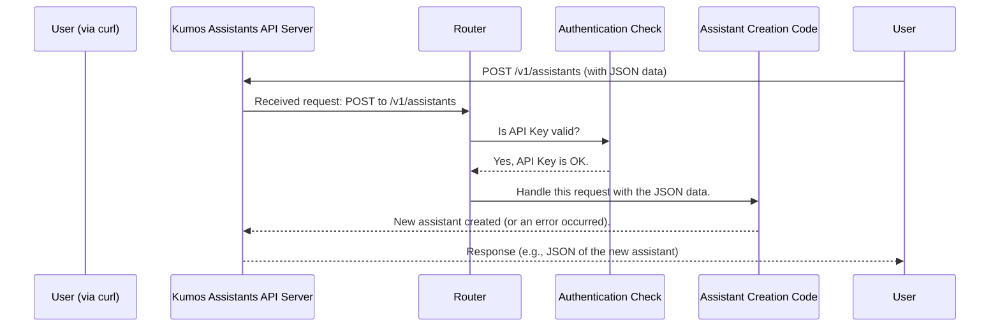

# Chapter 2: API Request Handling & Routing

In [Chapter 1: Agent & Tool Framework](01_agent___tool_framework_.md), we learned how AI "Agents" can be equipped with "Tools" to perform complex tasks. We even saw an example of how to tell `kumos-assistants-api` to create an Agent using an API request. But how does the server actually *receive* that request and know what to do with it?

That's where **API Request Handling & Routing** comes in. This chapter will explain how `kumos-assistants-api` acts like a smart traffic controller for all incoming API calls.

## What's the Big Deal? The Server's Front Door

Imagine you send a letter to a large company. You don't just throw it at the building; you put an address on it, and maybe a department name. Inside the company, someone (or a system) reads that address and makes sure your letter gets to the right person or department.

The **API Request Handling & Routing** system in `kumos-assistants-api` is like that company's mailroom and main switchboard operator, all in one.
*   It **listens** for incoming "calls" (API requests from your computer or application).
*   It **understands** what you're asking for based on the "address" (the URL) and the "type of request" (like "create something" or "get information").
*   It **validates** the request to make sure it's understandable and authorized.
*   Finally, it **routes** (directs) your request to the correct internal service or "department" that can actually do the work.

Without this system, your requests would just be floating in cyberspace with no one to receive or understand them!

**Our Use Case:** Let's go back to the example from Chapter 1 where we wanted to create a "Document Searcher" assistant. You sent a `curl` command:

```bash
curl -X POST http://localhost:3000/v1/assistants \
  -H "Authorization: Bearer sk-test-001" \
  -H "Content-Type: application/json" \
  -d '{
    "name": "Document Searcher",
    "instructions": "You are an AI assistant that helps find information in documents.",
    "model": "qwen3:4b",
    "tools": [{"type": "file_search"}]
  }'
```

How does `kumos-assistants-api` know that this `curl` command means "create a new assistant"? Let's find out.

## Key Concepts: Listening, Understanding, and Directing

1.  **API Endpoints (The "Addresses")**:
    *   An API endpoint is a specific URL where the API can be accessed. In our example, `http://localhost:3000/v1/assistants` is an endpoint.
    *   The path part (`/v1/assistants`) tells the server what kind of resource you're interested in (in this case, "assistants").
    *   `kumos-assistants-api` is designed to be **OpenAI-compatible**. This means it uses similar endpoint paths and expects requests in a format that matches the official OpenAI Assistants API. So, if you know how to talk to OpenAI's API, you'll feel right at home here.

2.  **HTTP Methods (The "Intentions")**:
    *   Along with the URL, requests come with an "HTTP method." Common ones are:
        *   `POST`: Typically used to create new resources (like our new assistant).
        *   `GET`: Used to retrieve existing resources (e.g., get a list of all assistants).
        *   `DELETE`: Used to remove resources.
        *   `PUT` or `PATCH` (sometimes `POST` is used too): Used to update existing resources.
    *   In our `curl` command, `-X POST` explicitly tells the server we intend to `POST` data, which usually means "create."

3.  **Request Handling (The "Receptionist")**:
    *   This is the part of the server that actively listens for network traffic on a specific port (like `3000` in `http://localhost:3000`).
    *   When a request comes in, it grabs all the details: the HTTP method, the URL path, any headers (like `Authorization` for API keys), and the main data (the "body" of the request, which is the JSON part in our `curl` command).

4.  **Routing (The "Switchboard Operator")**:
    *   Once a request is received and its method and path are known, the router decides which piece of internal code should handle it.
    *   For example, it knows that a `POST` request to `/v1/assistants` should be handled by the code responsible for creating new assistants. A `GET` request to the same `/v1/assistants` path would be routed to different code responsible for listing assistants.

5.  **Validation (The "Security Check")**:
    *   Before passing the request to the internal service, the system often performs checks:
        *   Is the API key valid? (Authentication)
        *   Does the user have permission to perform this action? (Authorization - though simpler in basic setups)
        *   Is the request data in the correct format? (e.g., is the JSON valid?)

## How `kumos-assistants-api` Handles Our Request

Let's trace what happens when you run that `curl` command to create the "Document Searcher":

1.  **You send the command.** Your computer sends an HTTP POST request to `http://localhost:3000/v1/assistants`.
2.  **The server is listening.** `kumos-assistants-api` (running on `localhost` at port `3000`) receives this network traffic.
3.  **The "Handler" gets the details.** It sees:
    *   Method: `POST`
    *   Path: `/v1/assistants`
    *   Headers: `Authorization: Bearer sk-test-001`, `Content-Type: application/json`
    *   Body: The JSON data describing your new assistant.
4.  **The "Router" makes a decision.**
    *   It looks at its list of known routes. It finds a match: "Ah, a `POST` to `/v1/assistants`! I know exactly which function handles that: the `create_assistant_handler` function."
5.  **Validation (Quick Check).**
    *   The system checks the `Authorization` header. If `sk-test-001` is a valid API key (as per the [README.md](README.md#api-key-configuration)), the request proceeds. If not, it would send back an error.
6.  **Call the right code.** The router passes the request data (especially the JSON body) to the `create_assistant_handler` function.
7.  **The handler does its job.** This function now uses the information (name, instructions, model, tools) to:
    *   Potentially interact with the [Agent & Tool Framework](01_agent___tool_framework_.md) to understand the capabilities.
    *   Save the new assistant's details into the [Data Persistence Layer](06_data_persistence_layer_.md).
    *   Prepare a response (usually a JSON confirming the creation and showing the new assistant's ID).
8.  **Response sent back.** The server sends this response back to your `curl` command, which then prints it on your screen.

Here's a simplified diagram of this flow:



## Under the Hood: A Peek at Axum Routes

`kumos-assistants-api` uses a Rust web framework called **Axum** to manage all this request handling and routing. You don't need to be a Rust expert, but seeing a little bit of how it's structured can be helpful.

Inside the `kumos-assistants-api` codebase (specifically, you might find similar logic in files like `src/routes/mod.rs` or `src/main.rs`), there's code that defines all the valid "addresses" (routes) the server understands.

Here's a very simplified conceptual example of how routes might be defined:

```rust
// Conceptual snippet (not exact code, but shows the idea)
// This code tells Axum what to do for different URLs and methods.

use axum::{routing::{post, get}, Router};

// Imagine these are functions defined elsewhere that do the actual work:
// async fn handle_create_assistant(/* ... */) { /* logic to create an assistant */ }
// async fn handle_list_assistants(/* ... */) { /* logic to list assistants */ }
// async fn handle_get_assistant_by_id(/* ... */) { /* logic to get one assistant */ }

pub fn setup_assistant_routes() -> Router {
    Router::new()
        .route(
            "/v1/assistants", // The URL path
            post(handle_create_assistant) // If POST, call handle_create_assistant
            .get(handle_list_assistants)    // If GET, call handle_list_assistants
        )
        .route(
            "/v1/assistants/:assistant_id", // Path with a variable part
            get(handle_get_assistant_by_id)     // If GET, call handle_get_assistant_by_id
        )
    // ... and many other routes for threads, messages, runs, etc.
}
```

Let's break this down:
*   `Router::new()`: Creates a new router.
*   `.route("/v1/assistants", ...)`: Defines what happens for requests to the `/v1/assistants` path.
    *   `post(handle_create_assistant)`: If the request method is `POST`, Axum should call the `handle_create_assistant` function.
    *   `get(handle_list_assistants)`: If the request method is `GET`, Axum should call `handle_list_assistants`.
*   `.route("/v1/assistants/:assistant_id", ...)`: This defines a route for getting a *specific* assistant.
    *   `:assistant_id` is a **path parameter**. It means this part of the URL is a variable. If you request `GET /v1/assistants/asst_abc123`, then `assistant_id` would be `asst_abc123`.
    *   `get(handle_get_assistant_by_id)`: This function would then receive `asst_abc123` and use it to fetch that specific assistant.

The actual handler functions (like `handle_create_assistant`) are usually found in files like `src/handlers/assistants.rs`. Here's a tiny glimpse of what such a function might look like conceptually:

```rust
// Conceptual snippet of a handler function
use axum::Json;
// These would be types defined by the async-openai crate or within kumos-assistants-api
// struct CreateAssistantRequest { /* ... fields like name, instructions ... */ }
// struct AssistantObject { /* ... fields like id, name, created_at ... */ }
// struct ApiError { /* ... */ } // For sending back errors

async fn handle_create_assistant(
    // Axum automatically takes the JSON from the request body
    // and tries to fit it into a CreateAssistantRequest struct.
    Json(payload): Json<CreateAssistantRequest>
) -> Result<Json<AssistantObject>, ApiError> { // It will return JSON or an error

    println!("Request to create assistant with name: {:?}", /* payload.name */ "some_name");

    // 1. VALIDATE the payload:
    //    e.g., Is the 'model' field supported? Are 'instructions' too long?
    //    If not valid, return an Err(ApiError::BadRequest(...)).

    // 2. DO THE WORK:
    //    Call internal services to actually create the assistant.
    //    This involves using the `payload` data.
    //    It will interact with the [Data Persistence Layer](06_data_persistence_layer_.md) to save it.
    //    let new_assistant = actual_create_assistant_logic(payload).await?; // This is where the magic happens

    // 3. RETURN SUCCESS:
    //    If everything went well, wrap the newly created assistant object in Json
    //    and send it back with a 200 OK (or 201 Created) status.
    //    Ok(Json(new_assistant))

    // For this example, we'll just pretend and return a placeholder error or success
    // This is highly simplified!
    Err(ApiError{ /* message: "Not fully implemented in this example" */ })
}
```
This function:
1.  Receives the JSON data sent by `curl` (Axum magically converts it into a `CreateAssistantRequest` Rust structure).
2.  (Ideally) Validates this data.
3.  Calls other parts of `kumos-assistants-api` to do the actual work of creating and saving the assistant. This is where it might use logic from the [Agent & Tool Framework](01_agent___tool_framework_.md) and store data using the [Data Persistence Layer](06_data_persistence_layer_.md).
4.  Sends back a JSON response.

## OpenAI Compatibility: Speaking the Same Language

A key feature of `kumos-assistants-api` is its aim for **OpenAI API compatibility**. This means that the routes and request/response formats are designed to match those of OpenAI's official Assistants API.

You can see this in the API Endpoints list in the project's `README.md`:
*   `POST /v1/assistants` - Create assistant
*   `GET /v1/assistants` - List assistants
*   `GET /v1/assistants/{id}` - Get assistant
*   `POST /v1/threads` - Create thread
*   `POST /v1/threads/{thread_id}/messages` - Create message in a thread
*   `POST /v1/threads/{thread_id}/runs` - Create a run (i.e., tell an assistant to process a thread)

The parts in curly braces like `{id}` or `{thread_id}` are path parameters, just like we saw with `:assistant_id`. The routing system extracts these values and makes them available to the handler functions.

This compatibility is great because:
*   If you've used OpenAI's API before, `kumos-assistants-api` will feel familiar.
*   Tools and libraries built to work with OpenAI's API (like client libraries in Python or JavaScript) can often be used with `kumos-assistants-api` with minimal changes (usually just changing the base URL).

## Conclusion

You've now seen how `kumos-assistants-api` acts as the main entry point for all API calls! It's like a diligent switchboard operator:

*   It **listens** for requests at specific URLs (endpoints).
*   It understands the **intent** (POST, GET, etc.) and the **resource** (`/assistants`, `/threads`).
*   It **validates** incoming requests (e.g., checks API keys).
*   It **routes** these requests to the correct internal code (handlers) that actually performs the actions, like creating an assistant or a message.
*   It leverages the Axum web framework in Rust to define these routes and handle requests efficiently.
*   Its design aims for **OpenAI compatibility**, making it easier to integrate into existing workflows.

So, when you make an API call to, say, start a new "run" for an assistant to process messages, this routing system is the first thing that springs into action.

Now that we understand how requests to *initiate* actions (like creating an assistant or starting a run) are received and directed, what happens next, especially when you ask an assistant to *do* something? In the next chapter, we'll dive into the [Run Execution Engine](03_run_execution_engine_.md), which manages the lifecycle of an assistant's task.

---

Generated by [AI Codebase Knowledge Builder](https://github.com/The-Pocket/Tutorial-Codebase-Knowledge)