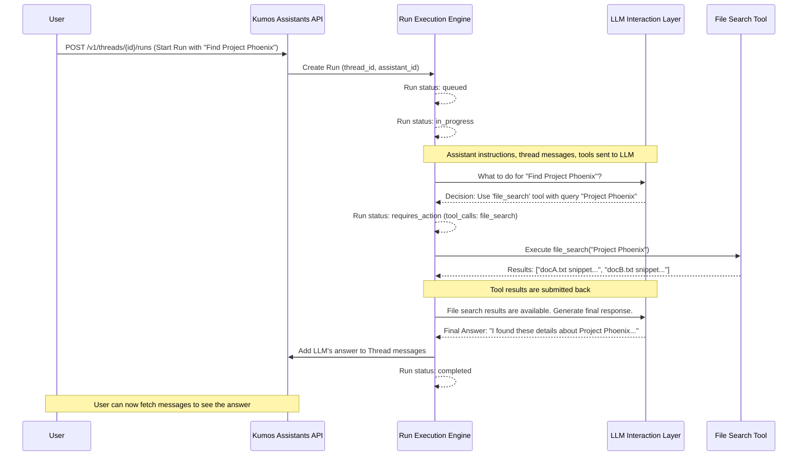

# Chapter 3: Run Execution Engine

In [Chapter 2: API Request Handling & Routing](02_api_request_handling___routing_.md), we saw how `kumos-assistants-api` receives your API requests and directs them to the right internal components. But what happens after you ask an assistant to actually *do* something, like process your messages and complete a task? That's where the **Run Execution Engine** steps in.

## What's the Big Idea? The Assistant's Project Manager

Imagine you have an assistant (like the "Document Searcher" we talked about in [Chapter 1: Agent & Tool Framework](01_agent___tool_framework_.md)). You give it a new task: "Find all documents related to 'Project Phoenix'."

Simply receiving this request isn't enough. Someone needs to:
1.  Actually start the work.
2.  Coordinate with the AI's "brain" (the LLM).
3.  Use any necessary tools (like file search).
4.  Keep track of whether the task is just starting, in progress, waiting for a tool, or finished.

The **Run Execution Engine** is like a dedicated project manager for each specific task your assistant undertakes. For every job you give your assistant, the engine creates a "Run." This "Run" represents the assistant's active work on that particular task. The engine manages this Run from start to finish, orchestrating all the necessary steps.

## Meet the "Run" and Its Lifecycle

When you ask an assistant to process messages in a conversation (a "Thread"), you are essentially creating a **Run**. This Run object is managed by the Run Execution Engine and goes through several stages, known as **statuses**:

*   `queued`: Your task is in line, waiting for its turn to be processed. Like waiting at a checkout counter.
*   `in_progress`: The assistant has picked up your task and is actively working on it. This usually means it's "thinking" with the LLM.
*   `requires_action`: The assistant has determined it needs to use one of its [Tools](01_agent___tool_framework_.md) (like `file_search`) to proceed. It's waiting for the tool to do its job and provide results.
*   `completed`: The assistant has successfully finished the task and has provided a response.
*   `failed`: Unfortunately, something went wrong, and the task could not be completed.
*   `cancelled`: You (or the system) decided to stop the task before it finished.
*   `expired`: The run took too long to complete and timed out.

The Run Execution Engine is responsible for moving the Run through these statuses as work progresses.

## Solving Our Use Case: Finding "Project Phoenix" Documents

Let's say we have our "Document Searcher" assistant (let's call its ID `asst_doc_searcher`) and a conversation thread (ID `thread_proj_phoenix`) where you've just added the message: "Find documents about 'Project Phoenix'."

To tell the assistant to process this message, you'd make an API call to create a Run. This is how you kick off the Run Execution Engine for this specific task:

```bash
curl -X POST http://localhost:3000/v1/threads/thread_proj_phoenix/runs \
  -H "Authorization: Bearer sk-test-001" \
  -H "Content-Type: application/json" \
  -d '{
    "assistant_id": "asst_doc_searcher"
  }'
```
Let's break this down:
*   `POST /v1/threads/thread_proj_phoenix/runs`: You're `POST`ing (creating) a new `run` for the thread `thread_proj_phoenix`.
*   `"assistant_id": "asst_doc_searcher"`: You're telling the system which assistant should handle this run.

When `kumos-assistants-api` receives this, the [API Request Handling & Routing](02_api_request_handling___routing_.md) system directs it to the part of the code that deals with Runs. The Run Execution Engine then swings into action:

1.  It creates a new Run object, associated with `thread_proj_phoenix` and `asst_doc_searcher`.
2.  Initially, this Run's status is set to `queued`.
3.  Very quickly (usually!), the engine picks it up and changes its status to `in_progress`.

Now the real work begins!

## Under the Hood: How the Engine Manages a Run

The Run Execution Engine is a critical piece of `kumos-assistants-api`. It acts as an orchestrator. Here's a step-by-step conceptual walkthrough of what happens after you create the run for "Project Phoenix":

1.  **Run Created & Queued**: Your API request creates a Run. It's initially `queued`.
2.  **Processing Begins**: The engine picks up the `queued` Run and changes its status to `in_progress`.
3.  **LLM Consultation (First Pass)**:
    *   The engine takes the assistant's instructions ("You are an expert at finding information..."), the conversation history from `thread_proj_phoenix` (including your "Find documents about 'Project Phoenix'" message), and the list of available tools (e.g., `file_search`).
    *   It sends all this to the [LLM Interaction Layer (Completer)](04_llm_interaction_layer__completer__.md). It's essentially asking the LLM: "Given all this, what should you do next?"
4.  **LLM Decides**:
    *   The LLM analyzes the request. It realizes that to find documents about "Project Phoenix," it needs to use the `file_search` tool.
    *   The LLM signals back: "I need to use the `file_search` tool with the query 'Project Phoenix'."
5.  **Transition to `requires_action`**:
    *   The Run Execution Engine sees the LLM's decision. It changes the Run's status to `requires_action`.
    *   It also records which tool needs to be called (`file_search`) and with what arguments (query: "Project Phoenix"). This is often called a "tool call."
6.  **Tool Execution**:
    *   The engine looks up the `file_search` tool in its [Agent & Tool Framework](01_agent___tool_framework_.md).
    *   It then executes the `file_search` tool with the query "Project Phoenix."
    *   The `file_search` tool does its job (searches your files) and returns the results (e.g., a list of document snippets).
7.  **Submitting Tool Outputs**:
    *   The engine takes these search results and prepares to send them back to the LLM.
    *   It creates a "tool output" and associates it with the Run. The Run is still `requires_action` or might briefly go back to `in_progress` while it submits this. Once submitted, the engine is waiting for the LLM again.
8.  **LLM Consultation (Second Pass)**:
    *   The engine sends the original context *plus* the `file_search` results back to the [LLM Interaction Layer (Completer)](04_llm_interaction_layer__completer__.md).
    *   It asks: "Okay, you wanted to search files, and here are the results. Now, what's the final answer for the user?"
9.  **LLM Formulates Response**: The LLM uses the search results to craft a human-friendly answer, like "I found three documents mentioning 'Project Phoenix': ..."
10. **Task Completion**:
    *   The engine receives this final response from the LLM.
    *   It adds this response as a new message to the `thread_proj_phoenix` (from the assistant).
    *   Finally, it changes the Run's status to `completed`.

The task is done! You can then retrieve the messages from the thread to see the assistant's answer.

Here's a diagram illustrating this flow:



## Inside the Engine: State Machine and Logic

The `kumos-assistants-api` project has a component often referred to as the **Run Executor** (you might find relevant code in `src/runs/` or a similar directory, as hinted in `CLAUDE.md` and `README.md`). This is the heart of the Run Execution Engine. It essentially implements a **state machine**. A state machine is a system that can be in one of several states, and it transitions between these states based on events or conditions.

Conceptually, the Run Executor might have logic that looks something like this (this is simplified pseudo-code, not exact Rust):

```rust
// Conceptual Rust-like pseudo-code for part of the Run Execution Engine

// This function might be called when a run needs processing
// async fn process_one_run_step(run: &mut RunObject) {
//
//   match run.status {
//     "queued" => {
//       // Transition to in_progress
//       run.status = "in_progress".to_string();
//       // Prepare to call the LLM for the first time
//       // ...
//     },
//     "in_progress" => {
//       // This state means we are waiting for the LLM to respond
//       // (or have just received its response)
//       // If LLM says "tool_calls":
//       //   run.status = "requires_action".to_string();
//       //   run.required_action = Some(llm_response.tool_calls);
//       // Else if LLM gives final answer:
//       //   add_message_to_thread(run.thread_id, llm_response.answer).await;
//       //   run.status = "completed".to_string();
//       // Else if LLM had an error:
//       //   run.status = "failed".to_string();
//     },
//     "requires_action" => {
//       // A tool needs to be called, or tool outputs need to be submitted
//       if run.has_pending_tool_calls() {
//         // For each tool_call:
//         //   let tool_result = execute_tool(tool_call.name, tool_call.arguments).await;
//         //   submit_tool_output_for_run(run, tool_call.id, tool_result).await;
//         // After submitting all outputs, the run will typically go back to LLM
//         // (often transitioning to in_progress or a similar state to indicate waiting for LLM)
//       } else {
//          // This state might also mean waiting for tool outputs to be provided by the user
//          // if the API supports submitting them explicitly. For now, let's assume auto-execution.
//       }
//     },
//     "completed" | "failed" | "cancelled" | "expired" => {
//       // Nothing more to do for this run
//     },
//     _ => { /* Handle unexpected status */ }
//   }
//
//   // After processing, save the updated Run object
//   // This interacts with the [Data Persistence Layer](06_data_persistence_layer_.md)
//   save_run_to_database(run).await;
//
//   // Optionally, send an event about the status change
//   // This would use the [Real-time Event Streaming](05_real_time_event_streaming_.md) system
//   // stream_event(run.thread_id, run.id, run.status).await;
// }
```

This pseudo-code illustrates:
*   The engine checks the current `status` of a Run.
*   Based on the status, it decides what action to take (e.g., call the LLM, execute a tool).
*   It updates the Run's `status` and other properties.
*   It saves these changes using the [Data Persistence Layer](06_data_persistence_layer_.md) so that the Run's current state is always stored.
*   It might also send out updates via [Real-time Event Streaming](05_real_time_event_streaming_.md) so that clients can be notified of progress without constantly asking.

The actual implementation in `kumos-assistants-api` is more complex and robust, handling various edge cases, errors, and timeouts, but this gives you the basic idea of its state-driven nature.

## Conclusion

The **Run Execution Engine** is the powerhouse that drives your AI assistant's ability to perform tasks. You've learned that:

*   It manages an assistant's active work on a task, called a **Run**.
*   A Run progresses through various **statuses** (like `queued`, `in_progress`, `requires_action`, `completed`) which reflect its current stage.
*   You initiate a Run by making an API call, typically `POST /v1/threads/{thread_id}/runs`.
*   The engine orchestrates the complex dance between your request, the [LLM Interaction Layer (Completer)](04_llm_interaction_layer__completer__.md) (the AI's brain), and any necessary [Tools](01_agent___tool_framework_.md) from the [Agent & Tool Framework](01_agent___tool_framework_.md).
*   It's like a state machine, continuously processing Runs based on their current status until they reach a final state.

This engine is crucial because it turns a static set of instructions and tools into a dynamic, problem-solving process.

Now that we understand *how* an assistant's task is managed, what about the "brain" itself? How does the assistant actually decide what to say or which tool to use? In the next chapter, we'll explore the [LLM Interaction Layer (Completer)](04_llm_interaction_layer__completer__.md), which is responsible for communicating with the Large Language Model.

---

Generated by [AI Codebase Knowledge Builder](https://github.com/The-Pocket/Tutorial-Codebase-Knowledge)