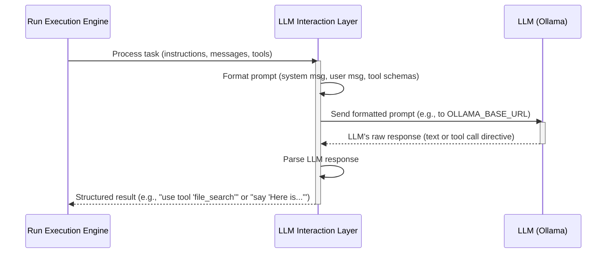

# Chapter 4: LLM Interaction Layer (Completer)

In [Chapter 3: Run Execution Engine](03_run_execution_engine_.md), we learned how the `kumos-assistants-api` manages an assistant's task using a "Run." We saw that the Run Execution Engine orchestrates the steps, including deciding when it's time to consult the AI's "brain" – the Large Language Model (LLM). But how does our system actually *talk* to this LLM? How does it ask questions and understand the answers?

That's the job of the **LLM Interaction Layer**, often called the **Completer**.

## What's the Big Idea? The Oracle's Translator

Imagine the LLM (like Ollama's `qwen3:4b` model) is a vastly knowledgeable but very particular oracle. You can't just shout a question at it. You need someone who understands:
*   How to phrase your request perfectly.
*   What information the oracle needs (like the assistant's purpose, the conversation so far, and any special tools the assistant can use).
*   How to interpret the oracle's sometimes cryptic replies, which might include instructions to perform specific actions.

The **LLM Interaction Layer (Completer)** is this specialized translator and envoy. It takes all the necessary information, formats it just right for the LLM, sends the request, and then carefully processes what the LLM says in return. This includes understanding if the LLM wants to provide a direct answer or if it's asking for a tool to be used.

**Our Use Case:** Let's go back to our "Document Searcher" assistant. In Chapter 3, we created a Run to find documents about "Project Phoenix." The [Run Execution Engine](03_run_execution_engine_.md) decided it was time to consult the LLM. It's the Completer layer's job to handle this consultation.

## Key Concepts: Talking to the Brain

1.  **The LLM: Your Assistant's "Brain"**:
    *   Large Language Models are powerful AI models trained on vast amounts of text. They are excellent at understanding language, generating text, answering questions, and even some forms of reasoning.
    *   In `kumos-assistants-api`, you can configure it to use LLMs like those provided by Ollama (e.g., `qwen3:4b` as mentioned in the `README.md`).

2.  **Crafting the "Prompt"**:
    *   You don't just send the user's latest message to the LLM. To get a good response, you need to give it context. This package of information is called a "prompt."
    *   The Completer assembles this prompt. It typically includes:
        *   **System Instructions**: The assistant's overall purpose (e.g., "You are an expert at finding information in documents.").
        *   **Conversation History**: The messages exchanged so far in the current "Thread."
        *   **Available Tools**: A description of any tools the assistant can use (like `file_search`), often in a special format the LLM understands (like JSON Schema).
        *   **User's Current Request**: The specific new message to process (e.g., "Find documents about 'Project Phoenix'").

3.  **Getting a "Completion" (The LLM's Response)**:
    *   The Completer sends this carefully crafted prompt to the LLM.
    *   The LLM processes the prompt and generates a "completion" – its response.
    *   This response can be:
        *   A direct text answer for the user.
        *   A "tool call" – an instruction for the assistant to use one ofits tools.

4.  **Interpreting Tool Calls**:
    *   If the LLM decides a tool is needed (e.g., "I need to search files to answer this"), it will say so in a structured way.
    *   The Completer must understand this "tool call" directive, extracting which tool to use and what inputs (arguments) to give it. For example, for `file_search`, the argument would be the search query like "Project Phoenix."

## How the Completer Helps Find "Project Phoenix"

Let's see how the Completer fits into our "Project Phoenix" document search:

1.  **The [Run Execution Engine](03_run_execution_engine_.md) needs the LLM's input.** It's at a point where it needs to decide what to do next with the user's request: "Find documents about 'Project Phoenix'."
2.  **The Engine calls the Completer.** It hands over:
    *   The assistant's instructions ("You are an expert at finding information...").
    *   The current conversation history (including "Find documents about 'Project Phoenix'").
    *   A list of the assistant's available tools (e.g., `file_search` and how to use it).
3.  **The Completer prepares the prompt.** It bundles all this information into a format the LLM (e.g., Ollama `qwen3:4b`) will understand. This might involve creating a sequence of "messages" with roles like `system`, `user`, and `assistant`.
4.  **The Completer sends the prompt to the LLM.** It makes an API call to the configured Ollama service.
5.  **The LLM responds.** In this case, the LLM, understanding its role and tools, might respond with something like: "To answer this, I need to use the `file_search` tool with the query 'Project Phoenix'."
6.  **The Completer parses the LLM's response.** It recognizes this is a tool call directive. It extracts:
    *   Tool to use: `file_search`
    *   Arguments: `query: "Project Phoenix"`
7.  **The Completer returns this structured information** to the [Run Execution Engine](03_run_execution_engine_.md).
8.  The Run Engine then proceeds to execute the `file_search` tool (as we saw in Chapter 3).

Later, after the `file_search` tool returns its results, the Run Engine will call the Completer *again*, this time providing the search results. The Completer will again talk to the LLM ("Here are the search results, now formulate a final answer"), and the LLM will generate the text that is finally shown to the user.

## Under the Hood: The Conversation with the LLM

The process of the Completer talking to the LLM is a critical exchange:



Let's break down some steps:

1.  **Gathering Information**: The Completer collects all pieces:
    *   **System Prompt**: The assistant's base instructions.
    *   **User Messages**: The history of the conversation.
    *   **Tool Definitions**: Descriptions of available tools, often in a format like JSON Schema, which tells the LLM what each tool does and what inputs it expects.

2.  **Formatting the Prompt**: LLMs that support "chat completions" (like many Ollama models and OpenAI models) expect the prompt as a sequence of messages, each with a "role" (`system`, `user`, `assistant`, or `tool`).

    Conceptually, building this list of messages might look like this (simplified):
    ```rust
    // Conceptual: Building the list of messages for the LLM
    // These types would come from a library like `async-openai`
    // use async_openai::types::{ChatCompletionRequestMessage, Role};

    // let mut messages_for_llm: Vec<ChatCompletionRequestMessage> = Vec::new();

    // // 1. System instruction
    // messages_for_llm.push(ChatCompletionRequestMessage {
    //     role: Role::System,
    //     content: Some("You are an expert at finding information in documents.".to_string()),
    //     // ... other fields like name, tool_calls might be None here
    //     tool_calls: None,
    //     tool_call_id: None,
    //     name: None,
    // });

    // // 2. User's query
    // messages_for_llm.push(ChatCompletionRequestMessage {
    //     role: Role::User,
    //     content: Some("Find documents about 'Project Phoenix'".to_string()),
    //     tool_calls: None,
    //     tool_call_id: None,
    //     name: None,
    // });

    // (If there were previous assistant messages or tool results, they'd be added here too)
    ```
    This Rust-like snippet shows how instructions and user queries become distinct messages in a list.

3.  **Describing Tools to the LLM**: If the assistant has tools, their definitions are also sent. This allows the LLM to "know" what tools it can ask the system to use. The `async-openai` crate provides structures for defining these tools.

4.  **Making the API Call**: The Completer then uses an HTTP client (often parts of the `async-openai` crate, configured with `OLLAMA_BASE_URL` and `OLLAMA_MODEL` from your server settings) to send this data to the LLM service (e.g., your local Ollama).

    A conceptual call:
    ```rust
    // Conceptual: Sending the request to an Ollama-compatible API
    // use async_openai::types::{CreateChatCompletionRequestArgs, ChatCompletionTool};
    // use async_openai::Client; // The client from async-openai

    // async fn ask_the_llm(
    //     messages: Vec<ChatCompletionRequestMessage>,
    //     tools_definitions: Option<Vec<ChatCompletionTool>>
    // ) -> Result<String, String> { // Simplified result: String or Error String
    //     // Client would be initialized with Ollama base URL and model
    //     let client = Client::new(); // Simplified: actual client needs config

    //     let request = CreateChatCompletionRequestArgs::default()
    //         .model("qwen3:4b") // This would come from config
    //         .messages(messages)
    //         .tools(tools_definitions.unwrap_or_default()) // Provide tools if any
    //         // .temperature(0.7) // Optional: influences creativity
    //         // .stream(false) // For non-streaming completion
    //         .build()
    //         .map_err(|e| e.to_string())?;

    //     let response = client.chat().create(request).await.map_err(|e| e.to_string())?;

    //     // Process the 'response' to get text or tool_calls
    //     // This is where we check if the LLM wants to use a tool
    //     // or if it provided a direct answer.
    //     // For simplicity, let's imagine it's just a text response for now.
    //     if let Some(choice) = response.choices.first() {
    //         Ok(choice.message.content.clone().unwrap_or_default())
    //     } else {
    //         Err("No response from LLM".to_string())
    //     }
    // }
    ```
    This simplified snippet shows how a request is built (using `async-openai` patterns) and sent. The actual `kumos-assistants-api` code for this resides in places like `src/completers/openai.rs` (as hinted in `CLAUDE.md`), which implements a `Completer` trait.

5.  **Parsing the LLM's Response for Tool Calls**:
    If the LLM decides to use a tool, its response will contain specific "tool_calls" information. The `async-openai` library helps parse this. A conceptual LLM JSON response snippet indicating a tool call might look like:
    ```json
    {
      "choices": [
        {
          "message": {
            "role": "assistant",
            "content": null, // No direct text message
            "tool_calls": [
              {
                "id": "call_随机ID例如call_123xyz",
                "type": "function",
                "function": {
                  "name": "file_search",
                  "arguments": "{\"query\":\"Project Phoenix\"}"
                }
              }
            ]
          }
          // ... other choice details
        }
      ]
      // ... other response fields
    }
    ```
    The Completer layer is responsible for extracting the `name: "file_search"` and the `arguments: "{\"query\":\"Project Phoenix\"}"` from such a structure. It then passes this information back to the [Run Execution Engine](03_run_execution_engine_.md).

## The `Completer` in `kumos-assistants-api`

As suggested by the `CLAUDE.md` file, `kumos-assistants-api` likely has a `Completer` trait (a Rust feature for defining shared behavior) located around `src/completers/mod.rs`. An implementation like `OpenAICompleter` (in `src/completers/openai.rs`) would handle the actual communication with Ollama or any other OpenAI-compatible LLM API. This design makes it flexible to potentially support different LLM backends in the future.

This layer is the bridge that allows the structured logic of `kumos-assistants-api` to leverage the powerful, but less structured, capabilities of a Large Language Model.

## Conclusion

The **LLM Interaction Layer (Completer)** is the essential diplomat that communicates with your AI assistant's "brain." You've learned that:

*   It acts as a **translator** between the `kumos-assistants-api` system and the Large Language Model (like Ollama).
*   It carefully **crafts prompts** by combining assistant instructions, conversation history, available tool definitions, and the user's current query.
*   It sends these prompts to the LLM and **parses the LLM's responses**.
*   Crucially, it can understand when the LLM wants to **use a tool** and extracts the necessary information (tool name and arguments).
*   This layer uses libraries like `async-openai` to handle the low-level details of API communication and data formatting, following OpenAI-compatible standards.

Without this layer, the [Run Execution Engine](03_run_execution_engine_.md) would have no way to get the "thoughts" or directives from the LLM that are needed to proceed with a task.

So far, we've seen how an assistant processes tasks and even uses tools. But often, users want to see progress as it happens, not just wait for the final result. How does `kumos-assistants-api` provide these live updates? In the next chapter, we'll explore [Real-time Event Streaming](05_real_time_event_streaming_.md).

---

Generated by [AI Codebase Knowledge Builder](https://github.com/The-Pocket/Tutorial-Codebase-Knowledge)