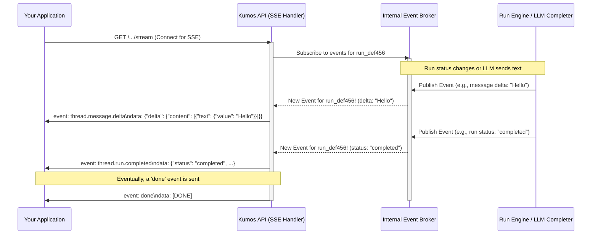

# Chapter 5: Real-time Event Streaming

In [Chapter 4: LLM Interaction Layer (Completer)](04_llm_interaction_layer__completer__.md), we saw how `kumos-assistants-api` communicates with the Large Language Model (LLM) – the AI's brain – to get decisions and generate text. But what if the LLM is generating a long response, or if an assistant's task involves several steps? Do you, the user, have to wait in silence until everything is completely finished? That wouldn't be very interactive!

This chapter introduces **Real-time Event Streaming**, a feature that allows `kumos-assistants-api` to send you live updates as things happen.

## What's the Big Idea? No More "Are We There Yet?"

Imagine you're chatting with an AI assistant. You ask it to summarize a long document. If the system didn't have real-time streaming, you'd send your request and then... wait. Maybe for a few seconds, maybe longer. You wouldn't know if it's working, stuck, or almost done. It's like asking "Are we there yet?" on a long car ride.

**Real-time Event Streaming** solves this. It's like getting a live play-by-play commentary.
*   If the assistant is generating text, you can see the words appear one by one, just like in popular AI chat interfaces.
*   If the assistant is performing a task with multiple steps (like using a tool), you can get updates on its progress: "Now searching files...", "File search complete, now analyzing...", etc.

This makes the interaction feel much more responsive and alive. You're not left guessing; you see things happening in real-time.

**Our Use Case:** Let's say our "Document Searcher" assistant (from [Chapter 1: Agent & Tool Framework](01_agent___tool_framework_.md)) is asked to "Summarize 'Project Dragon' based on all available files." This might take a little while. With real-time event streaming, as the assistant starts writing the summary, your application could display the summary text as it's being generated, word by word.

## Meet Server-Sent Events (SSE): Your Live News Feed

`kumos-assistants-api` uses a technology called **Server-Sent Events (SSE)** to achieve this real-time streaming.

Think of SSE like subscribing to a live news feed or listening to a radio broadcast:
1.  **You (the client application) "tune in"**: Your application makes a special kind of request to a streaming endpoint on the `kumos-assistants-api` server. This keeps the connection open.
2.  **The Server "broadcasts" updates**: As events happen on the server (like a new word being generated for a message, or a run changing its status), the server sends a small piece of data (an "event") over that open connection.
3.  **You receive updates instantly**: Your application receives these events as they are sent and can immediately use them to update what the user sees.

It's a one-way street: the server sends updates to the client. The client doesn't use this connection to send data back; it just listens.

## Streaming in `kumos-assistants-api`

When you create a "Run" (as we learned in [Chapter 3: Run Execution Engine](03_run_execution_engine_.md)) to have an assistant process messages, you can choose to receive updates for this Run via streaming.

### What Kinds of Updates Can You Get?

The `kumos-assistants-api` can stream various types of events, aiming to be compatible with the OpenAI Assistants API. These events tell you about the progress of a Run and the messages being created or modified. Some common event types include:

*   **Run Status Updates**:
    *   `thread.run.created`: A new run has started.
    *   `thread.run.queued`: The run is waiting its turn.
    *   `thread.run.in_progress`: The run is actively being processed.
    *   `thread.run.requires_action`: The run needs a tool to be called.
    *   `thread.run.completed`: The run has finished successfully.
    *   `thread.run.failed`: The run encountered an error.
*   **Message Creation & Updates**:
    *   `thread.message.created`: A new message (usually from the assistant) has been fully created.
    *   `thread.message.delta`: This is key for seeing text appear word-by-word! A "delta" means a small *change* or *addition* to a message's content. As the LLM generates text, the server sends many `thread.message.delta` events, each with a new snippet of text.
*   **Tool Call Updates**:
    *   `thread.run.step.created`: A new step in the run (often a tool call) has started.
    *   `thread.run.step.delta`: Updates to a tool call's progress or output, piece by piece.
    *   `thread.run.step.completed`: A tool call step has finished.

### How to Connect and "Tune In"

To get these live updates, your application needs to make a `GET` request to a specific streaming endpoint. The `README.md` lists these under "Streaming":
*   `GET /v1/threads/{thread_id}/runs/{run_id}/stream`: To get events for a *specific run* within a thread.
*   `GET /v1/threads/{thread_id}/runs/stream`: To get events for *all runs* in a thread (less common for simple use cases).

Let's say you have a thread `thread_abc123` and you've just started a run `run_def456`. To stream events for this specific run, you (or your client application) would make a request similar to this using `curl`:

```bash
curl -N \
  -H "Authorization: Bearer sk-test-001" \
  http://localhost:3000/v1/threads/thread_abc123/runs/run_def456/stream
```

Let's break this down:
*   `curl`: The command-line tool to make web requests.
*   `-N`: This tells `curl` not to buffer the output. It's important for seeing events as they arrive.
*   `-H "Authorization: Bearer sk-test-001"`: You still need to provide your API key.
*   `http://localhost:3000/v1/threads/thread_abc123/runs/run_def456/stream`: This is the streaming endpoint for your specific run.

When you run this, `curl` will keep the connection open, and as `kumos-assistants-api` processes `run_def456`, it will send events that will appear in your terminal.

### What the Client Sees: The Event Format

The events are sent in a specific format. Each event typically has an `event:` line telling you the type of event, and a `data:` line containing a JSON object with the actual information.

Here's a simplified example of what you might see if the assistant is starting to generate a message:

```
event: thread.run.in_progress
data: {"id": "run_def456", "status": "in_progress", ...other_run_details...}

event: thread.message.delta
data: {"id": "msg_xyz789", "delta": {"content": [{"type": "text", "text": {"value": "Hello", "annotations": []}}]}}

event: thread.message.delta
data: {"id": "msg_xyz789", "delta": {"content": [{"type": "text", "text": {"value": ",", "annotations": []}}]}}

event: thread.message.delta
data: {"id": "msg_xyz789", "delta": {"content": [{"type": "text", "text": {"value": " world", "annotations": []}}]}}

# ... more events like status changes, or more message deltas ...

event: thread.run.completed
data: {"id": "run_def456", "status": "completed", ...other_run_details...}

event: done
data: [DONE]
```

Your application would parse these:
*   It sees `event: thread.message.delta`.
*   It looks at the `data:` line, parses the JSON, and finds `delta.content[0].text.value`.
*   It then appends this new piece of text ("Hello", then ",", then " world") to what's already displayed for that message.
*   When it sees `event: done` and `data: [DONE]`, it knows the stream for that particular operation (like generating a response) has finished.

This is how you get that "typing effect"!

## Under the Hood: How Does It Work? The Internal "Radio Station"

So, how does `kumos-assistants-api` actually send these updates? Imagine an internal "radio station" or an event broker.

1.  **Something Happens**:
    *   The [Run Execution Engine](03_run_execution_engine_.md) updates a Run's status (e.g., from `in_progress` to `requires_action`).
    *   The [LLM Interaction Layer (Completer)](04_llm_interaction_layer__completer__.md) receives a new chunk of text from the LLM.
2.  **Event Published Internally**: The part of the system that caused the event (e.g., the Run Engine or the Completer) "publishes" this event to an internal message bus or channel. Think of this as the radio DJ announcing something.
3.  **Streaming Handler is Listening**: When you connect to a streaming API endpoint (like `/v1/threads/.../stream`), a special request handler in `kumos-assistants-api` starts listening to this internal message bus for events related to your specific run or thread.
4.  **Event Forwarded to You**: When the handler "hears" an event on the bus that's relevant to you, it formats it as an SSE message (with `event:` and `data:` lines) and sends it down the open connection to your client.

Here's a simplified diagram:



### A Glimpse at the Code (Conceptual)

The `kumos-assistants-api` project likely has a dedicated part for streaming, possibly in `src/streaming/`. The `README.md` mentions an "In-memory broker using Tokio channels for real-time updates," and `CLAUDE.md` confirms this with "Streaming System (`src/streaming/`) ... using Tokio broadcast channels."

**1. Publishing an Event (Conceptual)**:
When, for example, the [LLM Interaction Layer (Completer)](04_llm_interaction_layer__completer__.md) gets a piece of text from the LLM, it might do something like this (highly simplified):

```rust
// This is very conceptual and simplified Rust-like code.
// Assume 'event_broker' is a shared component.
// Assume 'StreamEvent' is a type that can represent different kinds of updates.

// fn on_llm_text_received(run_id: &str, text_chunk: &str, event_broker: &EventBroker) {
//   let message_delta_event = StreamEvent::MessageDelta {
//       run_id: run_id.to_string(),
//       content_delta: text_chunk.to_string(),
//       // ... other details
//   };
//
//   // The broker sends this event to any interested listeners
//   event_broker.publish(message_delta_event);
// }
```
This `event_broker.publish(...)` call would use something like a Tokio broadcast channel's `send` method.

**2. The SSE Handler (Conceptual)**:
The Axum handler for an SSE endpoint (like `/v1/threads/{thread_id}/runs/{run_id}/stream`) would subscribe to the event broker for events related to that specific `run_id`.

```rust
// Very conceptual Axum handler for SSE
// use axum::response::sse::{Event, Sse};
// use futures_util::stream::{Stream, StreamExt}; // For mapping events
// use tokio_stream::wrappers::BroadcastStream;

// async fn stream_run_events_handler(
//     // run_id would be extracted from the path
//     // event_broker would be a shared state (e.g., Arc<EventBroker>)
//     run_id: String,
//     event_broker: EventBroker,
// ) -> Sse<impl Stream<Item = Result<Event, YourErrorType>>> {
//
//     // 1. Subscribe to the broker for events for this run_id
//     let mut receiver = event_broker.subscribe_to_run_events(&run_id);
//
//     // 2. Create a stream that transforms internal events to SSE 'Event' objects
//     let stream = async_stream::stream! {
//         // Wrap the broadcast receiver in a stream that handles potential lag
//         let mut broadcast_stream = BroadcastStream::new(receiver);
//
//         while let Some(internal_event_result) = broadcast_stream.next().await {
//             match internal_event_result {
//                 Ok(internal_event) => {
//                     // Convert your internal event type to an axum::response::sse::Event
//                     // This involves setting event.event (e.g., "thread.message.delta")
//                     // and event.data (the JSON string).
//                     let sse_event = convert_to_sse_event(internal_event);
//                     yield Ok(sse_event);
//                 }
//                 Err(_e) => {
//                     // Handle errors, maybe send an error event or break
//                     // For example, if the receiver lagged too much.
//                     // yield Err(YourErrorType::StreamLagged);
//                     break;
//                 }
//             }
//         }
//         // Optionally send a final "done" message or close marker if appropriate
//         // For OpenAI compatibility, a final `event: done\ndata: [DONE]\n\n` is standard.
//         let done_event = Event::default().event("done").data("[DONE]");
//         yield Ok(done_event);
//     };
//
//     Sse::new(stream)
// }

// fn convert_to_sse_event(internal_event: YourInternalStreamEvent) -> Event {
//     // Logic to format internal_event into an SSE Event
//     // Set event name (e.g., "thread.message.delta")
//     // Set data (JSON string of the event details)
//     // ...
//     Event::default() // Placeholder
// }
```
This conceptual code shows how the handler would:
*   Get a receiver from the Tokio broadcast channel (our `event_broker`).
*   Create a stream that listens to this receiver.
*   For each internal event received, convert it into the `axum::response::sse::Event` format (which sets the `event:` and `data:` fields).
*   Axum's `Sse` response type takes this stream and handles sending the events to the client.

This mechanism allows `kumos-assistants-api` to efficiently push updates to many connected clients without them needing to constantly ask "Is there anything new?"

## Conclusion

Real-time Event Streaming is a powerful feature that dramatically improves the user experience when interacting with AI assistants. You've learned that:

*   It solves the "are we there yet?" problem by providing **live updates** as tasks progress or text is generated.
*   `kumos-assistants-api` uses **Server-Sent Events (SSE)**, a technology where the server can push data to clients over an open connection.
*   Clients "tune in" by connecting to specific streaming API endpoints.
*   Events like run status changes, message content deltas (for word-by-word text generation), and tool call progress are streamed.
*   Internally, this is often managed by an **event broker** (like Tokio broadcast channels) that distributes events from where they happen (e.g., the Run Engine) to the SSE handlers connected to clients.

This makes interactions feel more dynamic and transparent.

So far, we've seen how assistants are defined, how requests are handled, how tasks are executed, how the AI "thinks," and how we get live updates. But where is all this information about assistants, threads, messages, and runs stored? In the next chapter, we'll explore the [Data Persistence Layer](06_data_persistence_layer_.md).

---

Generated by [AI Codebase Knowledge Builder](https://github.com/The-Pocket/Tutorial-Codebase-Knowledge)