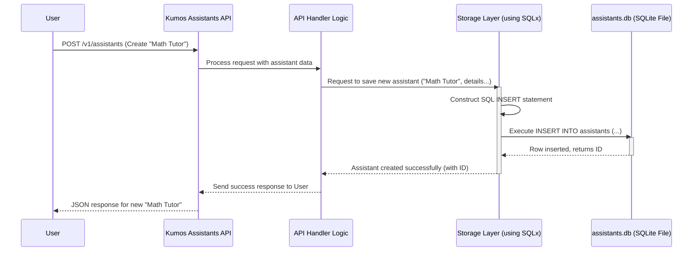

# Chapter 6: Data Persistence Layer

Welcome to the final chapter of our foundational tour through `kumos-assistants-api`! In [Chapter 5: Real-time Event Streaming](05_real_time_event_streaming_.md), we saw how you can get live updates as your assistant works. But what happens to all the information you create – your assistants, conversations, and messages – when the server stops or restarts? How does the system remember everything?

That's the crucial role of the **Data Persistence Layer**.

## What's the Big Idea? The System's Memory

Imagine building an amazing AI assistant, having a long conversation with it, and then, if the server restarts, *poof*! Everything is gone. That would be terrible! You need a way for the system to remember all the important data.

The **Data Persistence Layer** is essentially the system's long-term memory.
*   It's responsible for **storing** all crucial data: your assistant configurations, the conversation threads, every message exchanged, and the status of any tasks (Runs) your assistant undertakes.
*   It's also responsible for **retrieving** this data whenever it's needed.

Think of it like a highly organized digital filing cabinet. Information is securely stored and can be easily found and accessed. This ensures **data durability** – meaning your data survives even if the server restarts.

In `kumos-assistants-api`, this digital filing cabinet is powered by **SQLite**.

## Our Use Case: Remembering the "Math Tutor"

Let's say you create an assistant using an API call, like the "Math Tutor" example from the `README.md` (and similar to what we discussed in [Chapter 1: Agent & Tool Framework](01_agent___tool_framework_.md)):

```bash
curl -X POST http://localhost:3000/v1/assistants \
  -H "Authorization: Bearer sk-test-001" \
  -H "Content-Type: application/json" \
  -d '{
    "name": "Math Tutor",
    "instructions": "You are a helpful math tutor.",
    "model": "qwen3:4b",
    "tools": [{"type": "file_search"}]
  }'
```

When `kumos-assistants-api` receives this, it's not enough for it to just process the request in memory. For "Math Tutor" to exist tomorrow, or after a server reboot, its details (name, instructions, model, tools) must be saved somewhere permanent. This is where the Data Persistence Layer steps in. It takes these details and writes them to the SQLite database.

Later, if you ask the API to list your assistants (`GET /v1/assistants`), the system will query the Data Persistence Layer, which will retrieve the "Math Tutor" (and any other assistants you've created) from the database and show them to you.

## SQLite: Our Reliable Digital Filing Cabinet

`kumos-assistants-api` uses **SQLite** as its database. SQLite is a popular choice for many applications because:
*   It's **serverless**: It doesn't require a separate server process to run.
*   It's **file-based**: The entire database (all your assistants, threads, messages, etc.) is stored in a single file on the server's disk.
*   It's **reliable and efficient** for the scale of many applications.

You configure where this database file is located using the `DATABASE_URL` environment variable.
*   By default, it might be `sqlite:./assistants.db` (a file named `assistants.db` in the current directory).
*   When using Docker, as shown in the `README.md` and `Dockerfile`, it's often set to something like `sqlite:/data/assistants.db`. This means the database file is stored in a `/data` directory, which can be mapped to a folder on your host machine to ensure the data persists even if the Docker container is removed and recreated.

This `assistants.db` file is where all the magic of remembering happens!

## What Gets Stored? The Contents of Our Cabinet

The Data Persistence Layer is responsible for managing several key types of data. The `README.md` mentions the main database tables used:

*   `assistants`: Stores the definitions of all your assistants – their names, instructions, which LLM model they use, and what tools they have.
*   `threads`: Represents the conversation sessions. Each thread is like a separate chat log.
*   `messages`: Holds all the individual messages within each thread, including who sent them (user or assistant) and the content of the message.
*   `runs`: Keeps track of every task an assistant undertakes. This includes the run's status (e.g., `queued`, `in_progress`, `completed`, `failed`), which thread it belongs to, and which assistant is performing it.
*   `run_steps`: For runs that involve multiple steps (like using a tool), this table stores details about each individual step.

Every time you create an assistant, start a new thread, send a message, or initiate a run, the Data Persistence Layer writes this information into the appropriate tables in the SQLite database.

## Under the Hood: How Data is Saved and Fetched

Let's trace what happens when you create our "Math Tutor" assistant, focusing on the persistence aspect:

1.  **API Request**: You send the `POST /v1/assistants` request.
2.  **Handling & Routing**: The [API Request Handling & Routing](02_api_request_handling___routing_.md) system directs this to the code responsible for creating assistants (an "API Handler").
3.  **Handler Prepares Data**: The handler function takes the JSON data you sent (name, instructions, etc.) and prepares it.
4.  **Call to Storage Layer**: The handler then calls a function in the Data Persistence Layer (often called the "Storage Layer"). This might look conceptually like `storage_module.create_assistant(assistant_data)`.
5.  **SQL Query Construction**: Inside the Storage Layer, a SQL (Structured Query Language) command is constructed. For creating an assistant, this would be an `INSERT` statement, something like:
    `INSERT INTO assistants (id, name, instructions, model, tools_json, ...) VALUES (?, ?, ?, ?, ?, ...);`
6.  **Database Interaction**: The Storage Layer uses a Rust library called `sqlx` to send this SQL command to the SQLite database file.
7.  **Data Saved**: SQLite executes the command, and a new row representing "Math Tutor" is added to the `assistants` table in the `assistants.db` file.
8.  **Response**: The Storage Layer confirms success (perhaps returning the new assistant's ID), and this information flows back through the handler to you as an API response.

Here’s a simplified diagram of this interaction:



When you later request data (e.g., `GET /v1/assistants/{assistant_id}`), a similar process occurs, but the Storage Layer constructs a `SELECT` SQL query to fetch the data from the SQLite database.

## A Peek at the Code (Conceptual)

The `kumos-assistants-api` uses `sqlx`, a modern Rust library for interacting with SQL databases. It's known for being asynchronous (fitting well with Axum) and for its ability to check your SQL queries at compile-time (which helps catch errors early). You might find the core storage logic in files like `src/storage/sqlite.rs`, as hinted by the project's `CLAUDE.md` guide.

Here’s a very simplified conceptual idea of what a function to save an assistant might look like using `sqlx`:

```rust
// --- Conceptual Rust Snippet (Highly Simplified) ---
// This is NOT exact code from the project, but illustrates the idea.

// Assume 'pool' is a sqlx::SqlitePool, a connection pool to your SQLite database.
// Assume 'request' is an object containing the assistant's details.
// Assume 'AssistantObject' is the structure for the assistant to be returned.

async fn save_assistant_to_db(
    pool: &sqlx::SqlitePool,
    org_user_id: &str, // For multi-tenancy
    request: CreateAssistantRequest // Data from the API call
) -> Result<AssistantObject, sqlx::Error> {

    let assistant_id = format!("asst_{}", "random_unique_string"); // Generate a new ID
    let tools_json = serde_json::to_string(&request.tools).unwrap_or_else(|_| "[]".to_string());

    // sqlx::query! macro can check SQL at compile time if migrations are set up
    let record = sqlx::query!(
        r#"
        INSERT INTO assistants (id, name, instructions, model, tools, org_user_id, created_at)
        VALUES ($1, $2, $3, $4, $5, $6, $7)
        RETURNING id, name, instructions, model, tools, org_user_id, created_at
        "#,
        assistant_id,
        request.name,
        request.instructions,
        request.model,
        tools_json, // Tools are often stored as a JSON string
        org_user_id,
        chrono::Utc::now().timestamp_millis() // Store time as milliseconds
    )
    .fetch_one(pool) // Execute the query and expect one row back
    .await?;

    // Convert the database record to an AssistantObject to return
    Ok(AssistantObject {
        id: record.id,
        name: record.name,
        // ... and so on for other fields
        // Note: Timestamps from DB (millis) might need conversion to seconds for API response
    })
}
```

In this conceptual snippet:
*   An SQL `INSERT` statement is defined. The `$1, $2, ...` are placeholders for values.
*   `sqlx::query!(...).fetch_one(pool).await` executes the query. `sqlx` handles sending it to SQLite and getting the result.
*   If successful, the newly created assistant's details (retrieved by `RETURNING ...`) are used to build the response.

**Database Migrations**:
You might have noticed a `migrations` folder mentioned in the `Dockerfile` and `README.md`. `sqlx` uses a "migrations" system. Migrations are a set of SQL files that define and update your database structure (schema). For example, a migration file might contain `CREATE TABLE assistants (...)` to create the assistants table with all its columns and types.
When the application starts (or during the build process as seen in the `Dockerfile` with `sqlx migrate run`), `sqlx` can apply these migrations to ensure the database schema is up-to-date with what the code expects. This is crucial for maintaining consistency between your code and the database.

## Ensuring Your Data Lasts

The beauty of this persistence layer is its durability.
*   Because all your data is written to the `assistants.db` file (or whatever your `DATABASE_URL` points to).
*   If the `kumos-assistants-api` server process stops and restarts, as long as it can access that same database file, all your assistants, threads, messages, and run histories will still be there.
*   This is why Docker configurations for `kumos-assistants-api` (like in the `README.md`) emphasize using volumes (e.g., `-v $(pwd)/data:/data`). This maps a directory on your host computer to the `/data` directory inside the container. The SQLite database file `assistants.db` is then stored in this mapped directory, ensuring it survives even if the container is stopped, removed, and a new one is started.

Without this persistence layer, `kumos-assistants-api` would have amnesia every time it restarted!

## Conclusion: The System Remembers!

You've now reached the end of our tour through the core components of `kumos-assistants-api`! In this chapter, we've uncovered the importance of the **Data Persistence Layer**:

*   It acts as the system's **long-term memory**, ensuring that crucial data like assistant configurations, conversation threads, messages, and run statuses are not lost.
*   It uses **SQLite** as its database, storing all information in a single file (e.g., `assistants.db`).
*   The Rust library **`sqlx`** is used to interact with the SQLite database, executing SQL commands to save and retrieve data.
*   **Database migrations** ensure the database structure is correctly defined and updated.
*   This layer is what gives `kumos-assistants-api` its **durability**, allowing your data to persist across server restarts.

Understanding these six core components – from the [Agent & Tool Framework](01_agent___tool_framework_.md) defining what assistants *can do*, to the [API Request Handling & Routing](02_api_request_handling___routing_.md) that welcomes your requests, the [Run Execution Engine](03_run_execution_engine_.md) that manages tasks, the [LLM Interaction Layer (Completer)](04_llm_interaction_layer__completer__.md) that talks to the AI's brain, [Real-time Event Streaming](05_real_time_event_streaming_.md) for live updates, and finally, this Data Persistence Layer that remembers everything – gives you a solid foundation for using and appreciating the `kumos-assistants-api`.

With these pieces working together, `kumos-assistants-api` provides a powerful and robust platform for building and deploying your own AI assistants! We hope this tour has been helpful for your journey into the world of AI assistants.

---

Generated by [AI Codebase Knowledge Builder](https://github.com/The-Pocket/Tutorial-Codebase-Knowledge)