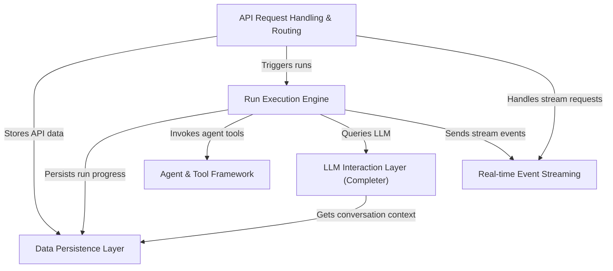

# Tutorial: kumos-assistants-api

The `kumos-assistants-api` project is a *Rust-based server* that mimics OpenAI's Assistants API.
It allows you to create and manage **AI assistants** that can perform tasks using *tools* (like file search or code interpretation) and interact with Large Language Models (LLMs) like Ollama.
The server supports **real-time updates** via streaming, so you can see messages and run progress live, and it *securely stores* all assistant configurations, conversation threads, messages, and run statuses.

**Source Repository:** [None](None)

## Chapters

1. [Agent & Tool Framework
](01_agent___tool_framework_.md)
2. [API Request Handling & Routing
](02_api_request_handling___routing_.md)
3. [Run Execution Engine
](03_run_execution_engine_.md)
4. [LLM Interaction Layer (Completer)
](04_llm_interaction_layer__completer__.md)
5. [Real-time Event Streaming
](05_real_time_event_streaming_.md)
6. [Data Persistence Layer
](06_data_persistence_layer_.md)

---

Generated by [AI Codebase Knowledge Builder](https://github.com/The-Pocket/Tutorial-Codebase-Knowledge)