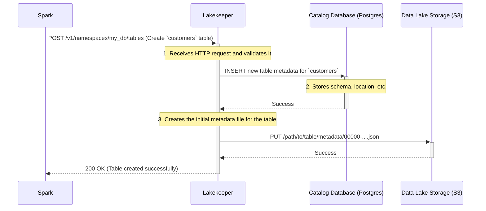

# Chapter 1: Iceberg REST Catalog Implementation

Welcome to the world of Lakekeeper! In this first chapter, we'll explore the most fundamental concept at the heart of the project. We'll learn what it means for Lakekeeper to be an "Iceberg REST Catalog" and why that's so important for building a modern data lakehouse.

### The Problem: A Messy Data Warehouse

Imagine you have a giant digital warehouse where you store all your company's data. This warehouse is called a "data lake." You have data coming in from everywhere: sales reports, user activity logs, marketing analytics, and more.

Initially, you just dump files into this warehouse. But soon, you face a huge problem:
- How do you know which files belong to which dataset?
- What's the structure (the columns and data types) of the data in those files?
- How can you read data from yesterday without accidentally including data from today?
- How can different tools (like Spark for processing and Trino for querying) all work with this data consistently?

Without a system to manage this, your data lake quickly becomes a "data swamp"—a messy, unusable collection of files.

This is where Apache Iceberg and Lakekeeper come in.

### The Solution: A Library for Your Data

Apache Iceberg is a table format that brings order to your data lake. It tracks every file, every schema change, and every version of your data over time. But Iceberg needs a "brain" to manage all this information, especially when many different users and tools need to access it.

This is where a **Catalog** comes in.

At its core, **Lakekeeper is an implementation of the Apache Iceberg REST Catalog specification.**

Let's break that down:

1.  **Catalog**: Think of Lakekeeper as a library's card catalog. A card catalog doesn't hold the books themselves. Instead, it holds all the *information about the books*: their title, author, and exact location on a shelf. Similarly, Lakekeeper doesn't store your actual data files (the "books"). It stores the **metadata** about your data tables:
    *   **Schema**: What are the columns and their data types?
    *   **Partitions**: How is the data organized for faster queries?
    *   **Snapshots**: What did the table look like at a specific point in time?
    *   **File Locations**: Pointers to the actual data files sitting in your data lake (e.g., in an S3 bucket).

2.  **REST**: This stands for **Re**presentational **S**tate **T**ransfer. It sounds complicated, but it's just a standard way for computer programs to talk to each other over a network (like the internet). By following the "REST" specification, Lakekeeper provides a universal language that any Iceberg-compatible tool can understand.

So, when Spark, Trino, or Python needs to read or write to an Iceberg table, they don't have to manage the metadata files themselves. They simply make a network request to the Lakekeeper server, asking, "Where is the latest metadata for the `sales.invoices` table?" Lakekeeper looks it up and sends back the answer.

<p align="center">

<em>Lakekeeper acts as a central catalog for various data processing engines.</em>
</p>

This central server approach is powerful because it ensures everyone is working with the same, up-to-date information, preventing conflicts and data corruption.

### How It Works: A Simple Example

Let's see this in action. Imagine a data analyst wants to create a new table to store customer information using Apache Spark.

1.  **The Analyst Runs a Command:** The analyst writes a simple SQL command in their Spark environment. Spark has been configured to use Lakekeeper as its catalog.

    ```sql
    CREATE TABLE my_db.customers (
      id INT,
      name STRING,
      signup_date DATE
    )
    USING iceberg;
    ```
    This command tells Spark to create a new Iceberg table called `customers` inside the `my_db` namespace.

2.  **Spark Talks to Lakekeeper:** Under the hood, Spark doesn't just create files on its own. It translates this SQL command into a standardized REST API call and sends it to the Lakekeeper server. The request essentially says: "Please create a new table named `my_db.customers` with this schema."

3.  **Lakekeeper Does the Work:** Lakekeeper receives the request. It checks if the table already exists, and if not, it records the new table's metadata (its name, schema, and an empty list of data files) in its own database (like PostgreSQL).

4.  **Lakekeeper Responds:** Lakekeeper sends a "Success" message back to Spark. Now, the `customers` table officially exists in the catalog!

When the analyst later adds data to this table, Spark will write the data files to the storage (like S3) and then make another REST call to Lakekeeper, saying: "I just added these new files to the `customers` table. Please update your records." Lakekeeper then creates a new "snapshot" of the table, pointing to the newly added files.

### A Look Under the Hood

What happens inside Lakekeeper when that `CREATE TABLE` request arrives? Let's visualize the journey.



1.  **The Request Arrives**: The Spark client sends an HTTP `POST` request to a specific Lakekeeper endpoint. This is the "REST" part in action.
2.  **Metadata is Stored**: Lakekeeper, being a Rust application, processes this request. It connects to its backend database (configured during setup) and inserts a new record for the `customers` table.
3.  **Initial Files are Created**: Lakekeeper creates the very first version of the table's metadata file (a small JSON file) and writes it to the designated location in your data lake storage (like an S3 bucket). This file is the root of the table's history.
4.  **Success Response**: Lakekeeper sends a confirmation back to Spark, completing the operation.

Because Lakekeeper is written in Rust, it's compiled into a single, efficient binary. This makes it fast, reliable, and easy to deploy without needing complex runtimes like a JVM.

### Get Started in Minutes!

One of the best things about Lakekeeper is how easy it is to get started. You can run Lakekeeper and a full example environment using Docker.

First, clone the project repository:
```sh
git clone https://github.com/lakekeeper/lakekeeper.git
```
Then, navigate into the minimal example directory and start the services:
```sh
cd lakekeeper/examples/minimal
docker compose up
```
This simple command starts Lakekeeper, a PostgreSQL database for it to use, and a Jupyter notebook environment with Spark already configured to talk to your new Lakekeeper catalog. You can immediately start creating and querying tables!

### Conclusion

You've now learned the foundational concept of Lakekeeper: it is a fast, secure, and easy-to-use **Iceberg REST Catalog**. It acts as a central "librarian" for your data lake, managing all the metadata for your Iceberg tables. By speaking the universal "REST" language, it allows many different tools to work together seamlessly on the same data.

This central catalog is the building block for all the other powerful features Lakekeeper offers. But what happens when you have multiple teams or projects all wanting to use the same Lakekeeper instance without stepping on each other's toes? For that, you need a way to keep their work separate and organized.

In the next chapter, we'll explore how Lakekeeper solves this with its powerful [Multi-Tenancy Model (Project & Warehouse)](02_multi_tenancy_model__project___warehouse__.md).

---

Generated by [AI Codebase Knowledge Builder](https://github.com/The-Pocket/Tutorial-Codebase-Knowledge)