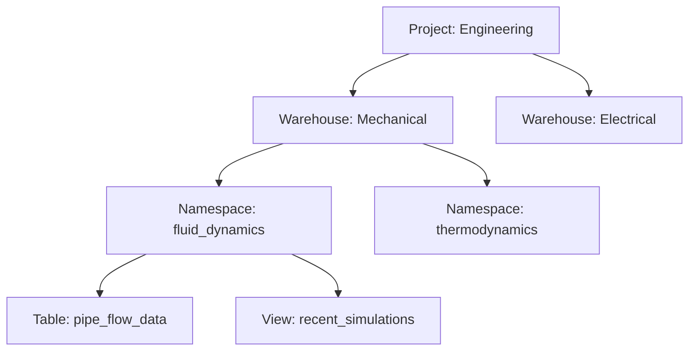
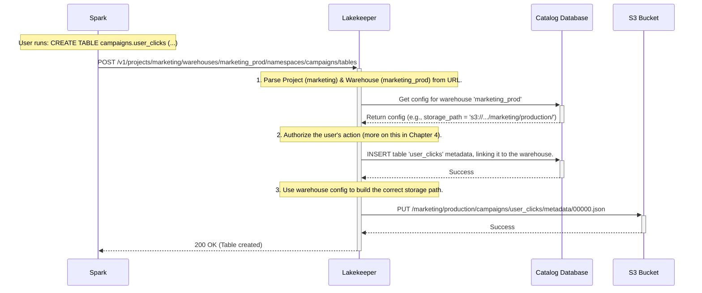

# Chapter 2: Multi-Tenancy Model (Project & Warehouse)

In the [previous chapter](01_iceberg_rest_catalog_implementation_.md), we learned that Lakekeeper acts as a central library catalog for your entire data lakehouse. This is fantastic for getting started, but what happens when your organization grows? Soon, you'll have multiple teams—like Marketing, Sales, and Engineering—all wanting to use the same central catalog. How do you keep their data organized and prevent one team from accidentally interfering with another's?

This is where Lakekeeper's multi-tenancy model comes in. It provides a clean, hierarchical way to give every team their own secure and isolated workspace.

### The Problem: A Crowded Library

Imagine our library from Chapter 1 has become incredibly popular. Different departments from a university are all trying to use it at once. The historians are cataloging ancient texts, the physicists are storing experimental data, and the literature students are analyzing poetry.

Without any organization, it would be chaos! Books would get misplaced, research would get mixed up, and nobody would have a clear space to work. We need a way to create separate sections for each department.

This is the exact problem Lakekeeper solves with its multi-tenancy model. It allows a single Lakekeeper deployment to serve many different teams (or "tenants") without them stepping on each other's toes.

### The Solution: A Library for Each College

Lakekeeper organizes all data assets into a clear hierarchy. To understand it, let's stick with our university library analogy.

*   **Project**: This is the highest level of organization. Think of it as a dedicated library building for a specific college, like the "College of Engineering Library" or the "College of Arts Library". A `Project` is the top-level container for a team, department, or business unit. It provides a boundary for administration and security.

*   **Warehouse**: Inside each library building (`Project`), you have different floors or large sections. This is a `Warehouse`. For example, the "College of Engineering Library" might have a "Mechanical Engineering Warehouse" and an "Electrical Engineering Warehouse". A `Warehouse` is the actual connection point for query engines like Spark or Trino. It has its own dedicated storage location (like a specific folder in S3), ensuring that data is physically separated.

*   **Namespace**: On each floor (`Warehouse`), you have rows of bookshelves. This is a `Namespace`. It's just like a schema in a traditional database. For example, the "Mechanical Engineering Warehouse" could have a `fluid_dynamics` namespace and a `thermodynamics` namespace.

*   **Table / View**: Finally, the individual books on the shelves are your `Tables` and `Views`.

This creates a clear and logical hierarchy:



This structure is the key to providing isolation and organization for multiple teams within a single Lakekeeper instance.

### Putting It Into Practice

Let's go back to our company with a `Marketing` team and a `Sales` team. A Lakekeeper administrator would first create a `Project` for each team. Then, within each project, they can create one or more warehouses.

For example, the administrator creates a warehouse for the Marketing team's production data. Using Lakekeeper's management API, this might look like a simple `curl` command:

```sh
curl -X POST 'http://localhost:8181/v1/projects/marketing/warehouses' \
-H 'Content-Type: application/json' \
-d '{
  "warehouse_name": "marketing_prod",
  "storage_profile": {
    "type": "s3",
    "bucket": "my-company-datalake",
    "path": "marketing/production/"
  }
}'
```

This command tells Lakekeeper to create a new warehouse named `marketing_prod` inside the `marketing` project. Crucially, it specifies that all data for this warehouse should be stored under the `s3://my-company-datalake/marketing/production/` path.

Now, when a data analyst from the Marketing team wants to work, they configure their Spark environment to connect directly to their specific warehouse.

```python
# Spark configuration for the Marketing team
spark_conf = {
    "spark.sql.catalog.lakekeeper": "org.apache.iceberg.spark.SparkCatalog",
    "spark.sql.catalog.lakekeeper.catalog-impl": "org.apache.iceberg.rest.RESTCatalog",
    # The URI now points to a specific project and warehouse!
    "spark.sql.catalog.lakekeeper.uri": "http://localhost:8181/v1/projects/marketing/warehouses/marketing_prod",
    # ... other settings
}
```

By connecting to this specific URI, the analyst's Spark session is completely sandboxed within the `marketing_prod` warehouse. If they create a table called `campaigns.user_clicks`, Lakekeeper will automatically ensure its data is stored safely in `s3://my-company-datalake/marketing/production/campaigns/user_clicks/`, completely separate from the Sales team's data.

### How It Works Under the Hood

What happens when that Spark `CREATE TABLE` command arrives at the warehouse-specific endpoint?

Let's trace the request.



1.  **Request Routing**: Lakekeeper's web server (written in Rust) receives the HTTP request. It parses the URL and immediately identifies which project (`marketing`) and warehouse (`marketing_prod`) the request is for.
2.  **Configuration Lookup**: It queries its internal database to fetch the configuration for the `marketing_prod` warehouse, including its root storage path (`s3://my-company-datalake/marketing/production/`).
3.  **Metadata Creation**: Lakekeeper creates the new table's metadata in its database and writes the initial Iceberg metadata file to the correct, isolated storage path.

This entire process is invisible to the end-user. They simply connect to their designated warehouse endpoint and work as if they have the whole catalog to themselves, while Lakekeeper manages the isolation and security behind the scenes. This is a core part of what makes Lakekeeper so powerful for growing organizations. We'll dive deeper into how permissions are enforced in our chapter on [Fine-Grained Authorization (AuthZ) with OpenFGA](04_fine_grained_authorization__authz__with_openfga_.md).

### Conclusion

You've now learned about Lakekeeper's multi-tenancy model, which uses a `Project -> Warehouse -> Namespace` hierarchy to provide clean, secure, and isolated environments for different teams. This powerful feature allows a single Lakekeeper instance to scale with your organization, bringing order and governance to a potentially chaotic data lakehouse.

But creating these isolated spaces is only half the battle. How do we ensure that only authorized users from the Marketing team can access the marketing warehouse? For that, we first need to know *who* the user is.

In the next chapter, we'll explore how Lakekeeper identifies users with its system for [Pluggable Authentication (AuthN)](03_pluggable_authentication__authn__.md).

---

Generated by [AI Codebase Knowledge Builder](https://github.com/The-Pocket/Tutorial-Codebase-Knowledge)