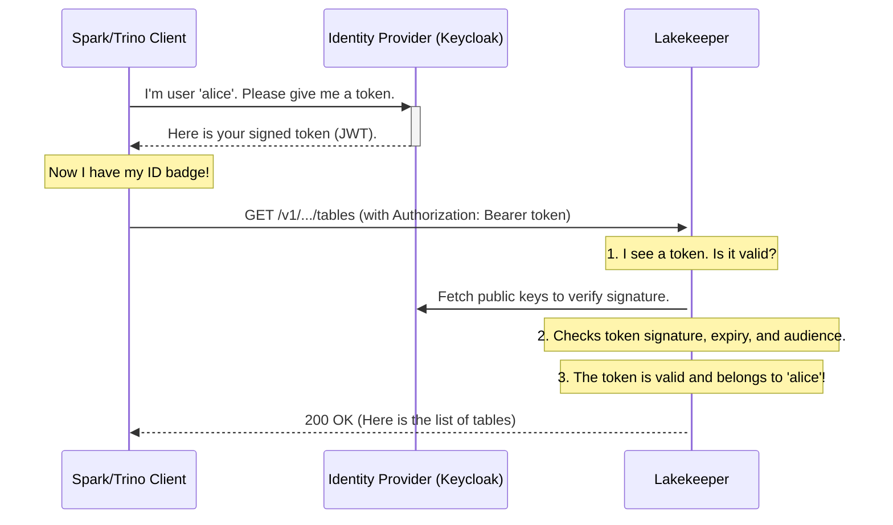

# Chapter 3: Pluggable Authentication (AuthN)

In the [previous chapter](02_multi_tenancy_model__project___warehouse__.md), we learned how Lakekeeper uses `Projects` and `Warehouses` to create organized, isolated workspaces for different teams. This is like building a large office building with separate floors for the Marketing and Sales departments.

But having separate floors isn't enough. How do we stop someone from the Sales team from wandering onto the Marketing floor and accessing sensitive campaign data? Before we can even decide *what* a person is allowed to do, we first need to know *who they are*.

This is where Authentication comes in.

### The Problem: The Unattended Front Door

Imagine our new office building is open, but there's no security guard at the front door. Anyone can walk in, claim they work there, and head for the elevators. It would be chaos! You need a system at the entrance to check everyone's ID and verify that they are who they say they are.

This process of verifying identity is called **Authentication** (often abbreviated as **AuthN**). It’s the first and most critical step in securing any system.

### The Solution: Pluggable ID Checkers

Lakekeeper doesn't try to build its own complex system for managing usernames and passwords. That's a huge security risk and a lot of work! Instead, it's designed to "plug into" the identity management systems your company already uses. This is a much more secure and flexible approach.

Lakekeeper supports two primary methods for checking IDs:

1.  **OpenID Connect (OIDC)**: This is the standard for human users. Think of it like using your company ID badge to get into the building. Your company's identity provider (like Okta, Google, Microsoft Entra ID, or Keycloak) is responsible for issuing the badge (a secure token). When you want to access Lakekeeper, you present this badge. Lakekeeper just needs to check that the badge is valid and was issued by a trusted source.

2.  **Kubernetes Service Accounts**: This is for applications and services, not people. Imagine a robotic cleaning service that needs to access different floors. You wouldn't give it a photo ID badge. Instead, you'd give it a special electronic keycard (a token) that proves it's the authorized cleaning robot. When Lakekeeper is running inside a Kubernetes cluster, it can natively authenticate other applications using these special tokens provided by Kubernetes.

This "pluggable" approach means you can use your existing security infrastructure to control access to your data catalog.

### How It Works: Connecting to an Identity Provider

Let's see how easy it is to configure Lakekeeper to use an OIDC provider. All you need to do is tell Lakekeeper two things when you start it up:

1.  Where is your identity provider located?
2.  What is our "audience"? (i.e., what name should be on the token to show it's intended for Lakekeeper?)

Here is a snippet from a `docker-compose` file that configures Lakekeeper to use a Keycloak identity server:

```yaml
# From: docker-compose/keycloak-overlay.yaml
services:
  lakekeeper:
    environment:
      # 1. The address of our identity provider
      - LAKEKEEPER__OPENID_PROVIDER_URI=http://keycloak:8080/realms/iceberg
      # 2. The name tokens should be issued for
      - LAKEKEEPER__OPENID_AUDIENCE=lakekeeper
```

That's it! With these two environment variables, Lakekeeper now knows how to validate ID badges (tokens) issued by your Keycloak server.

Now, when a data analyst from the Marketing team wants to query a table, their tool (like Spark or Trino) will first ask the OIDC provider for a token. Then, it will include that token in every request to Lakekeeper.

```sh
# Step 1: The user's tool gets a token from the identity provider.
# (This process is usually handled automatically by the tool.)
TOKEN="eyJhbGciOiJSUzI1NiIsInR5cCIg..." # A long, secure token string

# Step 2: The tool sends requests to Lakekeeper with the token.
curl -H "Authorization: Bearer $TOKEN" \
  'http://localhost:8181/v1/projects/marketing/warehouses/marketing_prod/tables'
```

This `Authorization: Bearer $TOKEN` part is the digital equivalent of showing your ID badge to the security guard. Lakekeeper sees the token and verifies it before letting the request proceed.

### A Look Under the Hood

What happens inside Lakekeeper when a request with a token arrives?



1.  **Token Extraction**: Lakekeeper receives the request and extracts the token from the `Authorization` header.
2.  **Token Validation**: It performs a series of checks on the token:
    *   **Signature**: Was this token really signed by the trusted Identity Provider? It checks this using public keys it fetches from the provider's URI. This prevents forgeries.
    *   **Expiration**: Is the token still valid, or has it expired? This prevents the use of old, stolen tokens.
    *   **Audience**: Was this token intended for Lakekeeper? This ensures a token for another application can't be used to access the data catalog.
3.  **Identity Confirmed**: If all checks pass, Lakekeeper now knows the identity of the user (e.g., `alice@marketing.com`). The request is allowed to proceed to the next step. If any check fails, Lakekeeper immediately rejects the request with a `401 Unauthorized` error.

The best part is that both OIDC and Kubernetes Service Account authentication can be enabled at the same time. Lakekeeper will automatically detect which type of token is being presented and use the correct method to validate it. This is the power of a "pluggable" system.

### Conclusion

You've now learned how Lakekeeper handles Authentication (AuthN). By plugging into standard systems like OIDC and Kubernetes, Lakekeeper securely verifies the identity of every user and service without managing passwords itself. It's the essential "front door security" for your data catalog.

We've successfully checked the user's ID at the door. We know *who* they are. But that's only half the story. Just because we know it's Alice from Marketing doesn't mean she should be allowed to delete the Sales team's quarterly report table.

Now that we have a trusted identity, we need a system to decide what that identity is allowed to do. This is the job of Authorization, and it's the subject of our next chapter.

Next, we will explore [Fine-Grained Authorization (AuthZ) with OpenFGA](04_fine_grained_authorization__authz__with_openfga_.md).

---

Generated by [AI Codebase Knowledge Builder](https://github.com/The-Pocket/Tutorial-Codebase-Knowledge)