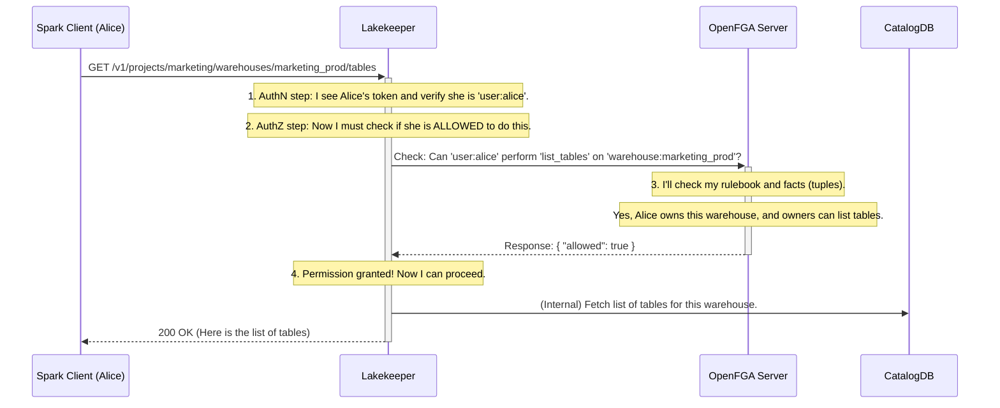

# Chapter 4: Fine-Grained Authorization (AuthZ) with OpenFGA

In the [previous chapter on Pluggable Authentication (AuthN)](03_pluggable_authentication__authn__.md), we learned how Lakekeeper securely verifies *who* a user is. It's like having a security guard at the front door of your office building who checks everyone's ID badge.

But once someone is inside the building, that's not the end of the story. An intern from the marketing department shouldn't be able to walk into the CEO's office and read confidential financial reports. Knowing *who* someone is (Authentication) is different from deciding *what they are allowed to do* (Authorization).

This is where Authorization, or **AuthZ**, comes into play.

### The Problem: One Key Fits All Doors

Imagine you've successfully authenticated Alice from the Marketing team. She's inside the building. But what happens now? Can she create tables in the Sales team's warehouse? Can she delete the Engineering team's production data? Without a proper authorization system, the answer might be "yes," which would be a disaster!

We need a system of rules that defines which keycard (user) can open which doors (perform actions on data). We need these rules to be very specific, or "fine-grained." For example, we might want to give Alice permission to *read* a specific table but not *write* to it.

### The Solution: A Central Security Desk with a Rulebook

To solve this, Lakekeeper uses a powerful, open-source authorization system called **OpenFGA**.

Think of OpenFGA as a central security desk inside your office building. Lakekeeper doesn't try to remember every single permission for every user itself. Instead, for every single action a user tries to perform, Lakekeeper walks over to the OpenFGA security desk and asks a simple question:

> "Hey, Alice wants to `create a table` in the `marketing_prod` warehouse. Is she allowed to do that?"

OpenFGA consults its detailed rulebook and gives a simple "yes" or "no" answer.

This approach is powerful because it separates the logic of the data catalog (managing Iceberg metadata) from the complex logic of security policies. Lakekeeper focuses on what it does best, and OpenFGA focuses on what *it* does best.

#### How OpenFGA Thinks: Relationships and Roles

OpenFGA works by understanding relationships between users and objects. You tell it a set of simple facts, called "tuples." These facts build a graph of permissions.

For example, an administrator might tell OpenFGA these facts:
*   `user:alice` is a `data_admin` for `project:marketing`.
*   `warehouse:marketing_prod` is part of `project:marketing`.

Then, OpenFGA uses its rulebook (called a "model") to make decisions. The rulebook might contain rules like:
*   A `data_admin` of a `project` can `create_warehouse` in that `project`.
*   Anyone who can `create_warehouse` can also `create_table` inside that warehouse.

Because of these rules, when Lakekeeper asks if Alice can create a table, OpenFGA can follow the chain of relationships and correctly answer "yes."

### Putting It Into Practice

By default, Lakekeeper is configured to talk to an OpenFGA server. To enable it, you just need to set a couple of environment variables, as shown in this snippet from a `docker-compose` file.

```yaml
# From: docker-compose/openfga-overlay.yaml
services:
  lakekeeper:
    environment:
      # Tell Lakekeeper to use the OpenFGA backend
      - LAKEKEEPER__AUTHZ_BACKEND=openfga
      # Tell Lakekeeper where the OpenFGA server is
      - LAKEKEEPER__OPENFGA__ENDPOINT=http://openfga:8081
```
This tells Lakekeeper to direct all its permission questions to the OpenFGA service running at the specified address.

An administrator would then use Lakekeeper's management API to set up the permissions. For example, to make Alice the owner of the marketing warehouse, they would add a "tuple" to OpenFGA that states:

> `user:alice` has the `ownership` relation with `warehouse:marketing_prod`.

Now, whenever Alice tries to do anything related to that warehouse, OpenFGA's rulebook will grant her full permissions because she is the owner. If she tries to access the `sales_prod` warehouse, OpenFGA will find no such relationship and will tell Lakekeeper to deny the request.

### How It Works Under the Hood

Let's trace a request from Alice to see how Lakekeeper and OpenFGA work together. Alice wants to list all the tables in the marketing warehouse.



1.  **Authentication**: Lakekeeper first validates Alice's token to confirm her identity, just as we saw in the previous chapter.
2.  **Authorization Check**: Before running any database queries, Lakekeeper pauses. It constructs a question for OpenFGA: "Can this user perform this action on this resource?"
3.  **OpenFGA Decision**: OpenFGA receives the request. It looks at the facts it knows (e.g., `user:alice` is the `owner` of `warehouse:marketing_prod`) and applies the rules from its authorization model. It determines that owners are allowed to list tables and sends back a `true` response.
4.  **Action Proceeds**: Because Lakekeeper received a "yes," it proceeds with the user's request, fetches the data from its database, and returns it to Alice.

If Alice had tried to list tables in the `sales` warehouse, OpenFGA would have found no permissions and returned `false`. Lakekeeper would have immediately stopped and sent a `403 Forbidden` error back to Alice, without ever touching its database.

### Extensible by Design: The `Authorizer` Trait

What if your company already has a different authorization system? Lakekeeper is built for this. The integration with OpenFGA is the default implementation of a Rust trait called `Authorizer`.

A "trait" in Rust is like a contract or a blueprint. Lakekeeper's core logic doesn't depend on OpenFGA directly; it only depends on the `Authorizer` trait. This means you can create your own implementation that talks to your company's internal permission system and "plug it in" to Lakekeeper. This makes Lakekeeper incredibly flexible and adaptable to different enterprise environments. We'll learn more about this in our chapter on [Extensibility via Traits](07_extensibility_via_traits_.md).

### Conclusion

You've now seen how Lakekeeper handles Authorization (AuthZ) using OpenFGA. This powerful combination allows for incredibly detailed, fine-grained control over who can do what within your data catalog. By separating the "who" (Authentication) from the "what" (Authorization), Lakekeeper provides a secure, robust, and flexible foundation for your data governance strategy.

So far, we have secured the building's front door (AuthN) and the doors to all the rooms inside (AuthZ for the catalog). But what about the contents *inside* the rooms—the actual data files stored in S3 or another cloud storage? A clever user might try to bypass the catalog and access the files directly. How do we stop that?

In the next chapter, we'll explore how Lakekeeper secures the data itself with [Storage Access Management](05_storage_access_management_.md).

---

Generated by [AI Codebase Knowledge Builder](https://github.com/The-Pocket/Tutorial-Codebase-Knowledge)