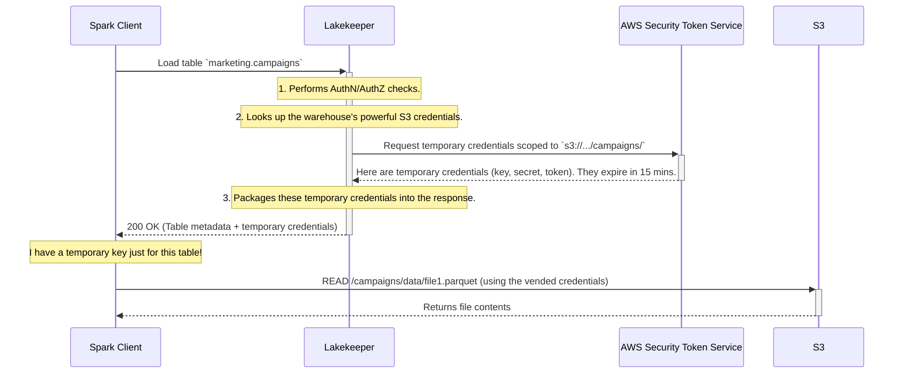

# Chapter 5: Storage Access Management

In our journey so far, we've built a secure office building for our data.
- In [Chapter 3: Pluggable Authentication (AuthN)](03_pluggable_authentication__authn__.md), we placed a security guard at the front door to check everyone's ID.
- In [Chapter 4: Fine-Grained Authorization (AuthZ) with OpenFGA](04_fine_grained_authorization__authz__with_openfga_.md), we installed keycard readers on every office door to control who can go where.

But we've overlooked one critical detail. The "office" (the Lakekeeper catalog) only holds the *instructions* on where to find things. The actual valuable items (your data files) are stored in a massive, separate warehouse (like AWS S3, GCS, or Azure ADLS). What's stopping a clever employee from skipping the office entirely and going straight to the warehouse with a master key?

### The Problem: The Unsecured Warehouse

Lakekeeper is a catalog; it doesn't store your terabytes of Parquet and Avro files. Those files, which make up your Iceberg tables, live in an object store like an S3 bucket.

Imagine your company gives every data scientist a powerful, long-lasting AWS access key so they can run their queries. This is like giving every employee a master key to the entire warehouse. It's a huge security risk!
- What if an employee accidentally leaks their key?
- What if a disgruntled employee decides to delete everything?
- How do you ensure they only access the data they're supposed to, and not the sensitive financial data in the next "aisle"?

Giving direct, powerful access to the underlying storage completely bypasses all the careful security we've built into Lakekeeper.

### The Solution: A Valet for Your Data

Lakekeeper solves this problem by acting as a secure valet or broker for your data storage. Instead of giving users the master key, Lakekeeper holds the powerful keys itself and hands out temporary, limited-access keys on demand.

This is the core of **Storage Access Management**.

Think of a bank vault. To access your safe deposit box, you don't get the master key to the entire vault. Instead, you go to the bank manager (Lakekeeper). The manager verifies your identity, checks that you're allowed to access your box, and then gives you a special key that:
1.  **Is Temporary**: It only works for the next 15 minutes.
2.  **Is Scoped**: It only opens *your specific safe deposit box* and nothing else.

Once you're done, the key becomes useless. This is exactly how Lakekeeper manages access to your data files. It provides **vended credentials** and performs **remote signing**.

This means that your users and query engines (like Spark and Trino) **never need to have powerful, long-lived credentials** for your S3 buckets. They only need to know how to talk to Lakekeeper.

### How It Works in Practice

When an administrator configures a `Warehouse` in Lakekeeper, they provide the powerful storage credentials directly to Lakekeeper and store them securely.

Here is a snippet of a warehouse configuration. Notice the AWS credentials are part of the profile stored *inside* Lakekeeper.

```json
{
  "warehouse_name": "marketing_prod",
  "storage_profile": {
    "type": "s3",
    "bucket": "my-company-datalake",
    "path": "marketing/production/",
    // These powerful credentials are known only to Lakekeeper
    "access_key_id": "AKIA...",
    "secret_access_key": "..."
  }
}
```

Now, when a data analyst wants to read data from a table in this warehouse, a magical exchange happens behind the scenes:

1.  The analyst's Spark job asks Lakekeeper for the metadata for the `marketing.campaigns` table.
2.  Lakekeeper authenticates and authorizes the request (Chapters 3 & 4).
3.  Lakekeeper uses its powerful credentials to ask AWS for a *temporary, restricted* set of credentials that can only read files from the `s3://my-company-datalake/marketing/production/campaigns/` folder and will expire in 15 minutes.
4.  Lakekeeper sends the table metadata *along with these temporary credentials* back to Spark.
5.  Spark's Iceberg connector is smart enough to see these temporary credentials and use them to read the data files directly from S3.

The analyst's Spark configuration is clean and simple. It contains no AWS keys!

```python
# Spark configuration for the Marketing analyst
spark_conf = {
    # ... other settings
    "spark.sql.catalog.lakekeeper.uri": "http://lakekeeper:8181/v1/projects/marketing/warehouses/marketing_prod",
    # Notice: NO AWS keys are configured here!
}
```

This is a massive security improvement. The analyst never sees any credentials, and the credentials that Spark uses are temporary and strictly limited to only the data it needs for that specific query.

### A Look Under the Hood

Let's visualize this process of vending (handing out) credentials with a sequence diagram.



1.  **Request**: The client (Spark) makes a standard request to load a table.
2.  **Auth & Credential Generation**: Lakekeeper authenticates and authorizes the user. It then uses its master credentials to call the AWS Security Token Service (STS), requesting a temporary, limited-privilege credential.
3.  **Response**: Lakekeeper embeds these temporary credentials in its response to Spark. The official Iceberg REST protocol has a standard place for these credentials, so any compatible engine knows what to do.
4.  **Direct Data Access**: Spark uses the temporary credentials to fetch the data files directly from S3. When the credentials expire, access is automatically revoked.

Lakekeeper supports this secure access model for all major cloud providers, including AWS S3, Google Cloud Storage, and Azure Data Lake Storage.

### Conclusion

You've now learned about one of Lakekeeper's most critical security features: **Storage Access Management**. By acting as a central, trusted broker, Lakekeeper secures not only the metadata catalog but also the raw data files in your object store. It eliminates the need for users and query engines to hold dangerous, long-lived credentials, replacing them with automatically vended, temporary, and tightly scoped credentials.

We have now covered all the core concepts of Lakekeeper: the catalog itself, multi-tenancy, authentication, authorization, and secure data access. We have all the pieces to build a secure, multi-tenant data lakehouse. But how do we actually run this in a production environment?

In the next chapter, we will learn how to take our Lakekeeper service and run it reliably and scalably with [Deployment as a Containerized Service](06_deployment_as_a_containerized_service_.md).

---

Generated by [AI Codebase Knowledge Builder](https://github.com/The-Pocket/Tutorial-Codebase-Knowledge)