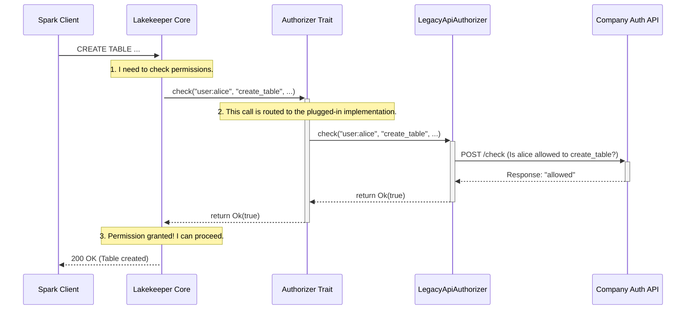

# Chapter 7: Extensibility via Traits

In the [previous chapter on Deployment as a Containerized Service](06_deployment_as_a_containerized_service_.md), we learned how to run Lakekeeper as a self-contained, pre-fabricated appliance. We treated it like a microwave: you plug it in, configure a few settings, and it just works.

But what if you need to do more? What if you need to open up that microwave and swap out the standard heating element for a custom, high-powered one that your company designed? A core design principle of Lakekeeper is that it's not just a sealed box; it's a highly customizable system designed to integrate with your existing infrastructure.

### The Problem: Every Company is Unique

Imagine your company has been running for years and has a well-established, custom-built system for managing permissions. This system is the single source of truth for who can access what. When you introduce Lakekeeper, you face a dilemma:
- Do you try to duplicate all those permissions into Lakekeeper's default authorization system, [OpenFGA](04_fine_grained_authorization__authz__with_openfga_.md)? That would be a nightmare to keep in sync.
- Do you ask the entire company to switch to a new authorization system? That's probably not going to happen.

You need a way to tell Lakekeeper: "Instead of using your own internal rulebook for permissions, please make a phone call to *our* system and ask it for a 'yes' or 'no' answer."

### The Solution: Pluggable Components with Traits

Lakekeeper solves this problem by exposing its key components as **Rust `Traits`**.

If you're new to Rust, think of a `Trait` as a **contract** or a **blueprint**. It's like the design for a standard electrical outlet. The outlet contract defines the shape of the plug and the type of electricity it provides (e.g., 120V AC). It doesn't care if you plug in a lamp, a toaster, or a laptop charger. As long as your appliance has a plug that fits the contract, it will work.

<p align="center">

<em>Traits define a standard interface, allowing different implementations to be "plugged in".</em>
</p>

Lakekeeper uses this exact concept. It defines a contract for several of its core functions:
*   `Authorizer`: The contract for checking permissions.
*   `Catalog`: The contract for storing table metadata (the default is PostgreSQL).
*   `SecretsStore`: The contract for storing sensitive information like S3 keys.
*   `CloudEventBackend`: The contract for publishing events when a table changes.

By defining these contracts, Lakekeeper allows you to unplug the default component (like the `OpenFgaAuthorizer`) and plug in your own custom one, without having to change Lakekeeper's core logic.

### A Practical Example: Building a Custom Authorizer

Let's walk through our use case: we want to integrate Lakekeeper with our company's legacy authorization API.

**Step 1: Understand the Contract (The `Authorizer` Trait)**

First, we look at the `Authorizer` trait inside Lakekeeper's source code to see what the contract requires. A simplified version of the contract looks like this:

```rust
// A simplified blueprint for any Authorizer
#[async_trait]
pub trait Authorizer: Send + Sync {
    /// Checks if a principal is allowed to perform an action on a resource.
    async fn check(
        &self,
        principal: &str, // Who is asking? (e.g., "user:alice")
        action: &str,    // What do they want to do? (e.g., "create_table")
        resource: &str,  // On what? (e.g., "warehouse:marketing_prod")
    ) -> Result<bool, Error>;
}
```
This is a very simple contract. It says, "Any component that wants to be an `Authorizer` must provide one function called `check`. This function will receive who is asking, what they want to do, and on what resource. It must promise to return either `true` (allowed), `false` (denied), or an error."

**Step 2: Build Our Custom Component (The Implementation)**

Now, we can create our own Rust code that "implements" this contract. We'll create a new component called `LegacyApiAuthorizer` that calls our company's internal API.

```rust
// Our custom authorizer that talks to our company's API
pub struct LegacyApiAuthorizer {
    api_endpoint: String,
}

#[async_trait]
impl Authorizer for LegacyApiAuthorizer {
    async fn check(&self, principal: &str, action: &str, resource: &str) -> Result<bool, Error> {
        // 1. Build a request to our company's API.
        let request_body = format!(
            "{{\"user\": \"{}\", \"permission\": \"{}\", \"object\": \"{}\"}}",
            principal, action, resource
        );

        // 2. Make an HTTP POST request to the internal API.
        // (Details of the HTTP client are simplified for clarity)
        let response = my_http_client::post(&self.api_endpoint, request_body).await?;
        
        // 3. Return true if the API says "allowed".
        Ok(response.body == "allowed")
    }
}
```
This code does exactly what we need. It fulfills the `Authorizer` contract by providing a `check` function. Inside that function, instead of talking to OpenFGA, it makes an HTTP request to our internal system and returns the result.

**Step 3: Plug It In**

The final step is to tell Lakekeeper's main application to use our new `LegacyApiAuthorizer` instead of the default one. This usually involves a small change in the application's startup code.

```rust
// In Lakekeeper's main setup function (simplified)

// Before: Using the default OpenFGA authorizer
let authorizer = OpenFgaAuthorizer::new(&config.openfga);

// After: Using our custom authorizer
let authorizer = LegacyApiAuthorizer {
    api_endpoint: "http://auth.internal.mycompany.com/check".to_string(),
};

// The rest of the application setup is the same!
let app = build_lakekeeper_service(authorizer, ...);
```
That's it! Lakekeeper's core logic doesn't need to change at all. It was designed from the beginning to work with *any* component that satisfies the `Authorizer` contract. We've successfully hot-swapped a critical part of the system to perfectly fit our company's needs.

### How It Works Under the Hood

Let's see what happens when a request comes in, using our new custom authorizer.


1.  **Generic Call**: Lakekeeper's core API code receives the request and calls the `check` function on its `authorizer` object. It doesn't know or care what kind of authorizer it is; it only knows that it fulfills the `Authorizer` trait.
2.  **Dynamic Dispatch**: Rust's trait system automatically routes this call to our `LegacyApiAuthorizer`'s implementation of the `check` function.
3.  **Custom Logic**: Our custom code runs, calls our internal API, and returns the result back up the chain.

This decoupling is what makes the system so flexible. Lakekeeper's core is stable, while its peripheral components can be swapped out to meet specific needs.

### Conclusion

You have now reached the end of our beginner's guide to Lakekeeper! In this final chapter, you've learned about the project's most powerful design principle: **Extensibility via Traits**. This mechanism allows developers to replace default implementations for authorization, database backends, secret stores, and more, enabling deep and seamless integration with bespoke company infrastructure. It's the key that unlocks Lakekeeper's full potential in complex enterprise environments.

Throughout this series, we have journeyed from the very basics of what an [Iceberg REST Catalog is](01_iceberg_rest_catalog_implementation_.md), to organizing teams with a [Multi-Tenancy Model](02_multi_tenancy_model__project___warehouse__.md), to securing every layer of the system with [Authentication](03_pluggable_authentication__authn__.md), [Authorization](04_fine_grained_authorization__authz__with_openfga_.md), and [Storage Access Management](05_storage_access_management_.md). We've seen how easy it is to deploy as a [Containerized Service](06_deployment_as_a_containerized_service_.md) and, finally, how to customize it for your own unique needs.

We hope this guide has given you a solid foundation and inspired you to explore what's possible with Lakekeeper. The world of open data lakehouses is exciting and rapidly evolving, and we invite you to be a part of it. Check out the project on GitHub, join the community discussions, and start building

---

Generated by [AI Codebase Knowledge Builder](https://github.com/The-Pocket/Tutorial-Codebase-Knowledge)