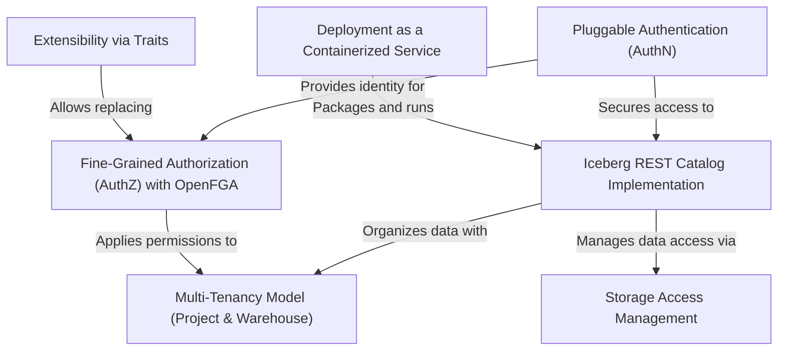

# Tutorial: lakekeeper

Lakekeeper is a server that acts as a central **metadata catalog** for *Apache Iceberg* tables. Think of it as a library's card catalog for your data lake; it tracks information about your data tables, but doesn't store the actual data itself. It provides robust security by controlling *who* can access both the metadata and the underlying data through **pluggable authentication** and **fine-grained authorization**. The entire service is designed to be easily deployed and managed as a lightweight **container** in modern cloud environments.

**Source Repository:** [None](None)

## Chapters

1. [Iceberg REST Catalog Implementation
](01_iceberg_rest_catalog_implementation_.md)
2. [Multi-Tenancy Model (Project & Warehouse)
](02_multi_tenancy_model__project___warehouse__.md)
3. [Pluggable Authentication (AuthN)
](03_pluggable_authentication__authn__.md)
4. [Fine-Grained Authorization (AuthZ) with OpenFGA
](04_fine_grained_authorization__authz__with_openfga_.md)
5. [Storage Access Management
](05_storage_access_management_.md)
6. [Deployment as a Containerized Service
](06_deployment_as_a_containerized_service_.md)
7. [Extensibility via Traits
](07_extensibility_via_traits_.md)

---

Generated by [AI Codebase Knowledge Builder](https://github.com/The-Pocket/Tutorial-Codebase-Knowledge)