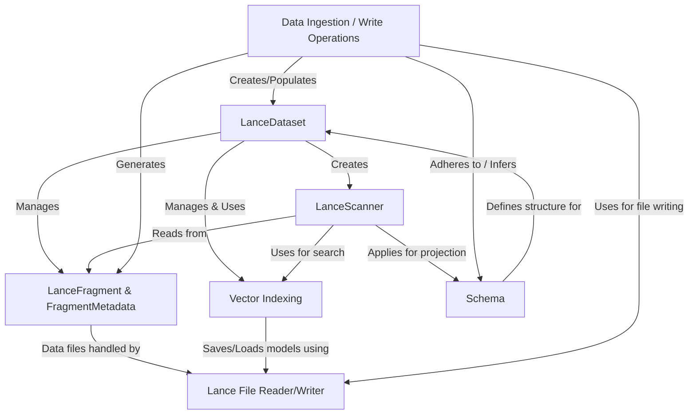

# Tutorial: lance

**Lance** is a *modern columnar data format* optimized for machine learning (ML) workflows and datasets.
Think of it as an advanced, high-performance filing system for your data, especially useful when working with vectors for tasks like similarity search (e.g., finding similar images or text).
It allows for **100x faster random access** compared to formats like Parquet, offers *zero-copy versioning* of datasets, and seamlessly integrates with popular data science tools.

**Source Repository:** [None](None)

## Chapters

1. [Schema
](01_schema_.md)
2. [Data Ingestion / Write Operations
](02_data_ingestion___write_operations_.md)
3. [LanceDataset
](03_lancedataset_.md)
4. [LanceScanner
](04_lancescanner_.md)
5. [Vector Indexing
](05_vector_indexing_.md)
6. [LanceFragment & FragmentMetadata
](06_lancefragment___fragmentmetadata_.md)
7. [Lance File Reader/Writer
](07_lance_file_reader_writer_.md)

---

Generated by [AI Codebase Knowledge Builder](https://github.com/The-Pocket/Tutorial-Codebase-Knowledge)