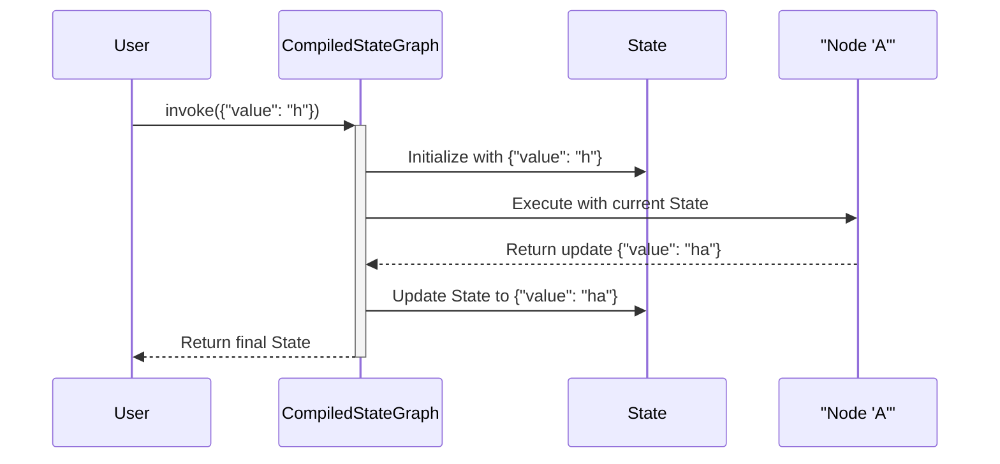

# Chapter 1: StateGraph

Welcome to your first step into LangGraph! Before we can build powerful, intelligent agents, we need a way to structure our application's logic. How do we define the steps it should take? How does it remember what it's done?

This is where `StateGraph` comes in.

## What's the Big Idea?

Imagine you're building a simple chatbot. The chatbot needs to:
1.  Receive a message from a user.
2.  Think about a response.
3.  Send the response back.
4.  Remember the conversation so it can have a coherent dialogue.

You can think of this process as a flowchart. Each box is a step, and arrows connect the steps.

`StateGraph` is the tool we use to create this flowchart in code. It's the **blueprint** for our application. It holds all the steps (we call them **nodes**) and the connections between them (we call them **edges**).

Most importantly, it defines a shared **state**, which is the memory of our application. For our chatbot, the state would be the list of conversation messages. Every node in the graph can read from and write to this state, allowing them to share information and build on each other's work.

## Building a Simple Graph: A Step-by-Step Guide

Let's build the simplest possible graph. It will have one step that modifies the state.

### 1. Define the State

First, we need to decide what information our graph will keep track of. This is the "state". We'll define it as a Python `TypedDict`. For our example, we'll just track a single value, `value`.

```python
from typing_extensions import TypedDict

class GraphState(TypedDict):
    """
    Represents the state of our graph.

    Attributes:
        value: A string value that will be updated.
    """
    value: str
```
This is like defining the structure of our application's memory. We're saying, "Every step of the way, our graph will have a dictionary containing a `value` key with a string."

### 2. Create the `StateGraph`

Now, let's create the graph object itself. We pass our state definition to it, so it knows what kind of "memory" to manage.

```python
from langgraph.graph import StateGraph

# This defines the workflow
workflow = StateGraph(GraphState)
```
Think of `workflow` as an empty blueprint. We've told it what the final house's rooms are (the `GraphState`), but we haven't added any rooms (nodes) or hallways (edges) yet.

### 3. Define the Nodes (The Steps)

A node is just a function that performs an action. It receives the current state and returns a dictionary with the values it wants to change.

Let's create a node that adds an "a" to the `value` in our state.

```python
def node_a(state):
    print("---Executing Node A---")
    current_value = state["value"]
    new_value = current_value + "a"
    return {"value": new_value}
```
Notice how the function takes `state` as input, reads from it, and returns a dictionary with the key `value` to update the state.

Now, let's add this function to our graph as a node. We give it a unique name, like `"A"`.

```python
workflow.add_node("A", node_a)
```
We've just added our first "room" to the blueprint and named it "A".

### 4. Define the Edges (The Connections)

We have a node, but how does the graph know where to start? We need to define the entry point.

```python
from langgraph.graph import START

workflow.set_entry_point("A")
```
This tells the graph, "When you start running, the first node to execute is 'A'".

And where does it go after "A"? For this simple example, we'll just end the process. We connect our "A" node to a special, built-in node called `END`.

```python
from langgraph.graph import END

workflow.add_edge("A", END)
```
Our blueprint is now complete! It's a very simple one: `START` -> `A` -> `END`.

### 5. Compile the Graph

Our `workflow` object is just a blueprint. To make it a runnable application, we need to `compile()` it.

```python
app = workflow.compile()
```
This step takes our definition and builds the final, optimized, and runnable state machine.

### 6. Run It!

Now we can run our application. We use the `.invoke()` method and pass in the initial state.

```python
initial_state = {"value": "h"}
final_state = app.invoke(initial_state)

print(final_state)
```
**Output:**
```
---Executing Node A---
{'value': 'ha'}
```
It worked! The graph started at node "A", our function ran, it updated the state from `"h"` to `"ha"`, and then it finished.

## What's Happening Under the Hood?

You've successfully built and run a graph, but what did LangGraph *actually* do?

1.  **Initialization:** When you call `app.invoke()`, LangGraph creates the initial state using your input (`{"value": "h"}`).
2.  **Execution:** It looks for the entry point (`START`) and sees it's connected to node "A". It then prepares to run node "A".
3.  **State Passing:** It passes the *entire current state* to the `node_a` function.
4.  **Update Calculation:** Your `node_a` function runs and returns a dictionary: `{"value": "ha"}`. This doesn't immediately overwrite the state; it's just an update package.
5.  **State Update:** LangGraph takes this package and updates the official state. It sees the `value` key and updates it.
6.  **Flow Control:** After the node finishes, LangGraph looks for edges leaving "A". It finds the edge to `END`, so it knows the workflow is complete.
7.  **Return Value:** It returns the final, updated state.

Here is a simplified diagram of the process:



The `StateGraph` object you created simply stored your nodes and edges in memory. `add_node` added to a dictionary of nodes, and `add_edge` added to a list of connections. The `compile()` method is where the magic happens. It takes that simple structure and builds a powerful execution engine using a concept called [Pregel](05_pregel_.md), which we'll cover in a later chapter. For now, just know that `compile()` turns your simple blueprint into a real, working application.

## Conclusion

You've learned the most fundamental concept in LangGraph: the `StateGraph`.

*   It acts as a **blueprint** for your application.
*   It's defined by a **state** object that acts as its memory.
*   You add logic by creating **nodes** (functions).
*   You control the flow of execution by connecting nodes with **edges**.

This simple structure allows you to build incredibly complex and powerful applications, from simple chatbots to sophisticated, multi-agent systems.

But what if you want to do more than just replace a value in the state? What if you want to *add* messages to a list, like in a real chatbot? To do that, we need more control over how the state gets updated. That's where our next topic comes in.

Next up: [Channels](02_channels_.md)

---

Generated by [AI Codebase Knowledge Builder](https://github.com/The-Pocket/Tutorial-Codebase-Knowledge)