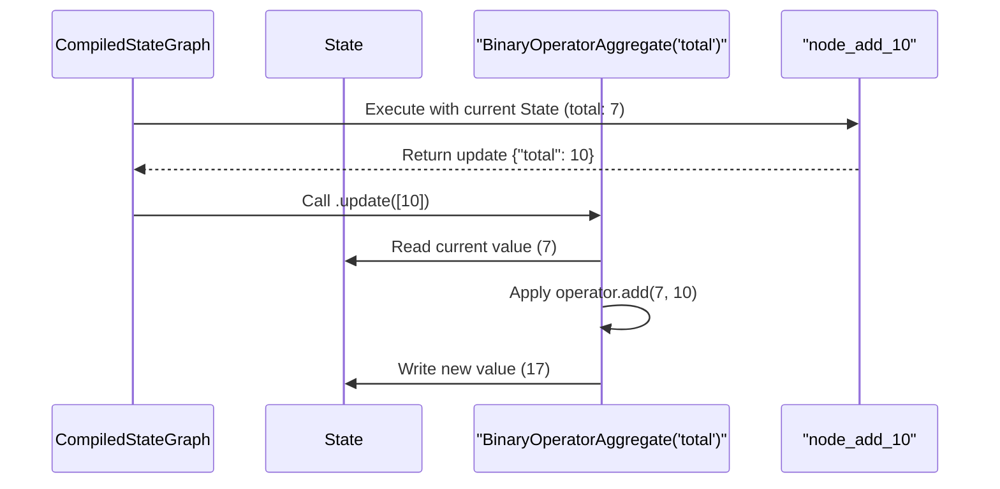

# Chapter 2: Channels

In the [previous chapter on StateGraph](01_stategraph_.md), we learned how to build a basic application blueprint. Our nodes could read from the shared state and write back to it. However, you might have noticed a limitation: when a node wrote to the state, it simply **replaced** the old value.

What if we don't want to replace data? What if we want to *add* to it?

Imagine our chatbot application. We don't want each new message to replace the entire conversation history; we want to *append* it to a list of messages. This is the problem that Channels solve.

## Mailboxes for Your State

Think of your graph's state as a wall of mailboxes. Each key in your state dictionary (like `"value"` or `"messages"`) is a separate mailbox.

By default, every mailbox has a simple rule: **it can only hold one letter at a time**. When a new letter arrives, the old one is thrown out. This is exactly what happened in Chapter 1. Our node returned `{"value": "ha"}`, and the old value `"h"` was replaced. This default "one-letter" rule is a Channel called `LastValue`.

But what if we could use different *types* of mailboxes?
*   A mailbox that **collects every letter** into a neat pile (a list).
*   A mailbox that **adds up the numbers** written on each letter.
*   A mailbox that only keeps the **most recent letter**. (This is the default!)

**Channels are these different types of mailboxes.** They are the underlying data structures that define the rules for how each key in your state is updated. They allow for predictable and powerful state management, even when multiple parts of your graph try to write to the same place at the same time.

## Meet the Channels

LangGraph provides several built-in Channel types. Let's look at the three most common ones.

### 1. `LastValue` (The Default)

This is the "one-letter-only" mailbox. It keeps only the last value it receives.

*   **Use Case:** Tracking a session ID, the latest user request, or any piece of information that should be overwritten.
*   **Behavior:** If the state has `{"topic": "dogs"}` and a node returns `{"topic": "cats"}`, the new state will be `{"topic": "cats"}`.

### 2. `Topic`

This is the "collector" mailbox. It gathers all values sent to it into a list. This is perfect for our chatbot's message history!

*   **Use Case:** Storing a list of conversation messages, a sequence of tool calls, or any history of events.
*   **Behavior:** If the state has `{"messages": ["A"]}` and a node returns `{"messages": "B"}`, the new state will be `{"messages": ["A", "B"]}`.

### 3. `BinaryOperatorAggregate`

This is the "calculator" mailbox. You give it a function (like addition or subtraction), and it uses that function to combine the old value with the new one.

*   **Use Case:** Keeping a running total, counting steps, or aggregating scores.
*   **Behavior:** If the state has `{"score": 5}` and a node returns `{"score": 10}`, and the channel is set up to add, the new state will be `{"score": 15}`.

## Building with a New Mailbox

Let's build a simple graph that uses the `BinaryOperatorAggregate` channel to keep a running total. Two different nodes will send numbers, and we'll see how the channel adds them up.

### 1. Define the State (with a Channel!)

To tell LangGraph to use a specific channel for a state key, we use `Annotated` from Python's `typing` library. We're "annotating" our state key with the channel rule we want to use.

Here, we'll tell the `total` key to use a channel that adds (`+`) numbers together.

```python
from typing import Annotated
from typing_extensions import TypedDict
import operator
from langgraph.channels.binop import BinaryOperatorAggregate

class GraphState(TypedDict):
    total: Annotated[int, BinaryOperatorAggregate(operator.add)]
```

This code tells LangGraph: "The `total` key holds an integer, but don't just replace it! Use the `BinaryOperatorAggregate` rules with the addition function (`operator.add`) to update it."

### 2. Create the Graph and Nodes

This part is just like before. We'll create a `StateGraph` and two simple nodes. Each node will return a number to be added to the `total`.

```python
from langgraph.graph import StateGraph, START, END

workflow = StateGraph(GraphState)

def node_add_5(state):
    print("---Node 1: Adding 5---")
    return {"total": 5}

def node_add_10(state):
    print("---Node 2: Adding 10---")
    return {"total": 10}

workflow.add_node("add_5", node_add_5)
workflow.add_node("add_10", node_add_10)
```

### 3. Wire It Up and Run

We'll create a simple sequence: start, add 5, then add 10, then end. We'll start our `total` at `2`.

```python
workflow.set_entry_point("add_5")
workflow.add_edge("add_5", "add_10")
workflow.add_edge("add_10", END)

app = workflow.compile()

final_state = app.invoke({"total": 2})
print(f"Final state: {final_state}")
```

**Output:**

```
---Node 1: Adding 5---
---Node 2: Adding 10---
Final state: {'total': 17}
```

It worked! Let's trace the `total`:
1.  It started at `2`.
2.  `node_add_5` ran. The channel applied the rule: `2 + 5 = 7`. The state's `total` is now `7`.
3.  `node_add_10` ran. The channel applied the rule again: `7 + 10 = 17`. The state's `total` is now `17`.

Without the channel, the final value would have been `10`, because the second node would have simply replaced the value from the first. Channels gave us a powerful new way to manage our state!

## What's Happening Under the Hood?

When you define your state with an `Annotated` channel, LangGraph sets up a special manager for that piece of state. When a node returns an update, the process looks like this:

1.  **Node Returns:** Your node finishes and returns a dictionary, for example, `{"total": 10}`.
2.  **Channel Lookup:** LangGraph sees the update is for the `total` key. It looks up the channel associated with `total`, which is our `BinaryOperatorAggregate`.
3.  **Update Method:** Instead of just overwriting the state, LangGraph calls the channel's `.update()` method. It passes the new value (`10`) to this method.
4.  **Channel Logic:** The channel's internal logic runs. The `BinaryOperatorAggregate` channel fetches the *current* value of `total` from the state (let's say it was `7`), applies its operator (`operator.add(7, 10)`), and calculates the result (`17`).
5.  **State Update:** The channel then saves this new result back into the main graph state.

Here's a simplified diagram of what happens when `node_add_10` runs:



The core logic lives inside the channel's `.update()` method. For `BinaryOperatorAggregate`, it looks something like this (simplified):

```python
# From libs/langgraph/langgraph/channels/binop.py

def update(self, values: Sequence[Value]) -> bool:
    # If this is the first value, just store it
    if self.value is MISSING:
        self.value = values[0]
        values = values[1:]
    # For all other values...
    for value in values:
        # ...combine the current value with the new one using the operator
        self.value = self.operator(self.value, value)
    return True
```
In contrast, the `LastValue` channel's `.update()` method is much simpler. It just takes the last value it was given and sets it as the new `self.value`, throwing away whatever was there before.

## Conclusion

You've now unlocked one of the most powerful and fundamental features of LangGraph.

*   **Channels** define the **rules** for how your graph's state is updated.
*   They solve the problem of needing to **accumulate or modify** state instead of just replacing it.
*   You can assign a channel to a state key using `Annotated` in your `TypedDict` state definition.
*   We've seen `LastValue` (the default), `Topic` (for lists), and `BinaryOperatorAggregate` (for calculations).

We now understand how to define the graph's memory (`StateGraph`) and how to set the rules for updating it (`Channels`). The next step is to build more complex application flows with branching logic. To do that, we need a deeper understanding of how to connect our building blocks.

Next up: [Nodes & Edges](03_nodes___edges_.md)

---

Generated by [AI Codebase Knowledge Builder](https://github.com/The-Pocket/Tutorial-Codebase-Knowledge)