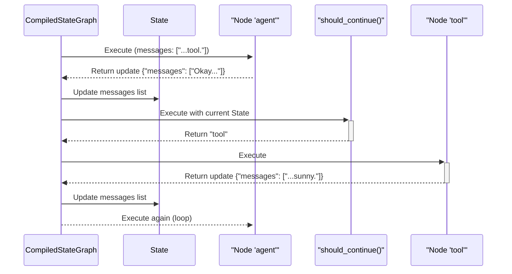

# Chapter 3: Nodes & Edges

In the previous chapters on [StateGraph](01_stategraph_.md) and [Channels](02_channels_.md), we learned how to create a blueprint for our application and define the rules for its memory. So far, our graphs have been simple, straight lines: `START -> A -> B -> END`.

But what if you need to make a decision? What if your application needs to do one thing in some cases, and another thing in others? To build truly intelligent agents, we need to create flows with branches and loops.

This is where the concepts of Nodes and Edges become crucial. They are the fundamental building blocks that let you design any workflow you can imagine.

## The Blueprint Analogy

Let's return to our house blueprint analogy from Chapter 1.

*   **Nodes are the "rooms" in your house.** Each room has a specific purpose—a kitchen for cooking, a bedroom for sleeping. Similarly, each node in your graph has a specific job, like calling a language model, getting user input, or using a tool. Nodes are the "doers."
*   **Edges are the "hallways and doors" connecting the rooms.** They define how you move from one room to another. Some are simple hallways (`add_edge`), always leading from room A to room B. Others are like a fork in the hallway with signs pointing to different rooms based on a decision (`add_conditional_edges`). Edges are the "connectors."

Using these two simple concepts, you can design a blueprint for any kind of application, from a simple linear process to a complex, looping agent.

## Building an Agent with a Choice

Let's build a simple AI agent that has to make a choice. After being called, it must decide whether to:
1.  Respond directly to the user.
2.  Use a tool to get more information first.

This "decision point" is a perfect use case for a conditional edge.

### 1. Define the State and Nodes

First, let's set up our state. We'll use the `Topic` channel we learned about in the last chapter to keep a list of messages.

```python
from typing import Annotated
from typing_extensions import TypedDict
from langgraph.graph import StateGraph, START, END
from langgraph.channels import Topic

class AgentState(TypedDict):
    messages: Annotated[list, Topic]
```
This state will track our conversation history.

Now, let's define our "rooms" (nodes). We need one node that acts as the agent's brain and another that pretends to be a tool.

```python
def call_agent(state):
    print("---AGENT---")
    # In a real app, this would be an LLM call.
    # For now, we'll simulate it.
    last_message = state["messages"][-1]
    if "tool" in last_message:
        return {"messages": ["Okay, I will use the tool."]}
    else:
        return {"messages": ["Hello! How can I help you?"]}

def call_tool(state):
    print("---TOOL---")
    # This is a dummy tool.
    return {"messages": ["The tool says: The weather is sunny."]}
```
*   `call_agent`: This function simulates our agent. It checks the last message. If it sees the word "tool", it decides it needs to use one. Otherwise, it gives a generic greeting.
*   `call_tool`: This function is a placeholder for any tool you might want to use, like a weather API or a calculator.

### 2. Add Nodes to the Graph

Let's add these functions as nodes to our graph blueprint.

```python
workflow = StateGraph(AgentState)

# Add the two nodes we defined above
workflow.add_node("agent", call_agent)
workflow.add_node("tool", call_tool)
```
Our blueprint now has two "rooms" named `"agent"` and `"tool"`.

### 3. Add Edges to Connect the Rooms

Now for the fun part: connecting everything. We always start at an entry point. Let's make the `"agent"` node our starting point.

```python
workflow.set_entry_point("agent")
```
This is a simple edge: execution will *always* begin at the `agent` node.

Next, we need the conditional edge. After the `agent` runs, where should it go? To the `tool` or to the `END`? We need a function that makes this decision.

```python
def should_continue(state):
    # This function decides the next path.
    last_message = state["messages"][-1]
    if "tool" in last_message:
        return "tool" # If the agent decided to use a tool, go to the tool node
    else:
        return END # Otherwise, finish the graph
```
This function is our "router". It inspects the state and returns a string with the name of the *next node to visit*.

Now, we can add this conditional edge to the graph.

```python
workflow.add_conditional_edges(
    "agent", # The edge starts from the "agent" node
    should_continue, # The function that makes the routing decision
)
```
This tells the graph: "After the `agent` node runs, call the `should_continue` function. Whatever string it returns, go to the node with that name."

Finally, after our tool runs, where should it go? Let's make it go back to the agent to process the tool's output. This creates a loop!

```python
# The tool always goes back to the agent to process the result
workflow.add_edge("tool", "agent")
```
Our blueprint is complete!

### 4. Compile and Run

Let's compile our graph and see it in action.

```python
app = workflow.compile()
```
First, let's try an input that *doesn't* require the tool.

```python
inputs = {"messages": ["What's up?"]}
for event in app.stream(inputs):
    print(event)
```
**Output:**
```
---AGENT---
{'agent': {'messages': ['Hello! How can I help you?']}}
```
The graph ran the `agent` node, the `should_continue` function returned `END`, and the process finished.

Now, let's try an input that *does* require the tool.

```python
inputs = {"messages": ["I need to use a tool."]}
for event in app.stream(inputs):
    print(event)
```
**Output:**
```
---AGENT---
{'agent': {'messages': ['Okay, I will use the tool.']}}
---TOOL---
{'tool': {'messages': ['The tool says: The weather is sunny.']}}
---AGENT---
{'agent': {'messages': ['Hello! How can I help you?']}}
```
Look at that!
1.  The `agent` ran and decided to use the tool.
2.  Our conditional edge routed the flow to the `tool` node.
3.  The `tool` ran and produced its output.
4.  The simple edge from `tool` sent the flow back to the `agent`.
5.  The `agent` ran again, saw no "tool" message this time, and finished.

## What's Happening Under the Hood?

Let's trace the decision-making process for the second run.

1.  **Node Execution:** The `agent` node is executed. It updates the state's `messages` list with `"Okay, I will use the tool."`.
2.  **Edge Check:** After the node finishes, LangGraph checks for edges leaving the `agent` node. It finds a conditional edge.
3.  **Router Execution:** LangGraph calls the router function associated with that edge, `should_continue`, and passes it the **current, updated state**.
4.  **Decision:** `should_continue` looks at the last message (`"Okay, I will use the tool."`), sees the word "tool", and returns the string `"tool"`.
5.  **Flow Control:** LangGraph receives the string `"tool"` and knows that the next node to execute is the one named `"tool"`. It adds `"tool"` to the queue of nodes to run.
6.  **Loop:** The `tool` node runs. When it finishes, LangGraph sees a simple edge pointing from `tool` to `agent` and adds `agent` back to the queue.

Here is a diagram of the conditional flow:



Diving into the code, when you call `add_edge` and `add_conditional_edges`, you are simply populating data structures inside your `StateGraph` object.

*   `workflow.add_edge("tool", "agent")`: This is very simple. It just adds the tuple `("tool", "agent")` to a set called `self.edges`.
    ```python
    # Simplified from libs/langgraph/langgraph/graph/state.py
    def add_edge(self, start_key: str, end_key: str) -> Self:
        # ... validation checks ...
        self.edges.add((start_key, end_key))
        return self
    ```

*   `workflow.add_conditional_edges("agent", should_continue)`: This is more sophisticated. It creates a `BranchSpec` object that bundles your router function (`should_continue`) and the mapping of its outputs to nodes. This spec is then stored in a dictionary called `self.branches`, keyed by the source node (`"agent"`).
    ```python
    # Simplified from libs/langgraph/langgraph/graph/state.py
    def add_conditional_edges(
        self,
        source: str,
        path: Callable,
        path_map: dict | None = None,
    ) -> Self:
        # ... validation checks ...
        self.branches[source][name] = BranchSpec.from_path(path, path_map)
        return self
    ```
When you `compile()` the graph, LangGraph transforms these simple lists and objects into a robust execution engine that knows how to follow these paths, call the router functions at the right time, and direct the flow of your application.

## Conclusion

You now have the complete toolkit to design any application flow.

*   **Nodes** are the functional units of your graph. They are the "doers" that perform tasks.
*   **Edges** define the control flow. They are the "connectors" that direct the path of execution.
*   `add_edge` creates a simple, direct path from one node to another.
*   `add_conditional_edges` creates a decision point, using a function to dynamically choose the next node based on the current state.

With these building blocks, you can create graphs with loops, branches, and complex logic, enabling you to build sophisticated and stateful agents. In our example, we simulated a tool, but LangGraph has built-in helpers to make tool usage even easier.

Next up: [ToolNode](04_toolnode_.md), a specialized node for seamlessly integrating tools into your graphs.

---

Generated by [AI Codebase Knowledge Builder](https://github.com/The-Pocket/Tutorial-Codebase-Knowledge)