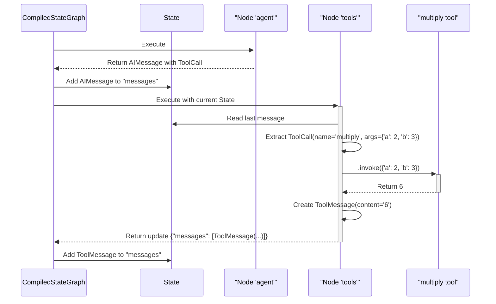

# Chapter 4: ToolNode

In our last chapter on [Nodes & Edges](03_nodes___edges_.md), we built an agent that could make a decision. We even created a placeholder "tool" node. But in a real agent, calling tools is a fundamental, multi-step process:

1.  The Language Model (LLM) decides to use a tool and outputs a special message called a "tool call".
2.  Your code needs to receive this tool call.
3.  It has to find the *correct* tool from a list of available tools.
4.  It needs to execute that tool with the arguments provided by the LLM.
5.  Finally, it must package the result into a "tool message" and add it back to the conversation history so the LLM knows what happened.

Doing all of this manually is tedious and error-prone. This is exactly the problem `ToolNode` is designed to solve.

## Your Smart Toolbox Assistant

Imagine your agent has a toolbox. The LLM is the "planner" who decides which tool to use. The `ToolNode` is the "assistant" who actually uses the tools.

The LLM writes a work order, like: `Use the calculator to multiply 5 and 3.` This work order is a `ToolCall`.

The `ToolNode` takes this work order, goes to the toolbox, finds the calculator, runs `5 * 3`, gets the result `15`, and writes a report: `The calculator returned 15.` This report is a `ToolMessage`.

`ToolNode` is a pre-built, specialized node that automates this entire "work order" process, making it incredibly easy to give your agents real capabilities.

## Building an Agent that Can Calculate

Let's build a simple agent that uses a calculator tool.

### 1. Create Your Tool

First, we need a tool. A tool can be any Python function. We use the `@tool` decorator from LangChain to give it a proper description, which the LLM will use to decide when to call it.

```python
from langchain_core.tools import tool

@tool
def multiply(a: int, b: int) -> int:
    """Multiplies two numbers."""
    return a * b
```
We've just created a `multiply` tool. The LLM will be able to read the function name (`multiply`), its arguments (`a`, `b`), and its description (`"Multiplies two numbers."`) to understand how to use it.

### 2. Create the `ToolNode`

Now, we create a `ToolNode` and give it our toolbox—in this case, a list containing just our `multiply` tool.

```python
from langgraph.prebuilt import ToolNode

tool_node = ToolNode([multiply])
```
That's it! `tool_node` is now a fully functional graph node that knows how to execute the `multiply` tool.

### 3. Define the State and Agent Node

Our state will be the same as before, just a list of messages. We'll also create a simple agent node that simulates an LLM call.

```python
from typing import Annotated
from typing_extensions import TypedDict
from langgraph.graph.message import add_messages
from langchain_core.messages import AIMessage, BaseMessage, ToolMessage

class AgentState(TypedDict):
    messages: Annotated[list[BaseMessage], add_messages]

# This is a dummy LLM. It just returns a tool call.
def call_agent(state):
    print("---AGENT---")
    return {"messages": [
        AIMessage(
            content="",
            tool_calls=[{"name": "multiply", "args": {"a": 2, "b": 3}, "id": "1"}]
        )
    ]}
```
Notice the `AIMessage`. Instead of regular text content, it has a list of `tool_calls`. This is the "work order" our fake LLM is sending to the `ToolNode`.

### 4. Wire the Graph

Now we'll assemble our graph. We'll have two nodes: `"agent"` and `"tools"`.

```python
from langgraph.graph import StateGraph, END
from langgraph.prebuilt import tools_condition

workflow = StateGraph(AgentState)

workflow.add_node("agent", call_agent)
workflow.add_node("tools", tool_node)

workflow.set_entry_point("agent")
```
This sets up our two "rooms" and defines the starting point.

How do we connect them? We'll use a conditional edge, just like in the last chapter. But this pattern is so common that LangGraph provides a helpful pre-built function for it: `tools_condition`.

```python
# The conditional edge will decide whether to call tools or end.
workflow.add_conditional_edges(
    "agent",
    tools_condition,
)

# After the tools are called, we always go back to the agent to review the results.
workflow.add_edge("tools", "agent")
```
`tools_condition` is a simple function that checks the last message. If it contains tool calls, it directs the graph to the `"tools"` node. If not, it directs the graph to `END`.

### 5. Compile and Run

Let's compile our graph. For this run, our fake LLM will produce a final answer after it sees the tool result.

```python
# We'll add a final response to our dummy LLM for the second pass.
def call_agent_final(state):
    print("---AGENT---")
    last_message = state['messages'][-1]
    # If the last message is a tool result, return the final answer.
    if isinstance(last_message, ToolMessage):
        return {"messages": [AIMessage(content="The result is 6.")]}
    # Otherwise, call the tool.
    return {"messages": [AIMessage(tool_calls=[{"name": "multiply", "args": {"a": 2, "b": 3}, "id": "1"}])]}

workflow.add_node("agent", call_agent_final)
app = workflow.compile()

# Let's run it!
inputs = {"messages": []}
for event in app.stream(inputs):
    print(event)
```
**Output:**
```
---AGENT---
{'agent': {'messages': [AIMessage(content='', tool_calls=[{'name': 'multiply', 'args': {'a': 2, 'b': 3}, 'id': '1'}])]}}
{'tools': {'messages': [ToolMessage(content='6', name='multiply', tool_call_id='1')]}}
---AGENT---
{'agent': {'messages': [AIMessage(content='The result is 6.')]}}
```
It worked perfectly!
1.  The `agent` node produced a `ToolCall`.
2.  `tools_condition` routed the flow to our `tool_node`.
3.  The `ToolNode` saw the call for "multiply", executed `2 * 3`, and returned a `ToolMessage` with the content "6".
4.  The flow went back to the `agent`, which saw the `ToolMessage` and produced the final answer.
5.  `tools_condition` saw no more tool calls and ended the graph.

## What's Happening Under the Hood?

The `ToolNode` seems like magic, but it's following a clear, simple procedure.

1.  **Receive State:** The `ToolNode` is called and receives the *entire current graph state*.
2.  **Find Last Message:** It looks at the `messages` list in the state and finds the most recent message.
3.  **Extract Tool Calls:** It confirms this message is an `AIMessage` and extracts the list of `tool_calls` from it.
4.  **Execute in Parallel:** For each `ToolCall` in the list:
    *   It looks up the tool by its `name` (e.g., "multiply") in its internal dictionary of tools.
    *   If the tool isn't found, it creates an error message.
    *   It calls the tool's `.invoke()` method, passing in the `args`.
    *   If the tool runs successfully, it captures the output.
    *   If the tool throws an error, it catches it and formats a user-friendly error message.
5.  **Format Output:** It takes the result from each tool execution and wraps it in a `ToolMessage`, making sure to include the original `id` of the `ToolCall`. This is crucial for the LLM to match results to its requests.
6.  **Update State:** It returns a dictionary that adds all the new `ToolMessage`s to the `messages` list in the state.

Here is a diagram of the process:



Diving into the code, the `ToolNode`'s logic for finding the work order is in its `_parse_input` method.

```python
# Simplified from libs/prebuilt/langgraph/prebuilt/tool_node.py

def _parse_input(self, input, store):
    # ... logic to find the messages list ...
    messages = input.get(self.messages_key, [])

    # Find the last AI message
    latest_ai_message = next(
        m for m in reversed(messages) if isinstance(m, AIMessage)
    )

    # Extract its tool_calls
    tool_calls = latest_ai_message.tool_calls
    return tool_calls, "dict"
```
And the logic for running a single tool call is in `_run_one`.

```python
# Simplified from libs/prebuilt/langgraph/prebuilt/tool_node.py

def _run_one(self, call, input_type, config):
    # ... validation logic ...
    try:
        # Look up the tool by name and invoke it!
        response = self.tools_by_name[call["name"]].invoke(call["args"], config)
    except Exception as e:
        # ... error handling logic ...
        content = _handle_tool_error(e, ...)
        return ToolMessage(content, name=call["name"], tool_call_id=call["id"])
    
    # Wrap the successful response in a ToolMessage
    return ToolMessage(msg_content_output(response), name=call["name"], tool_call_id=call["id"])

```
As you can see, the `ToolNode` is essentially a smart wrapper that contains all the boilerplate logic for robustly handling tool execution.

## Conclusion

You've learned how to use one of the most powerful prebuilt components in LangGraph.

*   `ToolNode` is a specialized node that **automates the process of executing tools**.
*   It takes a list of tools when you create it, building its own internal "toolbox".
*   It automatically **parses tool calls** from the last `AIMessage`, **executes** the correct tools, and **formats the results** as `ToolMessage`s.
*   The `tools_condition` helper function makes routing to the `ToolNode` simple and standardized.

By using `ToolNode`, you can focus on defining your agent's logic and the capabilities of your tools, rather than worrying about the plumbing of tool execution.

So far, we've treated our graph as a black box. We call `.invoke()` and get a result. But what exactly is the engine that runs our graph, executes the nodes in the right order, and updates the state? Understanding this engine is the key to unlocking LangGraph's full power.

Next up: [Pregel](05_pregel_.md), the processing engine at the heart of LangGraph.

---

Generated by [AI Codebase Knowledge Builder](https://github.com/The-Pocket/Tutorial-Codebase-Knowledge)