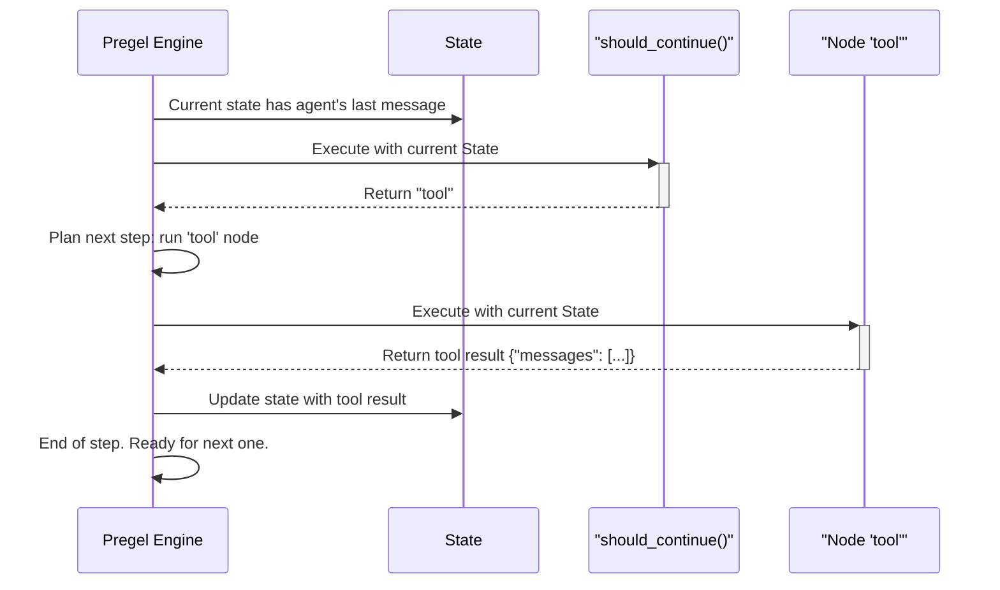

# Chapter 5: Pregel

In the previous chapters on [StateGraph](01_stategraph_.md), [Nodes & Edges](03_nodes___edges_.md), and even the [ToolNode](04_toolnode_.md), we've been building blueprints for our applications. We define the state, add nodes, and connect them with edges. Then, we use a "magic" method called `.compile()` to turn our blueprint into a runnable `app`.

But what exactly is that `app`? What engine is running our graph, executing nodes in the correct order, and updating the state at each step?

Meet **Pregel**, the powerful execution engine at the heart of LangGraph.

## The Project Manager for Your Graph

Imagine your graph is a team of expert workers (your nodes). Each worker has a specific skill. To complete a complex project, they need a project manager to coordinate their efforts.

Pregel is that project manager. Its job is to:
1.  **Start the Day:** Look at the initial project requirements (the input state).
2.  **Assign Tasks:** Figure out which worker(s) should start first (the entry point).
3.  **Run a Work Cycle:** Give the active workers their assignments. The workers do their jobs and produce results (state updates).
4.  **Review Progress:** Collect all the results from the workers who just finished.
5.  **Plan the Next Cycle:** Based on the new results, decide which workers need to be activated for the next cycle.
6.  **Repeat:** Continue running these work cycles until the project is complete (it reaches an `END` node).

This cyclical, step-by-step process is the core idea behind Pregel. It's an incredibly robust way to manage the flow of information and execution in your graph. You've already been using it every time you've run a compiled graph—now we're just giving it a name and looking inside the box.

## Tracing a Graph's Journey

Let's revisit the conditional agent graph we built in the [Nodes & Edges chapter](03_nodes___edges_.md). How does Pregel actually run this?

Here's the code for that graph again, for reference:

```python
# (Code from Chapter 3)
# State
class AgentState(TypedDict):
    messages: Annotated[list, Topic]

# Nodes
def call_agent(state): # ... returns a message ...
def call_tool(state): # ... returns a tool result ...

# Edges
def should_continue(state): # ... returns "tool" or END ...

# Graph construction
workflow = StateGraph(AgentState)
workflow.add_node("agent", call_agent)
workflow.add_node("tool", call_tool)
workflow.set_entry_point("agent")
workflow.add_conditional_edges("agent", should_continue)
workflow.add_edge("tool", "agent")

app = workflow.compile()
```

Now, let's follow the project manager (Pregel) as it executes `app.invoke({"messages": ["I need to use a tool."]})`.

**Step 0: Initialization**
*   **Pregel:** "Project start! The initial state has one message: `['I need to use a tool.']`."
*   **Pregel:** "The blueprint says the entry point is the 'agent' worker. Let's start our first work cycle."

**Step 1 (Work Cycle 1)**
*   **Pregel:** "Okay, 'agent' worker, you're up. Here is the current state."
*   **Agent Node:** Runs, processes the state, and returns `{"messages": ["Okay, I will use the tool."]}`.
*   **Pregel:** "Great work. I'll collect this result and update our main project state. The `messages` list now has a new message."

**Step 2 (Work Cycle 2)**
*   **Pregel:** "The 'agent' worker just finished. The blueprint shows a conditional hallway (`should_continue`) leaving its office. I need to run that decision-making function."
*   **`should_continue` function:** Runs, looks at the *new* state, sees the message contains "tool", and returns the string `"tool"`.
*   **Pregel:** "The decision is to go to the 'tool' worker. 'tool', you're up for this cycle. Here's the current state."
*   **Tool Node:** Runs and returns `{"messages": ["The tool says: The weather is sunny."]}`.
*   **Pregel:** "Excellent. I'll update the project state with the tool's result."

**Step 3 (Work Cycle 3)**
*   **Pregel:** "The 'tool' worker just finished. The blueprint shows a simple hallway from 'tool' back to 'agent'. Okay, 'agent', you're up again."
*   **Agent Node:** Runs again, this time with the tool's output in the state. It returns a final response like `{"messages": ["The weather is sunny. I can help with other things too!"]}`.
*   **Pregel:** "Got it. State updated."

**Step 4 (Work Cycle 4)**
*   **Pregel:** "The 'agent' worker is done. Let's check that conditional hallway (`should_continue`) again."
*   **`should_continue` function:** Runs, looks at the latest state, sees no more reason to use a tool, and returns `END`.
*   **Pregel:** "The decision is `END`. The project is complete! I'll return the final state."

This iterative process of running nodes, collecting updates, and deciding what to run next is the essence of Pregel.

## What's Happening Under the Hood?

When you call `.compile()`, LangGraph takes your nodes and edges and builds a `Pregel` object. This object contains all the logic for the execution loop we just described. The core of this logic lives in a class called `PregelLoop`.

Let's visualize the process from Step 2 of our example:



### Diving into the Code

The main loop logic is found in `libs/langgraph/langgraph/pregel/_loop.py`. Inside the `PregelLoop` class, a method called `tick()` represents one full "work cycle".

A simplified view of what happens in each `tick` looks like this:

```python
# Simplified concept from libs/langgraph/langgraph/pregel/_loop.py

class PregelLoop:
    def tick(self):
        # 1. Figure out which tasks to run in this step
        self.tasks = prepare_next_tasks(
            self.checkpoint, self.nodes, self.channels, ...
        )

        if not self.tasks:
            # No more work to do, we are done!
            return False

        # 2. Execute all the tasks for this step
        # (This happens in the background)
        execute_tasks(self.tasks)

        # ... more logic follows in after_tick() ...
        return True
```
The `tick()` method is the project manager starting a new day of work.

The real "intelligence" of the project manager lies in the `prepare_next_tasks` function, found in `libs/langgraph/langgraph/pregel/_algo.py`. This function is responsible for looking at the current state of all the [Channels](02_channels_.md) and deciding which nodes should be triggered.

```python
# Simplified concept from libs/langgraph/langgraph/pregel/_algo.py

def prepare_next_tasks(...):
    tasks = []
    # For every node in the graph...
    for name, process in processes.items():
        # ...check if any of its trigger channels have been updated
        if _triggers(channels, versions, seen_versions, process):
            # If so, create a new task for that node
            task = create_task_for_node(name, ...)
            tasks.append(task)
    return tasks
```
This is how Pregel knows to run the `tool` node only after the `agent` node has produced a message that satisfies the `should_continue` condition. It sees that a message was added (the channel was updated), and this triggers the conditional edge, which in turn schedules the `tool` node for the next step.

## Why "Pregel"?

The name and concept are inspired by a famous paper from Google called "Pregel: A System for Large-Scale Graph Processing." The core idea there was to process massive graphs (like the web graph) by having each node (or "vertex") run a small computation, send messages to its neighbors, and then repeat. LangGraph adapts this powerful, general-purpose idea for creating stateful, cyclical AI applications.

## Conclusion

You've now peeked under the hood of LangGraph's execution engine!

*   **Pregel** is the engine that powers your compiled graphs. You don't write Pregel code, but understanding how it works is key.
*   It operates in **steps** or **cycles**.
*   In each step, it **identifies** which nodes to run based on the latest state updates, **executes** them, and then **applies** their results to the state.
*   This loop continues until the graph reaches an `END` state.

This robust, step-by-step execution model is what allows LangGraph to handle complex, long-running tasks with loops and branches. But what if we want to intentionally pause this loop? For example, what if a tool fails and we need a human to fix it, or what if the agent needs to ask for clarification? To do that, we need a way to stop Pregel in its tracks.

Next up: [Interrupt](06_interrupt_.md), the mechanism for pausing and resuming your graph's execution.

---

Generated by [AI Codebase Knowledge Builder](https://github.com/The-Pocket/Tutorial-Codebase-Knowledge)