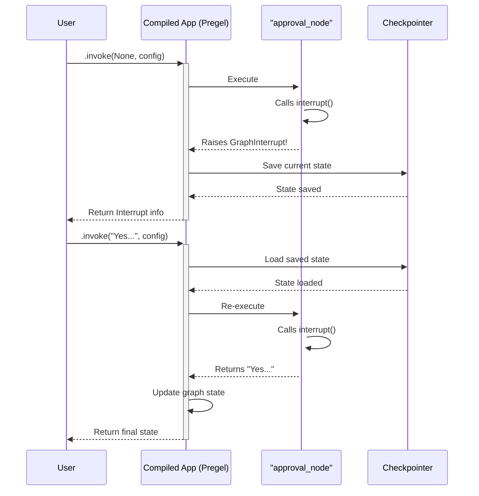

# Chapter 6: Interrupt

In the last chapter on [Pregel](05_pregel_.md), we saw how LangGraph uses a powerful engine to run our application's logic in automated, step-by-step cycles. This is perfect for agents that can think and act on their own.

But what if the agent isn't sure what to do? What if it needs to perform a risky action and wants to ask for permission first? We need a way to hit the "pause" button on the Pregel engine and ask for a human's input.

This is exactly what `Interrupt` is for. It's the mechanism that enables **human-in-the-loop** workflows.

## The Supervisor on the Assembly Line

Imagine your graph is a smart assembly line. Each node is a robotic worker performing a task. The Pregel engine is the conveyor belt, moving the product from one worker to the next.

Now, imagine one worker is about to drill a hole, but the instructions are unclear. Instead of making a mistake, it stops the entire assembly line and turns on a flashing yellow light to call for a human supervisor.

The supervisor (you, the user) walks over, examines the situation, and gives a clear instruction: "Yes, drill the hole here," or "No, skip this step." The worker receives the instruction, the flashing light turns off, and the assembly line starts moving again.

`Interrupt` is that flashing yellow light. It's a way for a node to pause the entire graph, surface some information to the user, and wait for external instructions before continuing.

## Building an Agent that Asks for Permission

Let's build a simple agent that wants to take an action but needs to ask for human approval before it proceeds.

### 1. The `interrupt` Function

The core of this feature is a single function: `interrupt`. You call this function from inside one of your nodes. When LangGraph encounters it, it immediately pauses the execution of the graph.

Crucially, for `interrupt` to work, your graph **must have a checkpointer configured**. The graph needs a way to "save its game" when it pauses, so it can load it back up when you're ready to resume. We'll learn all about checkpointers in the next chapter, but for now, we'll just add a simple in-memory one.

### 2. Define the State and the "Approval" Node

Our state will just track the final decision made by the human.

```python
from typing_extensions import TypedDict

class AgentState(TypedDict):
    approval: str
```

Now, let's create our node. This node will use the `interrupt` function to ask a question and wait for an answer.

```python
from langgraph.types import interrupt

def ask_for_approval(state):
    print("---ASKING FOR APPROVAL---")
    # The value passed to interrupt() is sent to the user.
    response = interrupt("Do you approve this action?")
    
    # When resumed, `response` will be the value the user provides.
    return {"approval": response}
```
When this node runs for the *first time*, the `interrupt()` call will pause everything and send the question `"Do you approve this action?"` to the user. When the user resumes the graph, the node will run *again*, but this time `interrupt()` will return the user's input.

### 3. Build and Run the Graph (The Pause)

Let's wire up a simple graph. It will start, go to our approval node, and then end. Remember to add a checkpointer!

```python
from langgraph.graph import StateGraph, START, END
from langgraph.checkpoint.memory import InMemorySaver

# A checkpointer is required for interrupts.
checkpointer = InMemorySaver()

workflow = StateGraph(AgentState)
workflow.add_node("approval_node", ask_for_approval)
workflow.set_entry_point("approval_node")
workflow.add_edge("approval_node", END)

app = workflow.compile(checkpointer=checkpointer)
```
Now, let's run it. We need a unique `thread_id` in our config so the checkpointer can keep track of this specific conversation.

```python
import uuid

config = {"configurable": {"thread_id": str(uuid.uuid4())}}
result = app.invoke(None, config)
```
**Output:**
```
---ASKING FOR APPROVAL---
```
And... that's it. The graph has stopped running. If you inspect the `result`, you will see that the graph is interrupted.

```python
print(result)
```
**Output:**
```python
{'__interrupt__': (Interrupt(value='Do you approve this action?', id='...'),)}
```
The graph is now paused, waiting for us. It has surfaced the `Interrupt` object, which contains the value we passed to the `interrupt()` function.

### 4. Resuming the Graph

To resume, we simply call `.invoke()` again on the *same compiled app* with the *same config*. This time, we pass the user's response as the input.

```python
user_response = "Yes, I approve."
resume_result = app.invoke(user_response, config)

print(resume_result)
```
**Output:**
```
---ASKING FOR APPROVAL---
{'approval': 'Yes, I approve.'}
```
It worked!
1.  LangGraph reloaded the saved state of our graph.
2.  It re-ran the `approval_node`.
3.  This time, `interrupt()` received the `user_response` ("Yes, I approve.") and returned it.
4.  Our node finished, updating the state, and the graph ran to completion.

## What's Happening Under the Hood?

The `interrupt` mechanism feels magical, but it's a clever combination of exceptions and the checkpointer.

1.  **First Run - The Exception:** When your node calls `interrupt()` for the first time in a given step, it doesn't return anything. Instead, it raises a special exception called `GraphInterrupt`.
2.  **Pregel Catches It:** The [Pregel](05_pregel_.md) engine is designed to catch this specific exception. Instead of crashing, it sees `GraphInterrupt` as a signal to pause.
3.  **Checkpointing:** Before pausing, Pregel instructs the checkpointer to save the complete current state of the graph—all the values in all the [Channels](02_channels_.md), and a note about where it was interrupted.
4.  **Reporting:** Pregel then reports the interrupt back to the user who called the graph.
5.  **Second Run - The Reload:** When you call the graph again with the same `thread_id`, the checkpointer first loads the saved state. Pregel now knows it's resuming from an interruption.
6.  **Passing the Resume Value:** Pregel takes the value you provided (e.g., `"Yes, I approve."`) and stores it in a special place in the configuration for this run.
7.  **Re-Executing the Node:** It then begins execution by re-running the node that was interrupted.
8.  **Returning the Value:** This time, when the `interrupt()` function is called, it checks the configuration, finds the resume value, and simply returns it. No exception is raised, and the node continues its execution as normal.

Here's a diagram of this two-part process:



### Diving into the Code

The `interrupt()` function itself is a clever switch. You can find it in `libs/langgraph/langgraph/types.py`.

```python
# Simplified concept from libs/langgraph/langgraph/types.py

def interrupt(value: Any) -> Any:
    # Get the current run's configuration
    conf = get_config()["configurable"]
    # Get the scratchpad for this run
    scratchpad = conf[CONFIG_KEY_SCRATCHPAD]
    
    # Check if there is a resume value waiting for us
    v = scratchpad.get_null_resume(True)
    if v is not None:
        # If so, return it!
        return v
    
    # If not, this is the first time. Raise the exception!
    raise GraphInterrupt(...)
```
And the `GraphInterrupt` exception class is defined in `libs/langgraph/langgraph/errors.py`. It's a simple exception class that the Pregel engine is specifically programmed to look for and handle gracefully.

## Conclusion

You've learned how to break out of the fully automated flow of the graph to get human feedback.

*   **`Interrupt`** is the mechanism for pausing a graph's execution to allow for human-in-the-loop workflows.
*   You use the `interrupt()` function inside a node to trigger a pause.
*   When a graph is interrupted, it **stops and waits** for you to resume it.
*   You resume a graph by calling it again with the same configuration, providing the necessary input.
*   This entire process is made possible by a **checkpointer**, which saves and loads the graph's state.

We've mentioned this "checkpointer" quite a few times now. It's the memory system that makes interrupts, resilience, and long-running agents possible. It's time to pull back the curtain and see exactly how it works.

Next up: [Checkpointer](07_checkpointer_.md)

---

Generated by [AI Codebase Knowledge Builder](https://github.com/The-Pocket/Tutorial-Codebase-Knowledge)