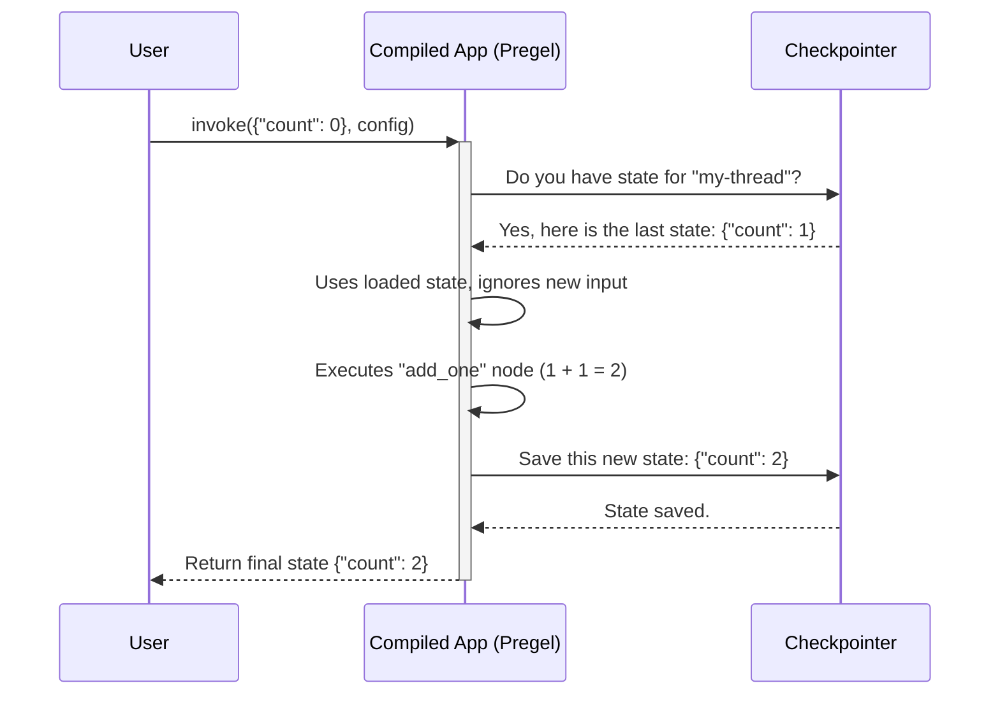

# Chapter 7: Checkpointer

In our last chapter on [Interrupt](06_interrupt_.md), we learned how to pause our graph and wait for human input. We briefly mentioned that this powerful feature is only possible because of something called a "checkpointer." You might have been wondering: what exactly is that? And how does the graph remember where it was when we resume it?

Welcome to the world of Checkpointers, the persistence layer for your LangGraph applications.

## Your Agent's Save System

Imagine you're playing a long video game. You wouldn't want to start from the very beginning every time you turn on your console. You rely on the game's save system to record your progress, so you can pick up right where you left off.

A **Checkpointer is the save system for your graph.**

At the end of each step, the checkpointer can save the current state of your graph. This has incredible benefits:
*   **Durable Execution:** If your program crashes, you don't lose all your work. You can restart from the last successful step.
*   **Long-Running Agents:** An agent can run for hours or days, pausing and resuming without losing its memory.
*   **Human-in-the-Loop:** As we saw with `Interrupt`, it allows the graph to "save and quit" while waiting for a human, then "load game" to continue.
*   **Persistent Memory:** A chatbot can remember your conversation from yesterday because its state was saved by a checkpointer.

The checkpointer is the key to turning a simple, in-memory script into a robust, stateful, and long-lived application. LangGraph provides several ready-to-use checkpointers, including `InMemorySaver`, `SqliteSaver`, and `PostgresSaver`.

## Building a Persistent Counter

Let's build a very simple graph that demonstrates the power of persistence. It will be a simple counter. Each time we run it, it will increment a number. Thanks to the checkpointer, it will remember the number between runs.

### 1. Define the State and Node

First, let's define our state. We'll track a single number, `count`. We'll also define a simple node that adds 1 to the count.

```python
from typing_extensions import TypedDict
from langgraph.graph import StateGraph, END

class State(TypedDict):
    count: int

def add_one(state: State) -> State:
    print(f"Current count: {state['count']}. Adding 1.")
    return {"count": state["count"] + 1}
```
This is a standard node that reads the current `count` and returns an updated value.

### 2. Create the Checkpointer

For this tutorial, we'll use the simplest checkpointer: `InMemorySaver`. As the name suggests, it saves the state in memory. This is great for learning, but for a real application that needs to survive a restart, you would use something like `SqliteSaver`.

```python
from langgraph.checkpoint.memory import InMemorySaver

checkpointer = InMemorySaver()
```
We've now created our "save system."

### 3. Build and Compile the Graph

Now we assemble our graph. The key difference is the new `checkpointer` argument we pass to the `.compile()` method.

```python
workflow = StateGraph(State)
workflow.add_node("add", add_one)
workflow.set_entry_point("add")
workflow.add_edge("add", END)

# Pass the checkpointer to the compile method
app = workflow.compile(checkpointer=checkpointer)
```
By passing in our `checkpointer`, we've told the compiled app to automatically save and load its state.

### 4. Run It (And Run It Again!)

To use the checkpointer, we need to give each "conversation" or "session" a unique ID. This is how the checkpointer knows which saved game to load. We provide this ID in the `config`.

Let's run our app for a thread named `"my-thread"`.

```python
# The config contains a "thread_id" which is used to
# identify the conversation.
config = {"configurable": {"thread_id": "my-thread"}}

# Run the graph for the first time
app.invoke({"count": 0}, config)
```
**Output:**
```
Current count: 0. Adding 1.
```
The graph ran and finished. Now, let's run the *exact same code again*, without changing anything.

```python
# Run the graph for the second time with the SAME config
app.invoke({"count": 0}, config)
```
**Output:**
```
Current count: 1. Adding 1.
```
Look at that! Even though we passed in `{"count": 0}` as the input again, the graph didn't start from 0. It started from 1, which was the final state from our *previous* run. The checkpointer loaded our progress! If we run it a third time, it will start from 2.

## What's Happening Under the Hood?

The process of saving and loading is seamlessly integrated into the [Pregel](05_pregel_.md) execution engine.

1.  **Invoke with Config:** When you call `app.invoke()` with a `config` that includes a `thread_id`, the process begins.
2.  **Load Checkpoint:** Before running any nodes, Pregel asks the checkpointer: "Do you have a saved state for `thread_id` 'my-thread'?"
3.  **Checkpointer Responds:**
    *   **First time:** The checkpointer (our `InMemorySaver`) looks in its internal dictionary and finds nothing for "my-thread". It tells Pregel there's no saved state. Pregel then uses the input you provided (`{"count": 0}`) as the starting state.
    *   **Second time:** The checkpointer finds the saved state from the previous run. It deserializes it and hands it to Pregel. Pregel ignores the new input (`{"count": 0}`) and uses the *loaded state* (`{"count": 1}`) instead.
4.  **Node Execution:** Pregel runs the graph's logic as usual, step by step.
5.  **Save Checkpoint:** After each step successfully completes, Pregel tells the checkpointer, "Here is the new state of the graph. Please save it."
6.  **Checkpointer Saves:** The checkpointer serializes the new state and saves it, associating it with the `thread_id` "my-thread" and a new, unique `checkpoint_id`.

Here is a simplified diagram of the second run:



### Diving into the Code

The checkpointer interface is defined in `langgraph.checkpoint.base.BaseCheckpointSaver`. All checkpointers, whether they save to memory, SQLite, or Postgres, implement the same core methods. The two most important are `get_tuple` and `put`.

For our `InMemorySaver`, the implementation is essentially a wrapper around Python dictionaries.

The `.get_tuple()` method, which retrieves saved states, is conceptually simple:

```python
# Simplified concept from libs/checkpoint/langgraph/checkpoint/memory/__init__.py
class InMemorySaver:
    def get_tuple(self, config: RunnableConfig) -> CheckpointTuple | None:
        thread_id = config["configurable"]["thread_id"]
        # Look up the thread_id in our storage dictionary
        if checkpoints := self.storage[thread_id]:
            # Get the latest saved checkpoint
            checkpoint_id = max(checkpoints.keys())
            saved_data = checkpoints[checkpoint_id]
            # ... load and format the data ...
            return formatted_checkpoint_tuple
```
It's just a dictionary lookup to find the saved data for the given `thread_id`.

The `.put()` method, which saves new states, is equally straightforward:

```python
# Simplified concept from libs/checkpoint/langgraph/checkpoint/memory/__init__.py
class InMemorySaver:
    def put(self, config: RunnableConfig, checkpoint: Checkpoint, ...) -> RunnableConfig:
        thread_id = config["configurable"]["thread_id"]
        # Serialize the checkpoint data
        serialized_data = self.serde.dumps(checkpoint)
        # Store it in our dictionary with its new unique ID
        self.storage[thread_id][checkpoint["id"]] = serialized_data
        # ... return the config for the next step ...
```
It's just a dictionary assignment. The `SqliteSaver` and `PostgresSaver` do the exact same things, but instead of using a dictionary, their `get_tuple` and `put` methods execute `SELECT` and `INSERT` SQL queries against a database.

## Conclusion

You've now unlocked the secret to building persistent and robust agents.

*   A **Checkpointer** acts as the **save system** for your graph.
*   It automatically **saves** the state after each step and **loads** it at the beginning of a run.
*   To use it, you instantiate a checkpointer (like `InMemorySaver`) and pass it to `graph.compile()`.
*   You must provide a `thread_id` in your `config` to identify which "saved game" to load and update.
*   This mechanism is the foundation for durable execution, long-running conversations, and human-in-the-loop features like `Interrupt`.

We have now covered all the core components of LangGraph's class-based API, from [StateGraph](01_stategraph_.md) to Checkpointers. While this API is incredibly powerful and flexible, LangGraph also offers a more concise, decorator-based syntax for building graphs, which can be simpler for many common patterns.

Next up: [Functional API (@task, @entrypoint)](08_functional_api___task___entrypoint__.md)

---

Generated by [AI Codebase Knowledge Builder](https://github.com/The-Pocket/Tutorial-Codebase-Knowledge)