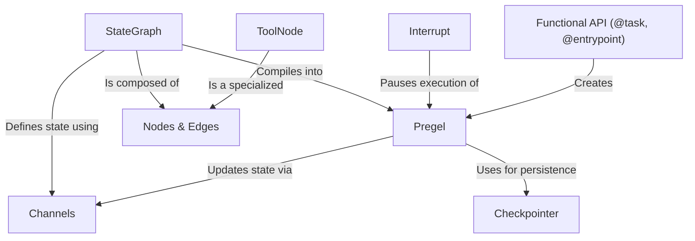

# Tutorial: langgraph

**LangGraph** is a library for building powerful, stateful applications with LLMs, such as agents and chatbots. It lets you define your application's logic as a *graph*, where each step is a *node* and the connections between them are *edges*.

The core idea is a shared **state** that acts as the application's memory. As the graph runs, nodes can read from and write to this state, allowing for complex, multi-step reasoning. LangGraph manages the entire execution flow, supports saving and loading the state for *persistence* (so agents can be long-running), enables easy *tool use*, and allows for *human-in-the-loop* interruptions.

**Source Repository:** [None](None)

## Chapters

1. [StateGraph
](01_stategraph_.md)
2. [Channels
](02_channels_.md)
3. [Nodes & Edges
](03_nodes___edges_.md)
4. [ToolNode
](04_toolnode_.md)
5. [Pregel
](05_pregel_.md)
6. [Interrupt
](06_interrupt_.md)
7. [Checkpointer
](07_checkpointer_.md)
8. [Functional API (@task, @entrypoint)
](08_functional_api___task___entrypoint__.md)

---

Generated by [AI Codebase Knowledge Builder](https://github.com/The-Pocket/Tutorial-Codebase-Knowledge)