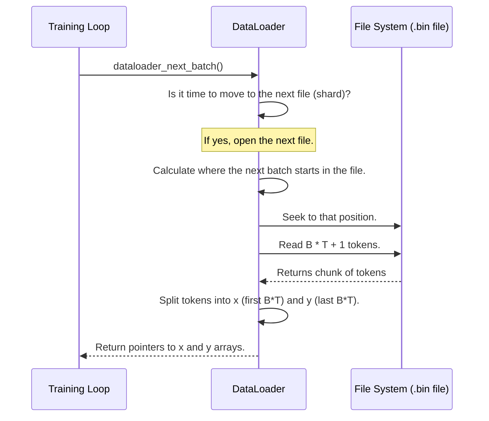

# Chapter 1: Data Loading & Batching

Welcome to `llm.c`! We're about to embark on a journey to build a complete Large Language Model (LLM) training pipeline, similar to GPT-2, entirely in C. But before our model can learn anything, it needs data. A lot of it. This chapter is all about setting the table for our model's grand feast.

Think of training an LLM like training a world-class athlete. This athlete needs a constant, well-prepared, and organized supply of food to build muscle and perform. Our `DataLoader` is the personal chef and delivery service for our model, ensuring it gets the right "food" (data) at the right time.

### The Problem: From Raw Text to Model Food

Imagine our training data is a massive library, like all of Shakespeare's plays stored in a single text file. Our model can't just "read" this book.

1.  **Language Barrier:** Computers don't understand words like "Thou" or "art"; they only understand numbers.
2.  **Memory Limits:** We can't load the entire library into memory at once. It's too big!
3.  **Efficiency:** Feeding the model one word at a time would be incredibly slow, like feeding an elephant one peanut at a time.

Our goal is to create a system that efficiently takes raw text, turns it into numbers, and serves it up in perfectly sized portions, or "batches," for the model to learn from.

### Step 1: Tokenization - Translating Words to Numbers

The first step is to break down the raw text into smaller, understandable pieces and convert them into numbers. This process is called **tokenization**. Each unique piece (which could be a word, part of a word, or a punctuation mark) is assigned a unique integer ID. This vocabulary of pieces is created by a "tokenizer."

In `llm.c`, we use a Python script to do this preprocessing. Let's look at a simplified piece of `dev/data/tinyshakespeare.py`.

```python
# dev/data/tinyshakespeare.py

# Use the same tokenizer as GPT-2
import tiktoken
enc = tiktoken.get_encoding("gpt2")

# Read the raw text file
text = open("tiny_shakespeare.txt", 'r').read()

# Turn the text into a long list of token IDs
tokens = enc.encode(text)
print(tokens[:24]) # See the first 24 tokens
```

If the text starts with "First Citizen:", the tokenizer might convert it into a list of integers like this:

**Input (text):** `"First Citizen:"`
**Output (tokens):** `[1722, 2920, 25, ...]`

### Step 2: Creating Data Shards - The Meal Prep

Now that we have a giant list of numbers (tokens), we can't just load it all into memory. Instead, we "prep" our data by saving it to disk in a special binary format. We might even split a huge dataset into multiple files, called **shards**, like meal-prepping into many containers.

Our Python script `dev/data/data_common.py` handles this. It saves the tokens in a simple `.bin` file.

```python
# dev/data/data_common.py

def write_datafile(filename, toks):
    # Create a header with some info (magic number, version, # of tokens)
    header = np.zeros(256, dtype=np.int32)
    header[0] = 20240520 # A special number to identify our file type
    header[1] = 1 # The version of the file format
    header[2] = len(toks)
    # Convert tokens to a compact format (unsigned 16-bit integers)
    toks_np = np.array(toks, dtype=np.uint16)
    # Write the header and then the tokens to the file
    with open(filename, "wb") as f:
        f.write(header.tobytes())
        f.write(toks_np.tobytes())
```

This creates a file like `tiny_shakespeare_train.bin`. It has a small header followed by a continuous stream of token IDs. This format is simple, compact, and super fast for our C code to read.

### Step 3: Batching - Serving the Meals

Now we're ready to serve the data. We don't feed the model one token at a time. Instead, we group them into rectangles of data called **batches**. A batch has two dimensions:

*   `B`: **Batch Size**. How many sequences we process at once.
*   `T`: **Sequence Length**. How many tokens are in each sequence.

For example, if `B=4` and `T=8`, a batch would look like this:

```
[
  [t1, t2, t3, t4, t5, t6, t7, t8],       # Sequence 1
  [t9, t10, t11, t12, t13, t14, t15, t16], # Sequence 2
  [t17, ..., t24],                         # Sequence 3
  [t25, ..., t32]                          # Sequence 4
]
```

This is where the `DataLoader` comes in. It reads from our `.bin` file and prepares these batches. In our Python training script (`train_gpt2.py`), using the `DataLoader` is straightforward:

```python
# train_gpt2.py

# B is batch size, T is sequence length
B, T = 4, 64

# Initialize the loader to read from our data file
train_loader = DistributedDataLoader("tiny_shakespeare_train.bin", B, T, ...)

# In the training loop, just ask for the next meal
x, y = train_loader.next_batch()
```

The most important part is what `x` and `y` are. For the model to learn, we give it an input `x` and ask it to predict the *next* token at every position. So, `y` is just `x` shifted one position to the left!

*   **`x` (inputs):** A chunk of text for the model to read.
*   **`y` (targets):** The text it should have predicted.

**Example:**
If our stream of tokens is `[17, 7, 24, 8, 19, 42, 31]`
And we ask for a batch where B=1, T=4:
*   `x` would be `[17, 7, 24, 8]`
*   `y` would be `[7, 24, 8, 19]`

The model sees `17` and tries to predict `7`. Then it sees `[17, 7]` and tries to predict `24`, and so on. This is the fundamental task it learns from. The `DataLoader` prepares millions of these `(x, y)` pairs.

### Under the Hood: The C `DataLoader`

Now let's see how this works in C. The C `DataLoader` (`llmc/dataloader.h`) mirrors the Python version's logic. Its job is to efficiently read from the `.bin` files and serve up batches.

When `dataloader_next_batch()` is called, here’s a simplified step-by-step of what happens:



Let's look at the key C functions in `llmc/dataloader.h`.

First, `dataloader_init` finds all the data files (shards) and gets everything ready.

```c
// llmc/dataloader.h

void dataloader_init(DataLoader *loader, const char* filename_pattern, size_t B, size_t T, ...) {
    loader->B = B;
    loader->T = T;

    // glob finds all files that match a pattern, e.g., "data_shard_*.bin"
    glob(filename_pattern, 0, NULL, &loader->glob_result);

    // Allocate memory for our input and target buffers
    loader->inputs = (int*)mallocCheck(B * T * sizeof(int));
    loader->targets = (int*)mallocCheck(B * T * sizeof(int));

    // ... more setup ...
    dataloader_reset(loader); // Opens the first file
}
```

The real magic happens in `dataloader_load_batch`. It seeks to the correct position in the binary file and reads exactly enough tokens for one batch (`B*T`) plus one extra token to create the target `y`.

```c
// llmc/dataloader.h

void dataloader_load_batch(DataLoader* loader) {
    size_t B = loader->B;
    size_t T = loader->T;

    // ... calculates the correct file offset ...

    // Read B*T+1 tokens from the file into a temporary buffer
    fseekCheck(loader->tokens_file, current_offset, SEEK_SET);
    freadCheck(loader->buffer, sizeof(uint16_t), B*T+1, loader->tokens_file);

    // Create inputs (x) and targets (y)
    for (int i = 0; i < B*T; i++) {
        loader->inputs[i] = (int)loader->buffer[i];
        loader->targets[i] = (int)loader->buffer[i+1];
    }
}
```
This simple but powerful mechanism ensures a steady stream of data, allowing our model to train continuously without ever running out of "food." It can handle datasets far larger than available RAM by intelligently reading small chunks from disk as needed.

### Conclusion

You've just learned about the critical first step in training an LLM: getting the data ready. We've seen how `llm.c` uses a combination of Python preprocessing and a simple, efficient C `DataLoader` to solve this problem.

- **Tokenization** translates text into numbers.
- **Data Shards** (`.bin` files) store these numbers efficiently on disk.
- **Batching** groups tokens into `(B, T)` chunks of inputs (`x`) and targets (`y`).
- The **`DataLoader`** is the engine that reads from shards and creates these batches on the fly.

This data pipeline prepares the perfect "meals" for our model. Now that the table is set and the food is ready, it's time to meet the guest of honor. In the next chapter, we'll dive into the heart of the LLM itself.

Next: [Chapter 2: Transformer Model Architecture](02_transformer_model_architecture_.md)

---

Generated by [AI Codebase Knowledge Builder](https://github.com/The-Pocket/Tutorial-Codebase-Knowledge)