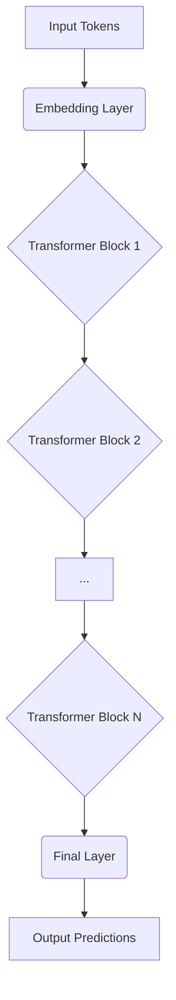
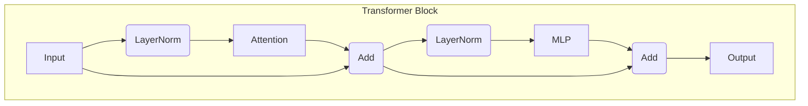
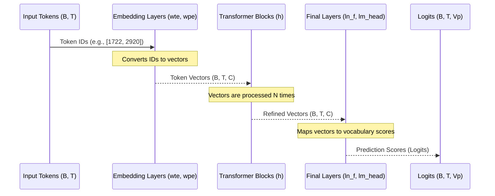

# Chapter 2: Transformer Model Architecture

In the [previous chapter](01_data_loading___batching_.md), we prepared the "food" for our language model. We turned a massive text file into a clean, efficient stream of numerical data batches. Now, it's time to introduce the guest of honor: the model itself.

If the data is the fuel, the model is the engine. Its job is to consume this fuel and learn to perform a task—in our case, generating human-like text. This chapter explores the blueprint of that engine, the **Transformer architecture**.

### The Goal: A Text-Processing Factory

Imagine a factory that takes in a sentence and, for each word, figures out which word is most likely to come next. This is the core task of our LLM.

**Input:** A sequence of token IDs, e.g., `[1722, 2920, 25]` ("First Citizen:")
**Output:** A sequence of predictions. For the input `[1722]`, it should predict `2920`. For `[1722, 2920]`, it should predict `25`.

To do this, the model needs to understand context. The word "bank" means something different in "river bank" versus "investment bank." The Transformer architecture is a powerful design that excels at understanding this kind of context in sequences.

### The Big Picture: A Stack of Lego Blocks

At its heart, a Transformer model is surprisingly simple: it's just the same block of layers repeated over and over, stacked on top of each other. Think of it like building a tower out of identical Lego blocks.

Each block takes a sequence of vectors (numbers representing our text) and transforms them. By stacking these blocks, the model can perform progressively more complex transformations, allowing it to grasp deeper meanings and relationships in the text.



The GPT-2 model we're building has multiple layers (e.g., the smallest version has 12), meaning it stacks 12 of these blocks.

### Inside a Single Block: The Two Key Stations

Each "Lego block" in our factory has two main work stations:

1.  **Self-Attention ("The Conference Room"):** This is where tokens talk to each other. For each token in the sequence, the attention mechanism looks at all the *other* tokens that came before it and decides which ones are most important for understanding its meaning. It's like a meeting where each word can ask, "To understand me, who else in this sentence should I pay attention to?" This is how the model learns context.

2.  **MLP / Feed-Forward Network ("The Thinking Station"):** After gathering context from the "conference room," each token goes to its own private "thinking station." The MLP (Multi-Layer Perceptron) is a standard neural network that processes the information for that single token. It crunches the numbers and refines the token's representation based on the context it just gathered.

These two stations are connected with a few other important pieces, like **Layer Normalization** (which keeps the numbers stable) and **Residual Connections** (which help information flow smoothly through the deep stack of blocks).

A single block looks like this:



### The Python Blueprint: `train_gpt2.py`

Let's see how this blueprint is defined in our Python reference code. We don't need to understand every detail, just the overall structure.

First, let's look at the main `GPT` class. Its `__init__` method is like an architect drawing up the plans.

```python
# train_gpt2.py

class GPT(nn.Module):
    def __init__(self, config):
        super().__init__()
        self.transformer = nn.ModuleDict(dict(
            # Token and position embeddings
            wte = nn.Embedding(config.vocab_size, config.n_embd),
            wpe = nn.Embedding(config.block_size, config.n_embd),
            # The stack of N identical transformer blocks
            h = nn.ModuleList([Block(config) for _ in range(config.n_layer)]),
            # The final layer normalization
            ln_f = nn.LayerNorm(config.n_embd),
        ))
        # The final layer that maps to word predictions
        self.lm_head = nn.Linear(config.n_embd, config.vocab_size, bias=False)
```

The most important line is `h = nn.ModuleList(...)`. This is where we create our stack of `N` identical `Block`s.

Now, let's look inside a single `Block`.

```python
# train_gpt2.py

class Block(nn.Module):
    def __init__(self, config):
        super().__init__()
        self.ln_1 = nn.LayerNorm(config.n_embd)
        self.attn = CausalSelfAttention(config) # The "Conference Room"
        self.ln_2 = nn.LayerNorm(config.n_embd)
        self.mlp = MLP(config) # The "Thinking Station"

    def forward(self, x):
        # The two main steps with residual connections ("x + ...")
        x = x + self.attn(self.ln_1(x))
        x = x + self.mlp(self.ln_2(x))
        return x
```

This code perfectly matches our diagram. It defines the two main stations (`attn` and `mlp`) and shows how the input `x` is processed and added back (the residual connection `x + ...`).

### Data Flow Through the Model

Now let's trace the journey of a single batch of data from input to final prediction.



1.  **Input Tokens:** Our `DataLoader` provides a batch of token IDs with shape `(B, T)`, where `B` is batch size and `T` is sequence length.
2.  **Embedding:** The `wte` and `wpe` layers convert these integer IDs into vectors of size `C` (e.g., 768). This gives each token an initial representation and adds information about its position in the sequence. The shape is now `(B, T, C)`.
3.  **Transformer Blocks:** The data flows through the stack of `N` blocks. Each block refines the vectors, enriching them with context from other tokens. The shape `(B, T, C)` remains the same.
4.  **Final Layers:** After the last block, a final LayerNorm (`ln_f`) is applied. Then, the `lm_head` (a linear layer) converts the refined `(B, T, C)` vectors into `(B, T, Vp)` prediction scores, where `Vp` is our vocabulary size. These raw scores are called **logits**.
5.  **Output Logits:** For each of the `T` positions in the sequence, we now have a list of `Vp` scores, one for every possible next token in the vocabulary. The higher the score, the more likely the model thinks that token is the correct next one.

### Different Engine Models: GPT-2 vs. LLaMA-3

The Transformer architecture is a general blueprint. Different models are like different engine designs based on that blueprint. For example, `llm.c` also supports models like LLaMA-3.

The `train_llama3.py` script shows a slightly different architecture. While the core idea of stacked blocks is the same, LLaMA-3 makes a few key tweaks:
*   It uses **RMSNorm** instead of `LayerNorm`. (A simpler, faster normalization).
*   It uses a **SwiGLU** activation in its MLP block instead of GPT-2's `GELU`.
*   It uses **Rotary Positional Embeddings (RoPE)** instead of learned absolute position embeddings (`wpe`).

These are minor but important design changes that can improve performance and training stability, like choosing a different fuel injector or spark plug for an engine.

### The C Implementation: From Blueprint to Bare Metal

The Python code defines the architecture using high-level `nn.Module` abstractions. Our C code in `train_gpt2.c` is the direct, bare-metal implementation of the math behind these layers.

The `gpt2_forward` function in C mirrors the Python `forward` method perfectly. It's a loop that calls the C functions for each layer in sequence.

```c
// train_gpt2.c

void gpt2_forward(GPT2 *model, int* inputs, int* targets, size_t B, size_t T) {
    // ... setup ...

    // Start with the encoder (embedding layers)
    encoder_forward(acts.encoded, inputs, params.wte, params.wpe, B, T, C);

    // Loop through each layer of the model
    for (int l = 0; l < L; l++) {
        // ... get pointers to weights and activations for layer l ...

        // --- The Transformer Block ---
        layernorm_forward(...);
        matmul_forward(...);      // Part of Attention
        attention_forward(...);
        matmul_forward(...);      // Part of Attention
        residual_forward(...);
        layernorm_forward(...);
        matmul_forward(...);      // Part of MLP
        gelu_forward(...);
        matmul_forward(...);      // Part of MLP
        residual_forward(...);
    }

    // Final layers
    layernorm_forward(...);
    matmul_forward(acts.logits, ...);
    softmax_forward(acts.probs, ...);
    // ... calculate loss if targets are provided ...
}
```

Each function like `layernorm_forward` or `attention_forward` is a plain C implementation of the mathematical operations for that layer. This structure makes it easy to see the one-to-one correspondence between the high-level Python model and our low-level C code.

### Conclusion

You now understand the blueprint for a modern Large Language Model! The Transformer is not magic; it's an elegant and effective engineering design.

-   It's built from a **stack of identical blocks**.
-   Each block uses **Self-Attention** to understand context and an **MLP** to "think."
-   This architecture transforms a sequence of simple token IDs into rich, context-aware predictions.
-   The Python code in `train_gpt2.py` gives us a clear blueprint, and the C code in `train_gpt2.c` is its direct mathematical implementation.

We now have our "food" ([Data Loading & Batching](01_data_loading___batching_.md)) and our "engine" (the Transformer model). In the next chapter, we'll see how to actually connect them and start the engine. We will learn how to teach the model to make better predictions.

Next: [Chapter 3: Training Loop & Optimization](03_training_loop___optimization_.md)

---

Generated by [AI Codebase Knowledge Builder](https://github.com/The-Pocket/Tutorial-Codebase-Knowledge)