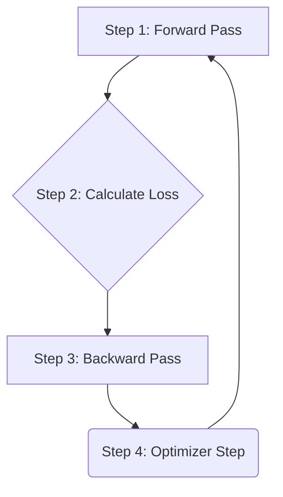

# Chapter 3: Training Loop & Optimization

In the [previous chapter](02_transformer_model_architecture_.md), we built our "engine"—the Transformer model. We have a powerful machine ready to process text. But right now, it's like an engine that's never been turned on. Its internal parameters are completely random, so its predictions are just gibberish.

This chapter is about starting the engine and teaching it to become a skilled wordsmith. We'll explore the training loop: the model's workout routine. This is where the real learning happens.

### The Goal: A Study Session for Our Model

Imagine our model is a student, the dataset we prepared in [Chapter 1](01_data_loading___batching_.md) is its textbook, and its exam is to predict the next word in a sentence. How does a student learn? They read a question, try to answer, check the correct answer, and learn from their mistakes.

Our training loop is precisely this study session. It's a cycle that repeats millions of times:
1.  Give the model a piece of text (a "question").
2.  Ask it to predict the next word (its "answer").
3.  Compare its prediction to the correct word in the text.
4.  Calculate a "mistake score," which we call **loss**.
5.  Slightly adjust the model's internal parameters to reduce this mistake score in the future.

The goal is simple: get the lowest possible loss. A lower loss means the model is getting better at predicting the next word.

### The Four Steps of a Workout Rep

Every single step of training follows the same four-part rhythm. This cycle is the heartbeat of deep learning.



1.  **Forward Pass:** We take a batch of data from our `DataLoader` and feed it through the model. The model processes the input and spits out its predictions (logits). It's like asking the student, "After 'to be or not to...', what comes next?"
2.  **Calculate Loss:** We compare the model's predictions with the actual target words. The difference between them is quantified as a single number, the **loss**. A high loss means the predictions were way off; a low loss means they were close.
3.  **Backward Pass (Backpropagation):** This is the magic of learning. We calculate how much each individual parameter (weight) in the model contributed to the final loss. These "blame scores" are called **gradients**. A gradient tells us two things for each parameter: the *direction* to change it (increase or decrease) and the *magnitude* of the change needed to reduce the loss.
4.  **Optimizer Step:** Finally, the **optimizer** comes in. Think of it as the model's personal trainer. It takes the gradients (the "blame scores") and updates all the model's parameters just a tiny bit in the right direction. This small adjustment makes the model slightly better for the next round.

By repeating this cycle over and over, the millions of tiny adjustments accumulate, and the model gradually "learns" the patterns of language.

### The Python Blueprint: `train_gpt2.py`

Our Python script `train_gpt2.py` shows this loop in its cleanest form. It's just a simple `for` loop that executes these four steps.

```python
# train_gpt2.py

# init the optimizer
optimizer = raw_model.configure_optimizers(...)

# The main training loop
for step in range(args.num_iterations + 1):
    # Fetch a batch of data
    x, y = train_loader.next_batch()

    # Step 1 & 2: Forward pass and loss calculation
    _, loss = model(x, y, return_logits=False)

    # Step 3: Backward pass (calculate gradients)
    loss.backward()

    # Step 4: Optimizer step (update weights)
    optimizer.step()

    # Reset gradients for the next iteration
    optimizer.zero_grad(set_to_none=True)
```

Let's break that down:
- `model(x, y)`: This runs the forward pass and automatically calculates the loss because we provide the targets `y`.
- `loss.backward()`: This is PyTorch's magic wand for backpropagation. It automatically calculates the gradients for every parameter in the model.
- `optimizer.step()`: The optimizer uses the calculated gradients to update the model's weights.
- `optimizer.zero_grad()`: This cleans the slate. We reset the gradients to zero so that the "blame scores" from this step don't get mixed up with the next one.

### The Personal Trainer: The AdamW Optimizer

How does the optimizer decide *how* to update the weights? We use a popular and effective optimizer called **AdamW**.

Think of the loss as a giant, hilly landscape, and we want to find the lowest valley. The gradients tell us which direction is downhill from where we are.

- A simple optimizer might just take a small step downhill. The size of this step is called the **learning rate**.
- **AdamW** is smarter. It's like a hiker with momentum. It doesn't just look at the current slope (gradient); it also considers the direction it was heading before. This helps it roll through small bumps and speed up in long, straight descents, making training faster and more stable.

The `gpt2_update` function in our C code is a from-scratch implementation of the AdamW optimizer.

### Under the Hood: The C Implementation

The training loop in our C code (`train_gpt2.c`) directly mirrors the Python version. It's a sequence of function calls that perform the same four steps.

Here's what one step of the C training loop looks like from a high level:

```mermaid
sequenceDiagram
    participant Loop as Main Loop (in main())
    participant Loader as DataLoader
    participant Model as GPT2 Model
    participant Optimizer as gpt2_update()

    Loop->>Loader: dataloader_next_batch()
    Loader-->>Loop: Returns pointers to x, y
    Loop->>Model: gpt2_forward(x, y)
    Model-->>Loop: Calculates and stores loss
    Loop->>Model: gpt2_zero_grad()
    Loop->>Model: gpt2_backward()
    Model-->>Loop: Calculates and stores gradients
    Loop->>Optimizer: gpt2_update()
    Optimizer-->>Loop: Updates model parameters
```

The `main` function in `train_gpt2.c` orchestrates this entire process in a simple `for` loop.

```c
// train_gpt2.c

for (int step = 0; step <= 40; step++) {
    // Get the next batch of data
    dataloader_next_batch(&train_loader);

    // Step 1 & 2: Forward pass and loss calculation
    gpt2_forward(&model, train_loader.inputs, train_loader.targets, B, T);

    // Before backward pass, reset all gradients to zero
    gpt2_zero_grad(&model);

    // Step 3: Backward pass to calculate gradients
    gpt2_backward(&model);

    // Step 4: Update the weights using the AdamW optimizer
    gpt2_update(&model, 1e-4f, 0.9f, 0.999f, 1e-8f, 0.0f, step+1);
}
```
This C code is a direct, one-to-one translation of the logic in our Python script. Each function—`gpt2_forward`, `gpt2_backward`, and `gpt2_update`—is a plain C implementation of the underlying math.

Let's peek inside our AdamW implementation, `gpt2_update`. You don't need to understand the math, but notice how it iterates through every single parameter and applies an update rule.

```c
// train_gpt2.c

void gpt2_update(GPT2 *model, float learning_rate, float beta1, float beta2, ...) {
    // Loop over every single parameter in the model
    for (size_t i = 0; i < model->num_parameters; i++) {
        float param = model->params_memory[i];
        float grad = model->grads_memory[i];

        // AdamW magic: update momentum buffers (m and v)
        float m = beta1 * model->m_memory[i] + (1.0f - beta1) * grad;
        float v = beta2 * model->v_memory[i] + (1.0f - beta2) * grad * grad;
        model->m_memory[i] = m;
        model->v_memory[i] = v;

        // ... bias correction happens here ...

        // Apply the final update to the parameter
        model->params_memory[i] -= learning_rate * (m_hat / (sqrtf(v_hat) + eps));
    }
}
```

This function is the "personal trainer" in action, carefully adjusting each "muscle" (parameter) of the model based on its performance in the last "rep."

### Conclusion

You've just learned the most fundamental concept in training neural networks! The training loop is the process that brings our static model architecture to life, allowing it to learn from data.

-   Learning is a cycle of **four steps**: forward pass, calculate loss, backward pass, and optimizer step.
-   **Loss** is a score that tells us how wrong the model is. The goal of training is to minimize it.
-   **Backpropagation** calculates gradients, which tell us how to adjust each parameter to reduce the loss.
-   The **Optimizer** (like AdamW) acts as a trainer, using the gradients to intelligently update the model's parameters.

We now have all the conceptual pieces to train a model from scratch. However, our C code so far is simple and educational, but not very fast. To train a real LLM, we need to make these operations run millions of times faster.

Next: [Chapter 4: High-Performance Kernels](04_high_performance_kernels_.md)

---

Generated by [AI Codebase Knowledge Builder](https://github.com/The-Pocket/Tutorial-Codebase-Knowledge)