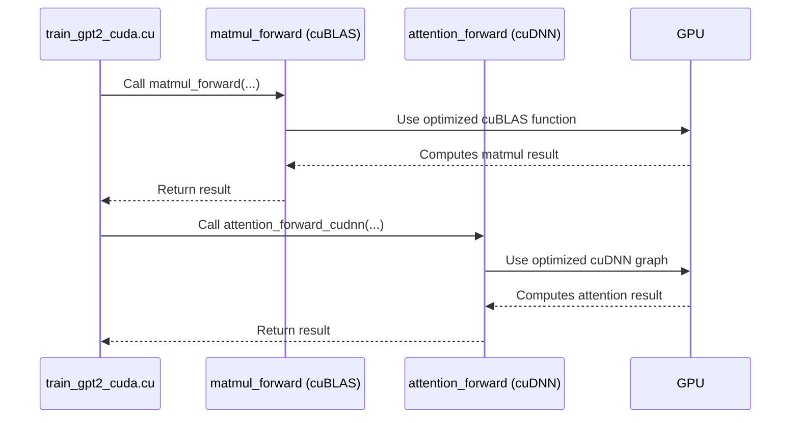

# Chapter 4: High-Performance Kernels

In the [previous chapter](03_training_loop___optimization_.md), we learned how to start the engine. We built a training loop that teaches our model by repeatedly running a four-step cycle: forward pass, loss calculation, backward pass, and optimizer step. Conceptually, this is everything we need.

However, there's a problem. The C code we've seen so far is written for clarity, not for speed. The `for` loops that perform the mathematics in our `train_gpt2.c` file are like using a manual screwdriver to build a skyscraper. It will work, but it will take an eternity. Training a real LLM involves *trillions* of calculations. To make this feasible, we need to swap our screwdriver for a high-powered drill.

This is where **high-performance kernels** come in. They are the power tools of our project.

### The Goal: Supercharging Our Math

The vast majority of the time spent in training is inside a few key mathematical operations, especially matrix multiplication (`matmul`). Our goal is to make these specific operations run as fast as humanly possible on our hardware, whether it's a CPU or a GPU.

A "kernel" is just a name for a routine or function that does a piece of the heavy computational lifting. Instead of a generic, slow C loop, a high-performance kernel is a custom-built piece of code, aggressively optimized for the hardware it runs on.

### Strategy 1: Parallelizing on the CPU with OpenMP

Let's start with our simple CPU code. A modern CPU doesn't just have one brain; it has multiple "cores," each capable of working independently. Our simple `for` loops only use one core, leaving the others idle.

**Analogy:** Imagine you have to assemble 8 chairs. Doing it yourself is slow. But if you have 7 friends, you can all work on one chair each at the same time. You'd finish roughly 8 times faster.

**OpenMP** is a beautifully simple technology that lets us do exactly this. It's a set of instructions we can give to the compiler. The most common one is a single line of code we add right before a `for` loop.

Let's look at our matrix multiplication from `train_gpt2.c`.

```c
// train_gpt2.c

// This tells the compiler: "Run the two loops below in parallel!"
#pragma omp parallel for collapse(2)
for (int b = 0; b < B; b++) {
    for (int t = 0; t < T; t++) {
        // ... do the math for one (b, t) position ...
    }
}
```

That's it! The `#pragma omp parallel for` directive tells the compiler to automatically split the work of this loop across all available CPU cores. This single line can make our code run many times faster without changing any of the underlying logic. It's one of the simplest ways to get a major performance boost.

### Strategy 2: Massive Parallelism on the GPU with CUDA

CPUs are great, but for the kind of math we're doing, GPUs are in a league of their own. While a CPU might have 8 or 16 powerful cores, a modern NVIDIA GPU has *thousands* of simpler cores.

**Analogy:** If OpenMP gives you a team of 8 skilled carpenters (CPU cores), CUDA gives you an army of 10,000 workers who are each incredibly fast at one simple task, like hammering a single nail. For a job that requires millions of nails, the army is unbeatable.

**CUDA** is NVIDIA's platform for programming GPUs. It allows us to write special functions, called "kernels," that can be executed by thousands of threads at the same time.

Here's what a conceptual CUDA kernel looks like. Notice the `__global__` keyword, which marks it as code to be run on the GPU.

```c
// llmc/cuda_kernels.cu (conceptual)

__global__ void matmul_forward_kernel(float* out, const float* inp, ...) {
    // Each thread calculates its unique position in the output matrix
    int idx = blockIdx.x * blockDim.x + threadIdx.x;

    // ... each thread does a tiny piece of the total work ...
    // e.g., calculate a single value in the output matrix
}
```

When we "launch" this kernel, we tell the GPU to run it with, say, 10,000 threads. Each thread gets a unique ID (`idx`) and performs the calculation for one small part of the problem. This is how we achieve massive parallelism and incredible speedups.

### Strategy 3: Using Pro-Grade Tools with cuBLAS and cuDNN

Writing our own CUDA kernels is powerful, but it's also difficult to get it perfect. Why build our own power drill from scratch when we can use a top-of-the-line, professionally engineered one?

NVIDIA provides specialized libraries for exactly this purpose:
1.  **cuBLAS:** A library for Basic Linear Algebra Subprograms. It contains highly-optimized functions for matrix multiplication. The NVIDIA engineers who wrote it have spent years perfecting it to be the fastest possible on their hardware.
2.  **cuDNN:** A Deep Neural Network library. It provides optimized routines for common deep learning operations, including the attention mechanism (our model's "conference room").

Instead of writing our own complex CUDA kernel for matrix multiplication, we can just call the right function from cuBLAS.

```c
// Using a cuBLAS function is much simpler than writing the kernel ourselves.
// (This is a simplified call)
cublasLtMatmul(cublaslt_handle, ...);
```

The `llm.c` project uses these libraries extensively in its high-performance CUDA implementation. For example, `llmc/cudnn_att.cpp` uses cuDNN to implement a super-fast version of the attention mechanism, leveraging a technique similar to FlashAttention. This is the heart of how `llm.c` achieves state-of-the-art performance.

### How it All Connects

The training loop calls a series of functions to perform the forward and backward passes. In the high-performance CUDA version of our code (`train_gpt2_cuda.cu`), these function calls are routed to the optimized GPU versions instead of the simple C loops.

Here’s a high-level view of what happens during a forward pass in the CUDA-accelerated version:



This "dispatch" to specialized kernels is the key. The high-level logic of the [Transformer Model Architecture](02_transformer_model_architecture_.md) and the [Training Loop & Optimization](03_training_loop___optimization_.md) remains exactly the same, but the underlying implementation of each mathematical step is replaced with a hyper-optimized version.

### Conclusion

You've now peeked under the hood at the real engine room of `llm.c`. High-performance kernels are what make training modern LLMs possible. Without them, the computation would be intractably slow.

-   The naive C loops are for learning; **kernels** are for performance.
-   On CPUs, we use **OpenMP** to easily parallelize our code across multiple cores.
-   On GPUs, we use **CUDA** to unlock massive parallelism with thousands of threads.
-   For the absolute best performance, we leverage professional-grade libraries like **cuBLAS** for matrix math and **cuDNN** for neural network operations.

These optimizations are the "secret sauce" that transforms `llm.c` from a simple educational tool into a powerful, high-speed training library. Now that we know how to make our model fast, how do we know *how* fast it is?

Next: [Chapter 5: Evaluation & Benchmarking](05_evaluation___benchmarking_.md)

---

Generated by [AI Codebase Knowledge Builder](https://github.com/The-Pocket/Tutorial-Codebase-Knowledge)