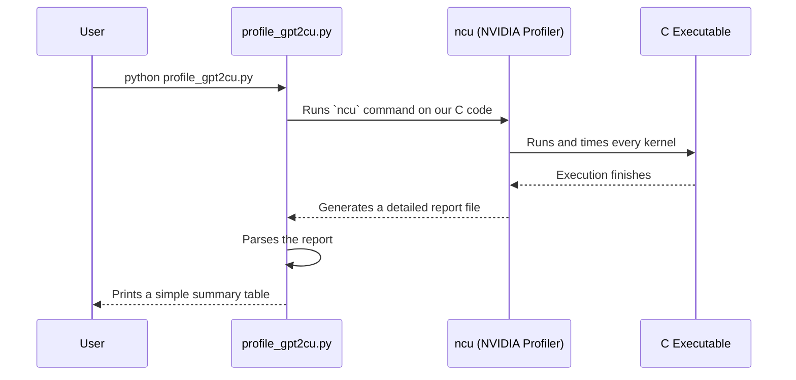

# Chapter 5: Evaluation & Benchmarking

In the [previous chapter](04_high_performance_kernels_.md), we equipped our project with power tools. We swapped our slow C loops for high-performance CUDA kernels, making our model training process incredibly fast. Now we have a powerful engine, but two big questions remain:

1.  How *smart* is our model after all that training?
2.  How *fast* is our code *really* running?

This chapter is about answering those questions. We'll introduce the model's report card (evaluation) and its stopwatch (benchmarking and profiling).

### The Goal: Grading Our Student and Timing Our Athlete

Imagine we've spent months training a student for a big exam and an athlete for a big race.

-   **Evaluation (The Report Card):** We need to give our student a standardized test to see what they've learned. We can't just "feel" like they're smart; we need a score. For LLMs, this means testing them on standardized language exams to measure their reasoning and knowledge.

-   **Benchmarking (The Stopwatch):** We need to time our athlete's 100-meter dash. This gives us a single, clear number—like tokens-per-second—to measure their overall performance.

-   **Profiling (The Slow-Motion Replay):** Just knowing the race time isn't enough. To make our athlete faster, we need to analyze their performance in slow motion. Which part of the race is slowing them down? Is it the start? The middle? Profiling does this for our code, breaking down execution time to find bottlenecks.

Let's explore how `llm.c` implements these three crucial steps.

### Part 1: Evaluation - The Model's Report Card

How do we give a language model an exam? We use standardized datasets designed to test specific skills. A popular one is **HellaSwag**, which tests common-sense reasoning. Each question gives the model a sentence and asks it to choose the most logical of four possible endings.

**Example HellaSwag Question:**
> A man is sitting on a roof. He...
> 1. is using wrap to wrap a pair of skis.
> 2. is ripping level tiles off.
> 3. is holding a rubik's cube.
> 4. starts pulling up roofing on a roof.

The correct answer is 4. How does the model "choose"? It calculates the probability of each full sentence. The model should find the sentence "A man is sitting on a roof. He starts pulling up roofing on a roof." to be the most likely (i.e., have the lowest loss).

The script `dev/data/hellaswag.py` helps us run this test. It downloads the dataset, feeds each question to a model, and checks if the model's most likely completion is the correct one.

```python
# dev/data/hellaswag.py (simplified logic)

num_correct = 0
num_total = 0

# Loop through all 10,042 questions in the validation set
for example in iterate_examples("val"):
    # The context is the start of the sentence, e.g., "A man is sitting on a roof. he"
    context = example["ctx"]
    # The label is the index of the correct ending (0, 1, 2, or 3)
    label = example["label"]
    # The four possible endings
    endings = example["endings"]

    # --- For each of the 4 endings ---
    # 1. Combine context + ending to form a full sentence.
    # 2. Feed the sentence to the model.
    # 3. Calculate the loss (how "surprised" the model is by this sentence).
    losses = calculate_loss_for_each_ending(model, context, endings)

    # The model's prediction is the ending with the lowest loss.
    pred = losses.argmin()

    if pred == label:
        num_correct += 1
    num_total += 1

print(f"Accuracy: {num_correct / num_total}")
```
This script gives us a simple accuracy score, our model's grade on the HellaSwag exam. For official scores, the community uses a standard tool called the **Eleuther AI Eval Harness**. The `dev/eval/README.md` file in `llm.c` shows you how to convert our trained `.bin` model into a standard format and run this official evaluation to get a full report card on multiple exams like HellaSwag, MMLU, and more.

### Part 2: Benchmarking - The Overall Speed

After training, we want to know how fast our model is. The most common metric is **tokens per second**. How many tokens can our model process (both forward and backward pass) in one second?

A more advanced metric is **Model Flops Utilization (MFU)**. Your GPU has a theoretical maximum speed (measured in TFLOPS, or trillions of floating-point operations per second). MFU tells you what percentage of that theoretical maximum you are actually achieving. An MFU of 50% means you are harnessing half of your GPU's raw power, which is considered very good!

The `llmc/mfu.h` header contains a database of NVIDIA GPU specs to help calculate this.

```c
// llmc/mfu.h (simplified snippet)

// A database of GPU performance specs
static GPUEntry gpu_db[] = {
    {"NVIDIA A100-SXM4-80GB", &AMPERE_DATACENTER, 432, 1410},
    {"NVIDIA GeForce RTX 4090", &ADA, 512, 2520},
    // ... many more GPUs ...
};

// This function looks up your GPU name and returns its
// theoretical peak TFLOPS.
float get_flops_promised(const char* device, int precision_mode) {
    // ... lookup logic ...
}
```
During training, our C code measures the time taken for each step, calculates the number of operations performed, and uses the value from `get_flops_promised` to print a live MFU estimate. This tells us how efficient our [High-Performance Kernels](04_high_performance_kernels_.md) are.

### Part 3: Profiling - The Slow-Motion Replay

A single benchmark number like tokens/sec is useful, but it doesn't help us find *why* our code is slow. For that, we need a profiler. A profiler is a tool that attaches to your running code and records the exact time spent inside every single function.

We use NVIDIA's command-line profiler, `ncu` (Nsight Compute), to analyze our CUDA kernels. The Python script `profile_gpt2cu.py` automates this entire process for us.

Here's how it works:



**Step 1: Running the Profiler**

The Python script first builds our C executable and then calls `ncu` on it using Python's `subprocess` module.

```python
# profile_gpt2cu.py

# Command to run ncu on our compiled C program
cmd = [NCU, "-o", "profile", "-f", "./profile_gpt2cu"]

# Execute the command
subprocess.check_call(cmd)
```
This runs our training code for one step and creates a `profile.ncu-rep` file containing incredibly detailed performance data for every kernel that ran on the GPU.

**Step 2: Summarizing the Results**

Next, the script asks `ncu` to export that data as a simple CSV file, which it then reads and summarizes into a human-readable table.

```python
# profile_gpt2cu.py (simplified parsing logic)

# ... code to get CSV data from ncu ...

print(f"{'name':<40} {'time':>6} {'frac':>6}  {'count':>6}")

# Loop over each kernel's data and print a summary line
for entry, value in ordered_time:
    # entry is kernel name, value is total time in ms
    print(f"{entry:<40} {value:6.2f} {100*value / total_time:6.2f}% ...")
```

The final output is a beautiful table that acts as our slow-motion replay. It shows exactly where the time is being spent.

**Example Output:**

```
Kernel type summaries:
  name                                     time    frac   count
  ----------------------------------------------------------------
  sm80_xmma_...                            11.83  56.31%      24  <-- Matrix Multiply
  cudnn_generated_...                       3.59  17.07%      24  <-- Attention
  adamw_kernel                              2.04   9.73%       1
  layernorm_...                             1.01   4.82%      26
  ... (other kernels) ...
```
From this table, we can immediately see that over 56% of our time is spent in matrix multiplication kernels (`xmma`) and 17% is spent in the cuDNN attention kernel. This confirms that optimizing these two areas, as we discussed in [Chapter 4](04_high_performance_kernels_.md), is the most important task for performance. This data-driven approach is key to writing fast code.

### Conclusion

You've now learned how we grade our model and time our code. This is a critical part of the machine learning engineering cycle: build, measure, improve.

-   **Evaluation** uses standardized tests like HellaSwag to give our model a "report card" on its language abilities.
-   **Benchmarking** uses a "stopwatch" to measure overall performance, giving us metrics like tokens-per-second and Model Flops Utilization (MFU).
-   **Profiling** provides a "slow-motion replay," using tools like NVIDIA's `ncu` to break down execution time and pinpoint the slowest parts of our code.

These tools don't just tell us how we did; they guide us on how to do better. Now that we understand the full C/CUDA training pipeline from data to evaluation, there's one last piece of the puzzle: how do we conveniently connect our fast C code to the user-friendly world of Python?

Next: [Chapter 6: Python-to-C/CUDA Bridge](06_python_to_c_cuda_bridge_.md)

---

Generated by [AI Codebase Knowledge Builder](https://github.com/The-Pocket/Tutorial-Codebase-Knowledge)