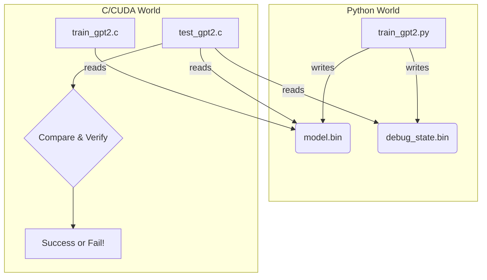

# Chapter 6: Python-to-C/CUDA Bridge

In the [previous chapter](05_evaluation___benchmarking_.md), we learned how to grade our model's intelligence and time its speed. We have a report card and a stopwatch. But this raises a fundamental question: how do we know our C/CUDA code is *correct* in the first place?

Our project has two versions of the same model: a simple, readable version in Python using PyTorch, and a lightning-fast version in C/CUDA. Even a tiny mathematical error in our C code—a single plus sign instead of a minus sign—could silently corrupt the entire training process. How can we be absolutely sure our C implementation is a perfect, bug-for-bug replica of the Python original?

This chapter introduces the brilliant solution to this problem: the **Python-to-C/CUDA Bridge**.

### The Goal: A Perfect Translation and a Master Answer Key

Imagine you've asked two people to translate a complex book. One is a world-renowned, trusted scholar (Python/PyTorch). The other is a new, incredibly fast speed-reader (our C/CUDA code). Before you trust the speed-reader's translation, you need to check their work against the scholar's.

The bridge is our system for doing exactly that.

1.  **The Scholar Writes the Answer Key:** The Python script acts as our trusted source. It performs one step of a calculation and writes *everything* down to a set of binary files: the initial model weights, the exact inputs, and the results of every calculation (outputs, loss, and gradients). This is our "ground truth."
2.  **The Student Checks Their Work:** The C/CUDA code is the student. It reads the same initial weights and inputs from the files. Then, it performs its own calculation and compares its results, number by number, against the answer key written by Python.

If every single number matches, we know our translation is perfect. If not, the system tells us exactly which number is wrong, pointing us directly to the bug.

### The Bridge in Action: A Two-Step Process

The bridge connects our Python and C worlds using simple binary files as a common language.



1.  **Step 1: Python Exports the Ground Truth.** We run our Python script (`train_gpt2.py`) with a special flag (`--write_tensors=1`). This tells it to perform one training step and then save two important files:
    *   `gpt2_124M.bin`: Contains the initial weights of the model.
    *   `gpt2_124M_debug_state.bin`: Contains the inputs, targets, outputs (logits), loss, and all the gradients for that single step. This is the complete "answer key".

2.  **Step 2: C Imports and Verifies.** Our C code uses these files for two purposes:
    *   **Normal Training (`train_gpt2.c`):** The main training program reads `gpt2_124M.bin` to initialize its weights, ensuring it starts from the exact same point as the Python model.
    *   **Unit Testing (`test_gpt2.c`):** This is a special test program. It also loads the initial weights, but then it *also* loads the `debug_state.bin` file. It runs one forward and backward pass and compares its calculated gradients against the "answer key" gradients from the file. If they match perfectly, the test passes.

This bridge is the cornerstone of development for `llm.c`. It's how we can confidently implement complex [High-Performance Kernels](04_high_performance_kernels_.md) and know they are mathematically correct.

### Under the Hood: The Python Side

Let's look at how the Python script `train_gpt2.py` creates these "answer key" files.

First, the `write_model` function saves the model's configuration (like number of layers, heads, etc.) and all its parameters (weights and biases) to a file.

```python
# train_gpt2.py

def write_model(model, filename, dtype):
    # Create a header with model config (magic number, version, etc.)
    header = torch.zeros(256, dtype=torch.int32)
    header[0] = 20240326 # magic number
    header[1] = 3      # file version
    header[2] = model.config.block_size
    # ... more config ...

    with open(filename, "wb") as file:
        # Write the header, then all the model's parameters
        file.write(header.numpy().tobytes())
        write_tensors(params, model.config.n_layer, file, dtype)
```
This function creates the `gpt2_124M.bin` file, which is our starting point.

Next, after performing one forward and backward pass, the `write_state` function saves the complete computational snapshot.

```python
# train_gpt2.py

def write_state(model, x, y, logits, loss, filename):
    # This file saves everything needed to debug one training step
    with open(filename, "wb") as file:
        # ... write another header ...
        # input x and targets y
        file.write(x.cpu().numpy().astype("int32").tobytes())
        file.write(y.cpu().numpy().astype("int32").tobytes())
        # logits (model output) and loss (the "mistake score")
        write_fp32(logits.cpu(), file)
        write_fp32(loss.cpu(), file)
        # and most importantly, the gradients for every parameter
        write_tensors(grads, model.config.n_layer, file, "float32")
```
This creates the `gpt2_124M_debug_state.bin` file, our master answer key for verifying the correctness of the C code's calculations.

### Under the Hood: The C Side

Now let's see how the C code uses these files. The main training executable, `train_gpt2.c`, uses a function called `gpt2_build_from_checkpoint` to load the initial weights.

```c
// train_gpt2.c

void gpt2_build_from_checkpoint(GPT2 *model, const char* checkpoint_path) {
    // Open the model file written by Python
    FILE *model_file = fopenCheck(checkpoint_path, "rb");

    // Read the 256-integer header
    int model_header[256];
    freadCheck(model_header, sizeof(int), 256, model_file);
    // ... check magic number and version ...

    // Read hyperparameters from the header
    model->config.max_seq_len = model_header[2];
    model->config.vocab_size = model_header[3];
    // ... and so on ...

    // Read all the parameter weights into the model's memory
    freadCheck(model->params_memory, sizeof(float), num_parameters, model_file);
    fcloseCheck(model_file);
}
```
This ensures that when we start `train_gpt2.c`, its brain is in the exact same initial state as the Python model was.

The real magic happens in our test suite. A simplified test might look something like this:

```c
// A simplified C test to verify correctness

// 1. Load the reference data from Python's debug file
ReferenceState ref = load_reference_state("gpt2_124M_debug_state.bin");

// 2. Build the model and load the same initial weights
GPT2 model;
gpt2_build_from_checkpoint(&model, "gpt2_124M.bin");

// 3. Run one forward and backward pass in C
gpt2_forward(&model, ref.inputs, ref.targets, B, T);
gpt2_zero_grad(&model);
gpt2_backward(&model);

// 4. Compare every calculated gradient to the reference gradient
for(int i = 0; i < model.num_parameters; i++) {
    // Check if the C gradient is very close to the Python gradient
    float difference = fabsf(model.grads_memory[i] - ref.grads[i]);
    assert(difference < 1e-4); // Fails if the numbers don't match!
}
printf("SUCCESS: Gradients match!\n");
```
This test is our guarantee. If we can change the C code, re-run this test, and see "SUCCESS", we know our change was correct. If the `assert` triggers, we know we've introduced a bug, and we can use a debugger to find exactly which parameter's gradient is the first to be wrong.

### Conclusion

The Python-to-C/CUDA Bridge isn't a piece of the model itself; it's a critical piece of engineering infrastructure. It's the quality assurance system that underpins the entire project.

-   **Python acts as the "ground truth"**, writing model weights and calculation states to `.bin` files.
-   **C/CUDA code reads these files** to initialize itself and, crucially, to run automated tests.
-   This system allows us to **verify that our C/CUDA code is a perfect mathematical replica** of the trusted PyTorch implementation.
-   It is an indispensable tool for **debugging** and developing with confidence.

With this bridge in place, we can be sure that our fast C code is not just fast, but also correct. We have the data pipeline, the model architecture, the training loop, the high-performance kernels, and a way to verify it all. The final piece of the puzzle is how to manage the complexity of building all these different C/CUDA versions.

Next: [Chapter 7: Build & Configuration System](07_build___configuration_system_.md)

---

Generated by [AI Codebase Knowledge Builder](https://github.com/The-Pocket/Tutorial-Codebase-Knowledge)