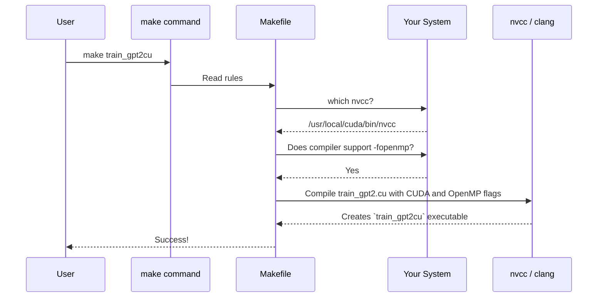

# Chapter 7: Build & Configuration System

In the [previous chapter](06_python_to_c_cuda_bridge_.md), we established a crucial quality-control system. The Python-to-C bridge ensures our fast C/CUDA code is a perfect mathematical replica of our trusted Python implementation. We have all the pieces: data loading, model architecture, a training loop, high-performance kernels, and a way to verify them.

But how do we assemble all these pieces? Our project needs to run on a wide variety of machines: a Linux server with a powerful A100 GPU, a Windows laptop with a GeForce RTX 4090, or a MacBook with a multi-core CPU. Each of these setups requires a slightly different assembly process. This chapter is about the master constructor that handles it all: the Build & Configuration System.

### The Goal: A Smart Factory Foreman

Imagine our project is a high-tech car, and we want to build it in factories all over the world. Each factory has different tools and parts available.

-   Factory A (Linux Server) has a top-of-the-line robotic arm (NVIDIA A100 GPU) and a specialized toolkit (cuDNN).
-   Factory B (Windows PC) has a different robotic arm (RTX 4090).
-   Factory C (MacBook) has no robotic arm, but a team of very fast workers (multi-core CPU with OpenMP).

We need a factory foreman who is smart enough to walk into any of these factories, survey the available equipment, and use the best possible tools to build the car. This is exactly what our `Makefile` does. It's a blueprint that intelligently inspects your system and builds an executable perfectly tailored to your hardware.

### The Blueprint: The `Makefile`

At its core, a `Makefile` is just a list of rules for building things. The most common tool for this is `make`. When you type `make train_gpt2` in your terminal, the `make` program looks for a file named `Makefile` and follows its instructions.

A rule looks like this:

```makefile
# A simple rule
target: dependency1 dependency2
    command_to_build_target
```

-   **Target:** The file we want to build (e.g., our `train_gpt2` program).
-   **Dependencies:** The files needed to build the target (e.g., `train_gpt2.c`).
-   **Command:** The command-line instruction to run (e.g., `clang train_gpt2.c -o train_gpt2`).

Our project's `Makefile` is a very sophisticated version of this, with two key superpowers: auto-detection and conditional compilation.

### Superpower 1: Auto-Detection (Surveying the Factory)

Before building anything, the `Makefile` runs a series of checks to see what "tools" you have installed. It's like the foreman walking around with a checklist.

**Check 1: Do you have an NVIDIA GPU and its compiler?**
The `Makefile` looks for `nvcc`, the NVIDIA CUDA Compiler. If it finds it, it knows it can build the GPU-accelerated versions of our code.

```makefile
# Makefile (simplified)

# Try to find the `nvcc` program in your system's PATH
NVCC := $(shell which nvcc 2>/dev/null)

# Later, we check if NVCC was found
ifeq ($(NVCC),)
    $(info ✗ nvcc not found, skipping GPU builds)
else
    $(info ✓ nvcc found, including GPU support)
    TARGETS += train_gpt2cu # Add GPU target to the build list
endif
```
This snippet uses a shell command to find `nvcc`. If the `NVCC` variable is not empty, it adds our CUDA program (`train_gpt2cu`) to the list of things it knows how to build.

**Check 2: Do you have a multi-core CPU speed-up tool?**
It also checks for **OpenMP**, a library for easily parallelizing code on CPUs, as we saw in the [High-Performance Kernels](04_high_performance_kernels_.md) chapter.

```makefile
# Makefile (simplified)

# Check if the compiler supports the -fopenmp flag
ifeq ($(shell echo | $(CC) -fopenmp -x c -E - > /dev/null 2>&1; echo $$?), 0)
    CFLAGS += -fopenmp -DOMP # Add the flag if it works
    $(info ✓ OpenMP found)
else
    $(info ✗ OpenMP not found)
endif
```
This is a clever trick. It tries to compile a tiny, empty program with the `-fopenmp` flag. If the command succeeds, it adds the flag to our main compiler settings. This will automatically enable the multi-core CPU optimizations.

### Superpower 2: Conditional Compilation (Using the Right Tools)

Once the foreman knows what tools are available, it adjusts the blueprint. This is done by passing special flags to the compiler.

For example, when our `Makefile` detects OpenMP, it adds `-DOMP`. Inside our C code, we can then have sections that are only included if that flag is present:

```c
// llmc/common.h

#ifdef OMP
#include <omp.h> // Include the OpenMP header file
#endif

// ... some function ...
#ifdef OMP
// If OMP is defined, use the parallel version of this loop
#pragma omp parallel for
#endif
for (int i = 0; i < n; i++) {
    // ... do work ...
}
```
This is called **conditional compilation**. The `#ifdef OMP` acts like an `if` statement for the compiler. The code between `#ifdef` and `#endif` is completely removed if the `-DOMP` flag isn't provided.

The same technique is used for enabling cuDNN. Running `make train_gpt2cu USE_CUDNN=1` tells the `Makefile` to add the `-DENABLE_CUDNN` flag, which "switches on" the ultra-fast cuDNN attention kernels in the code.

### The Build Process Step-by-Step

Let's trace what happens when you run `make train_gpt2cu` on a Linux machine with an NVIDIA GPU and OpenMP.



1.  **Survey:** The `Makefile` runs its checks. It finds `nvcc`, so it knows it can build CUDA targets. It finds OpenMP, so it adds the `-fopenmp` flag. It might also run `nvidia-smi` to find your exact GPU type to pass even more specific optimization flags.
2.  **Select Rule:** It finds the rule for building `train_gpt2cu`.
3.  **Compile:** It calls the compiler (`nvcc`) with all the flags it has gathered (e.g., `-O3` for optimization, `-fopenmp` for CPU parallelism, `--generate-code` for your specific GPU architecture).
4.  **Link:** It links all the necessary libraries, like cuBLAS for matrix math.
5.  **Result:** A `train_gpt2cu` executable file appears, custom-built and optimized for your specific machine.

### Portability: Handling Windows vs. Linux

A major challenge for C projects is that Windows and Linux are very different. They use different compilers (`cl.exe` vs. `clang`/`gcc`) and different commands (`del` vs. `rm`). Our `Makefile` handles this gracefully.

```makefile
# Makefile (simplified)

# Check if the Operating System is Windows
ifeq ($(OS), Windows_NT)
  # Use Windows commands and compiler
  CC := cl
  REMOVE_FILES = del
  CFLAGS = /O2 /openmp:llvm # Windows-specific flags
else
  # Use Linux/macOS commands and compiler
  CC := clang
  REMOVE_FILES = rm -f
  CFLAGS = -Ofast -fopenmp # Linux/macOS-specific flags
endif
```
This `ifeq` block acts as a big switch. It detects the operating system and sets up all the variables correctly for that environment. This allows the *same* `make` command to work seamlessly across different platforms. To fill in missing functions on Windows, a special header `dev/unistd.h` is used to provide Linux-like functionality, making the core C code even more portable.

### Conclusion

You now understand the project's master constructor. The build and configuration system is not just a convenience; it is the backbone of the project's performance and portability.

-   The **`Makefile`** is a blueprint that defines how to build the project.
-   It uses **auto-detection** to inspect your system's hardware (GPU, CPU cores) and software (CUDA, cuDNN, OpenMP).
-   It uses **conditional compilation** to enable or disable features, creating an executable that is perfectly tailored to your machine.
-   This system ensures you get the **best possible performance** while allowing the same codebase to run on **Linux, Windows, and macOS**.

Congratulations! You have completed the tour of `llm.c`. You've journeyed from the basics of [Data Loading & Batching](01_data_loading___batching_.md) to the intricacies of the [Transformer Model Architecture](02_transformer_model_architecture_.md), through the heart of the [Training Loop & Optimization](03_training_loop___optimization_.md), into the engine room of [High-Performance Kernels](04_high_performance_kernels_.md), and finally learned how we verify and build it all. You now have a holistic understanding of how a modern, high-performance LLM is trained from scratch in pure C/CUDA.

Go forth and build

---

Generated by [AI Codebase Knowledge Builder](https://github.com/The-Pocket/Tutorial-Codebase-Knowledge)