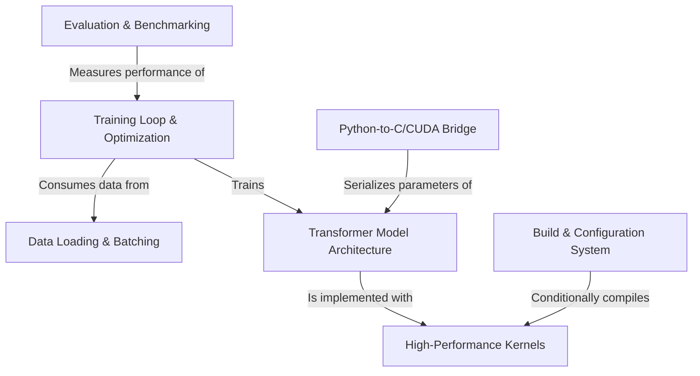

# Tutorial: llm.c

`llm.c` is a project for **training language models** like *GPT-2* and *LLaMA-3* from scratch in pure C/CUDA for maximum performance. It serves as a hands-on, educational tool that demystifies how LLMs work under the hood. The project provides a complete pipeline, starting from a reference Python implementation and translating it to highly optimized code for both CPUs and GPUs, covering everything from *data loading* and defining the *model architecture* to the *training loop* and performance *benchmarking*.

**Source Repository:** [None](None)

## Chapters

1. [Data Loading & Batching
](01_data_loading___batching_.md)
2. [Transformer Model Architecture
](02_transformer_model_architecture_.md)
3. [Training Loop & Optimization
](03_training_loop___optimization_.md)
4. [High-Performance Kernels
](04_high_performance_kernels_.md)
5. [Evaluation & Benchmarking
](05_evaluation___benchmarking_.md)
6. [Python-to-C/CUDA Bridge
](06_python_to_c_cuda_bridge_.md)
7. [Build & Configuration System
](07_build___configuration_system_.md)

---

Generated by [AI Codebase Knowledge Builder](https://github.com/The-Pocket/Tutorial-Codebase-Knowledge)