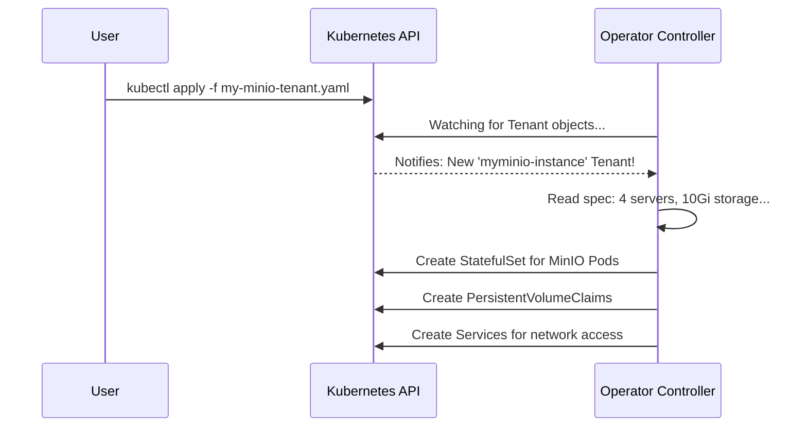

# Chapter 1: Tenant Custom Resource (CR)

Welcome to the MinIO Operator tutorial! In this first chapter, we'll explore the single most important concept in the entire system: the `Tenant` Custom Resource.

### The Goal: Your Own Private S3 Storage

Imagine you need a private, secure, and scalable object storage service, much like Amazon S3 or Google Cloud Storage, but running entirely within your own Kubernetes cluster. You want to store application backups, user uploads, or data for your machine learning models. How do you create such a service?

This is where the MinIO `Tenant` comes in. It's the master blueprint for building a complete, independent MinIO object storage deployment.

### What is a Tenant Custom Resource?

In Kubernetes, a "Custom Resource" (CR) is a way to extend Kubernetes's own API with new types of objects. The MinIO Operator introduces a new object type called `Tenant`.

Think of the `Tenant` CR as an order form for a custom-built computer. On the form, you specify exactly what you want:
*   How many servers?
*   How much storage should each one have?
*   Which version of the software should be installed?
*   What are the security settings?

You fill out this form (a single YAML file), hand it to Kubernetes, and the MinIO Operator acts as the expert technician. It reads your order, gathers all the necessary components, and builds the exact MinIO service you specified. The Operator's entire job is to bring your `Tenant` blueprint to life.

### Creating a Simple Tenant: A Walkthrough

Let's build a basic MinIO Tenant. Our goal is a 4-server MinIO deployment where each server has 4 small disks (10 GiB each).

Here is what the blueprint, our `Tenant` YAML file, looks like. We'll call it `my-minio-tenant.yaml`.

```yaml
apiVersion: minio.min.io/v2
kind: Tenant
metadata:
  name: myminio-instance
  namespace: minio-tenant
```

This first part is standard Kubernetes boilerplate.
*   `apiVersion` and `kind` tell Kubernetes that this is a `Tenant` object managed by the `minio.min.io/v2` API.
*   `metadata` gives our instance a name, `myminio-instance`.

Now for the important part, the `spec`, which describes *what* we want to build.

```yaml
spec:
  # Use a specific MinIO software version
  image: "quay.io/minio/minio:RELEASE.2025-04-08T15-41-24Z"

  # Define our group of servers, called a "pool"
  pools:
    - servers: 4
      volumesPerServer: 4
      volumeClaimTemplate:
        spec:
          resources:
            requests:
              storage: 10Gi
```

This `spec` section is the core of our blueprint.
*   `image`: Specifies the exact Docker image for the MinIO server software. This ensures a predictable deployment.
*   `pools`: This is an array defining groups of MinIO servers. We have one pool here.
    *   `servers: 4`: We are asking for 4 MinIO server Pods.
    *   `volumesPerServer: 4`: Each of those 4 servers will get 4 separate storage volumes.
    *   `volumeClaimTemplate`: This is the recipe for each storage volume. We're requesting `10Gi` (10 Gibibytes) of storage for each one.

Finally, we need to set the admin credentials.

```yaml
  # ... continuing the spec section
  
  # Tell the Tenant where to find the admin username and password.
  # This references a Kubernetes Secret you would create separately.
  configuration:
    name: myminio-credentials
```

The `configuration` field points to a Kubernetes Secret named `myminio-credentials`. This secret holds the root username and password, keeping them separate from our main configuration.

To bring this `Tenant` to life, you would save the complete YAML file and apply it using `kubectl`:

```sh
kubectl apply -f my-minio-tenant.yaml
```

Once you run this command, the MinIO Operator detects the new `Tenant` object and immediately gets to work building your MinIO deployment according to your exact specifications.

### Under the Hood: From Blueprint to Reality

So, what happens after you run `kubectl apply`? How does a simple YAML file turn into a running storage service?

1.  **You Apply the Manifest**: You submit your `Tenant` YAML file to the Kubernetes API.
2.  **Operator is Watching**: The [Operator Controller](03_operator_controller_.md), the brain of the system, is constantly watching the Kubernetes API for any changes related to `Tenant` objects.
3.  **A New Tenant Appears**: The Operator sees your new `myminio-instance` `Tenant`.
4.  **The Blueprint is Read**: The Operator's controller reads the `spec` section of your `Tenant`. It understands you want 4 servers, with 4 volumes each, using a specific MinIO image.
5.  **Kubernetes Objects are Created**: The Operator translates your high-level request into low-level Kubernetes resources. It creates StatefulSets (to manage the MinIO pods), PersistentVolumeClaims (to request the storage), Services (for networking), and Secrets (for credentials and certificates).
6.  **Kubernetes Takes Over**: Kubernetes's own controllers see these new objects and do their jobs: scheduling pods onto nodes, binding storage volumes, and configuring network routes.

Here is a simplified diagram of that flow:



#### A Glimpse at the Code

Internally, the Operator defines the `Tenant` structure using Go code. Your YAML file is simply a way to populate this structure.

The definition for the `Tenant` object lives in `pkg/apis/minio.min.io/v2/types.go`.

```go
// File: pkg/apis/minio.min.io/v2/types.go

// Tenant is a Kubernetes object describing a MinIO Tenant.
type Tenant struct {
	metav1.TypeMeta   `json:",inline"`
	metav1.ObjectMeta `json:"metadata,omitempty"`

	// Spec holds the desired state of the Tenant
	Spec TenantSpec `json:"spec"`
	
    // ...
}
```

This Go struct maps directly to the YAML. The `Spec` field contains our entire blueprint.

The `TenantSpec` struct further breaks down the configuration, including the all-important `pools`.

```go
// File: pkg/apis/minio.min.io/v2/types.go

type TenantSpec struct {
	// ... other fields
	Pools []Pool `json:"pools"`
	Image string `json:"image,omitempty"`
	Configuration *corev1.LocalObjectReference `json:"configuration,omitempty"`
	// ... other fields
}
```

When the Operator's controller logic runs, it works with these Go objects. For example, to get the admin credentials you specified, it runs code that looks for the `Configuration` field and fetches the corresponding Kubernetes Secret.

```go
// File: pkg/controller/tenants.go

// getTenantConfiguration reads the secret specified in the Tenant spec.
func (c *Controller) getTenantConfiguration(ctx context.Context, tenant *miniov2.Tenant) (map[string][]byte, error) {
	// Check if a configuration secret is defined
	if tenant.HasConfigurationSecret() {
		secretName := tenant.Spec.Configuration.Name
		// Get the secret from Kubernetes
		secret, err := c.kubeClientSet.CoreV1().Secrets(tenant.Namespace).Get(ctx, secretName, ...)
		// ... handle errors and return data
	}
	return nil, nil
}
```

This shows how the Operator programmatically reads your blueprint and takes action based on it.

### Conclusion

You've now learned about the most fundamental concept in the MinIO Operator: the `Tenant` Custom Resource. It is the declarative, user-facing blueprint that allows you to define an entire MinIO object storage service in a single file. You tell the Operator *what* you want, and it handles the complex details of *how* to build it inside Kubernetes.

In our example, we briefly touched upon the `pools` section. This is a powerful concept that lets you scale and structure your storage. In the next chapter, we'll take a much closer look at the [Tenant Pool](02_tenant_pool_.md).

---

Generated by [AI Codebase Knowledge Builder](https://github.com/The-Pocket/Tutorial-Codebase-Knowledge)