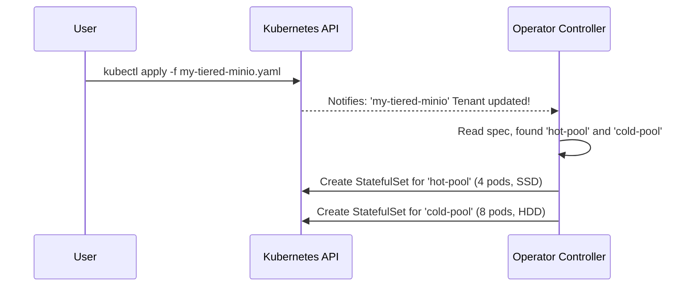

# Chapter 2: Tenant Pool

In the [previous chapter](01_tenant_custom_resource__cr__.md), we learned how the `Tenant` Custom Resource acts as the master blueprint for our entire MinIO deployment. We created a simple `Tenant` with a single group of servers. But what if you need more flexibility? What if one size doesn't fit all?

This is where the `Tenant Pool` comes in.

### The Goal: Tiered Storage for Different Needs

Imagine your application has two very different storage requirements:

1.  **Hot Data:** You need a place to store frequently accessed user profile pictures. This storage needs to be extremely fast. You're willing to pay more for high-speed SSDs, but you don't need a huge amount of space.
2.  **Cold Data:** You also need to store old, rarely accessed application logs for archival purposes. This storage can be slower, but it needs to be very large and inexpensive.

How can you manage both of these needs within a single, unified MinIO system? You do this by creating a `Tenant` with multiple `Pools`.

### What is a Tenant Pool?

A `Pool` is a group of MinIO server pods within your `Tenant` that all share the exact same configuration. A `Tenant` can have multiple pools, and each pool can be configured independently.

Think of it like this:
*   **Your `Tenant` is a data center.**
*   **Each `Pool` is a specific rack of servers within that data center.**

You can have one rack (`Pool`) equipped with high-speed, expensive servers (SSDs) and another rack (`Pool`) with slower, high-capacity servers (HDDs). They both belong to the same data center (`Tenant`) and can be managed together, but they serve different purposes.

A pool defines key characteristics for its group of servers:
*   The number of servers (`servers`).
*   The storage size and type (`volumeClaimTemplate`).
*   The Kubernetes nodes they should run on (`nodeSelector`).
*   CPU and memory resources (`resources`).

### Building a Tenant with Hot and Cold Pools

Let's update our `Tenant` blueprint from Chapter 1 to solve our tiered storage problem. We'll define two distinct pools in our YAML file.

```yaml
apiVersion: minio.min.io/v2
kind: Tenant
metadata:
  name: my-tiered-minio
  namespace: minio-tenant
spec:
  image: "quay.io/minio/minio:RELEASE.2025-04-08T15-41-24Z"
  
  # The 'pools' section is now an array with two items
  pools:
    # --- Pool 1: The "Hot" Tier for fast data ---
    - name: hot-pool
      servers: 4
      volumesPerServer: 1
      volumeClaimTemplate:
        spec:
          storageClassName: "fast-ssd" # Use our fast storage
          resources:
            requests:
              storage: 100Gi # Smaller, faster volumes
```

This first pool, named `hot-pool`, is for our frequently accessed data.
*   `name: hot-pool`: We give it a clear, descriptive name.
*   `storageClassName: "fast-ssd"`: This is the magic part. We're telling Kubernetes to provision storage from a pre-configured class of high-speed SSDs.
*   `storage: 100Gi`: We're requesting smaller, more expensive volumes.

Now, let's add the second pool for our archives right below the first one in the same `pools` array.

```yaml
    # --- Pool 2: The "Cold" Tier for archival data ---
    - name: cold-pool
      servers: 8
      volumesPerServer: 4
      volumeClaimTemplate:
        spec:
          storageClassName: "big-hdd" # Use our cheap storage
          resources:
            requests:
              storage: 1Ti # Larger, slower volumes
```

This `cold-pool` is completely different:
*   `name: cold-pool`: A distinct name for our archive tier.
*   `servers: 8`: We're asking for more servers to handle the larger capacity.
*   `storageClassName: "big-hdd"`: We're requesting storage from a class of slower, high-capacity hard drives.
*   `storage: 1Ti`: Each volume is a massive 1 Terabyte.

When you apply this single YAML file, the MinIO Operator will create *both* sets of servers, configured exactly as you specified, all within one manageable `Tenant`.

### Under the Hood: From Pools to StatefulSets

How does the Operator turn this array of pools into running servers? It creates a separate Kubernetes `StatefulSet` for each pool. A StatefulSet is a Kubernetes object ideal for managing stateful applications like databases or storage systems.

The process looks like this:

1.  **You Apply the Manifest**: You submit your `Tenant` YAML with two pools to the Kubernetes API.
2.  **Operator Reads the Blueprint**: The [Operator Controller](03_operator_controller_.md) sees the `Tenant` object and reads its `spec`. It finds the `pools` array containing `hot-pool` and `cold-pool`.
3.  **Loop and Create**: The Operator loops through each item in the `pools` array.
    *   For `hot-pool`, it generates a `StatefulSet` named `my-tiered-minio-hot-pool` with 4 pods, requesting `fast-ssd` storage.
    *   For `cold-pool`, it generates another `StatefulSet` named `my-tiered-minio-cold-pool` with 8 pods, requesting `big-hdd` storage.
4.  **Kubernetes Builds It**: Kubernetes takes these two `StatefulSet` objects and creates all the necessary pods and storage volumes.

Here is a diagram of that flow:



Your single `Tenant` blueprint effectively manages two independent, but related, groups of servers.

#### A Glimpse at the Code

The Operator's Go code directly reflects this structure. The `TenantSpec` contains a slice (an array) of `Pool` objects.

```go
// File: pkg/apis/minio.min.io/v2/types.go

type TenantSpec struct {
	// ... other fields
	Pools []Pool `json:"pools"`
	// ... other fields
}

// Pool (`pools`) defines a MinIO server pool on a Tenant.
type Pool struct {
	Name             string                        `json:"name"`
	Servers          int32                         `json:"servers"`
	VolumesPerServer int32                         `json:"volumesPerServer"`
	VolumeClaimTemplate *corev1.PersistentVolumeClaim `json:"volumeClaimTemplate"`
	// ... other pool-specific settings
}
```

When the Operator reconciles a `Tenant`, its logic iterates over this `Pools` slice.

The controller logic for handling multiple pools is conceptually simple. It loops through the pools defined in your `Tenant`'s specification and processes each one to create the necessary Kubernetes resources.

```go
// File: pkg/controller/pools.go (conceptual, simplified)

// This function processes all pools for a given tenant.
func (c *Controller) reconcileTenantPools(tenant *miniov2.Tenant) {

    // Loop over each Pool defined in the Tenant YAML.
    for i := range tenant.Spec.Pools {
        pool := &tenant.Spec.Pools[i]

        // For each pool, create a dedicated StatefulSet.
        // The 'NewPool' function uses the pool's specific configuration
        // (like server count and volume template) to build the StatefulSet.
        statefulSet := statefulsets.NewPool(tenant, pool, ...)

        // Apply this unique StatefulSet to Kubernetes.
        c.kubeClientSet.AppsV1().StatefulSets(...).Create(statefulSet)
    }
}
```

This code shows the core idea: for every `Pool` in your YAML, a corresponding `StatefulSet` is built and managed, ensuring each pool gets the exact configuration it needs.

### Conclusion

The `Tenant Pool` is the core building block for scaling and diversifying your MinIO storage. By defining multiple pools within a single `Tenant`, you can create sophisticated storage architectures, like hot/cold data tiers, without adding management complexity. You simply describe the different "racks" of servers you need, and the Operator builds them for you.

This powerful feature is made possible by the central "brain" of the system that reads your `Tenant` blueprint and takes action. In the next chapter, we'll dive deep into the heart of this process: the [Operator Controller](03_operator_controller_.md).

---

Generated by [AI Codebase Knowledge Builder](https://github.com/The-Pocket/Tutorial-Codebase-Knowledge)