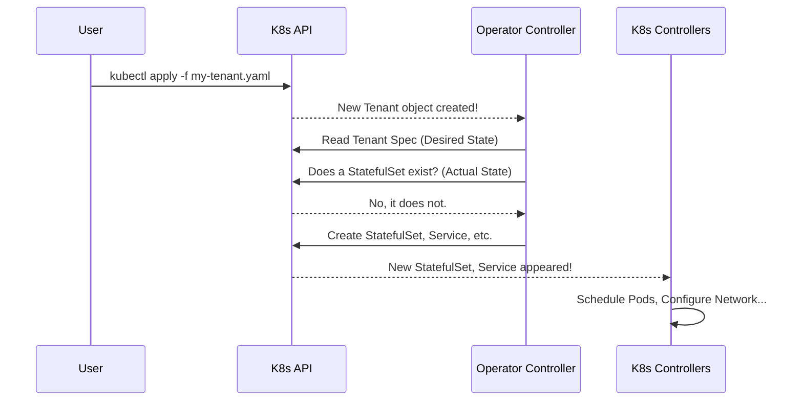

# Chapter 3: Operator Controller

In the previous chapters, we learned how to create blueprints for our storage using the [Tenant Custom Resource (CR)](01_tenant_custom_resource__cr__.md) and how to define different groups of servers with a [Tenant Pool](02_tenant_pool_.md). We've designed the "what" — what we want our storage system to look like.

But how does a YAML file, a simple text blueprint, turn into a fully functional, running storage service? What is the "magic" that brings our design to life?

### The Goal: An Automated Construction Manager

Imagine you're building a house. You give the architect's blueprints (your `Tenant` YAML) to a construction company. You don't tell them *how* to lay the foundation or *how* to frame the walls. You just give them the final design. The site manager is the one who reads the blueprint, checks the current state of the construction site, and tells the workers (plumbers, electricians) exactly what to do next to make progress. If you later give them an updated blueprint to add a new room, the manager figures out what needs to change.

The Operator Controller is this automated construction site manager for your MinIO `Tenant`. It's the brain of the entire system.

### What is the Operator Controller?

The Operator Controller is a program that runs continuously inside your Kubernetes cluster. Its only job is to watch for `Tenant` resources and make sure the reality in the cluster matches the blueprint you provided. This process of watching, comparing, and acting is called a **reconciliation loop**.

The loop works like this:
1.  **Observe**: What is the **desired state**? (It reads your `Tenant` YAML).
2.  **Observe**: What is the **actual state**? (It checks Kubernetes for existing StatefulSets, Services, etc., that belong to your `Tenant`).
3.  **Act**: Is there a difference? If so, take action to make the actual state match the desired state.
    *   New `Tenant` created? The Controller creates new StatefulSets, Services, and Secrets.
    *   `Tenant` updated (e.g., you change the MinIO `image` version)? The Controller updates the corresponding StatefulSet.
    *   `Tenant` deleted? The Controller deletes all the objects it created.

This loop runs over and over, ensuring your MinIO deployment is always in the state you've defined, automatically correcting any deviations.

### How It Works: From Blueprint to Reality

Let's follow what happens when you run `kubectl apply` on a new `Tenant` YAML file.

1.  **You Apply the Manifest**: You submit your `Tenant` blueprint to the Kubernetes API.
2.  **Controller is Watching**: The Operator Controller is constantly listening for any events related to `Tenant` objects. It immediately sees your new `Tenant`.
3.  **Reconciliation Kicks In**: The Controller's reconciliation loop for your `Tenant` starts.
4.  **Compare States**: It sees the desired state (e.g., a `hot-pool` with 4 servers) and the actual state (nothing exists yet!).
5.  **Create Kubernetes Objects**: The Controller acts as a translator. It converts your high-level request into the low-level objects Kubernetes understands. It tells the Kubernetes API:
    *   "Create a `StatefulSet` for `hot-pool` with 4 pods."
    *   "Create a `Service` so we can access MinIO."
    *   "Create `Secrets` to hold important credentials."
6.  **Kubernetes Takes Over**: Kubernetes's own built-in controllers see these new objects and do their job—scheduling pods, configuring networking, and attaching storage.

Here is a diagram of that flow:



### Under the Hood: A Glimpse at the Code

The Operator Controller is a Go program. Let's look at a few simplified snippets to see how it works internally.

#### 1. Starting the Controller

When the Operator starts, its main function kicks off the process, sets up a connection to Kubernetes, and starts the controller logic.

```go
// File: pkg/controller/controller.go (simplified)

// StartOperator starts the MinIO Operator controller
func StartOperator(kubeconfig string) {
	klog.Info("Starting MinIO Operator")

	// ... code to connect to the Kubernetes API ...

	// Create a new controller instance
	mainController := NewController( /* ... clients and informers ... */ )

	// Start the controller's main loop
	if err = mainController.Start(ctx, cancel, 2); err != nil {
		klog.Fatalf("Error running mainController: %s", err.Error())
	}
}
```
This is the entry point. It sets everything up and runs `mainController.Start()`, which begins the infinite reconciliation loop.

#### 2. Watching for Changes

How does the Controller "watch" for changes? It registers an event handler. It tells Kubernetes, "Hey, let me know whenever a `Tenant` is added, updated, or deleted."

```go
// File: pkg/controller/main-controller.go (simplified)

// ... inside NewController() function ...

// Set up an event handler for when Tenant resources change
tenantInformer.Informer().AddEventHandler(cache.ResourceEventHandlerFuncs{
    AddFunc: controller.enqueueTenant,
    UpdateFunc: func(oldObj, newObj interface{}) {
        controller.enqueueTenant(newObj)
    },
    DeleteFunc: controller.enqueueTenant,
})
```
Whenever a change happens, the `enqueueTenant` function is called. This function simply adds the `Tenant`'s name (like `minio-tenant/my-tiered-minio`) to a work queue, so the reconciliation loop can process it.

#### 3. The Reconciliation Logic (`syncHandler`)

This is the heart of the controller. A "worker" constantly pulls items from the work queue and runs the `syncHandler` function. This function performs the "compare and act" logic.

```go
// File: pkg/controller/main-controller.go (simplified)

// syncHandler compares the actual state with the desired state.
func (c *Controller) syncHandler(key string) (Result, error) {
	// 1. Get the Tenant object from Kubernetes using the 'key'
	namespace, name := key2NamespaceName(key)
	tenant, err := c.minioClientSet.MinioV2().Tenants(namespace).Get(ctx, name, ...)
	// ... error handling ...

	// 2. Check for the MinIO Service. If it doesn't exist, create it.
	err = c.checkMinIOSvc(ctx, tenant, ...)
	if err != nil { /* ... */ }

	// 3. Loop through each pool defined in the Tenant spec
	for i, pool := range tenant.Spec.Pools {
		// 4. Check for the pool's StatefulSet. If it doesn't exist, create it.
		ss, err := c.statefulSetLister.StatefulSets(tenant.Namespace).Get(...)
		if k8serrors.IsNotFound(err) {
			newSS := statefulsets.NewPool(tenant, &pool, ...)
			c.kubeClientSet.AppsV1().StatefulSets(tenant.Namespace).Create(ctx, newSS, ...)
		}
	}

	// 5. Update the Tenant's status
	c.updateTenantStatus(ctx, tenant, "Initialized", ...)
	return Result{}, nil
}
```
This simplified code shows the core pattern: for a given `Tenant`, it checks for each required resource (Services, StatefulSets for each pool) and creates them if they are missing.

#### 4. Permissions to Act

How can a simple program create powerful objects like StatefulSets? Because we grant it permission. The Operator is deployed with a `ClusterRole` that lists exactly what it's allowed to do.

```yaml
# File: resources/base/cluster-role.yaml (excerpt)

rules:
  - apiGroups:
      - apps
    resources:
      - statefulsets
    verbs:
      - get
      - create
      - list
      - update
      - delete
  - apiGroups:
      - ""
    resources:
      - services
      - secrets
    verbs:
      - get
      - create
      - list
      - delete
```
This YAML tells Kubernetes that the MinIO Operator is allowed to `create`, `delete`, `get`, `list`, and `update` StatefulSets, Services, and Secrets. Without these permissions, the controller's requests to the Kubernetes API would be denied.

### Conclusion

The Operator Controller is the active, intelligent engine that powers the entire system. It's not magic—it's a well-defined control loop that continuously works to bring your `Tenant` blueprints to life. You declare *what* you want in a simple YAML file, and the controller handles the complex, imperative steps of *how* to achieve and maintain that state within Kubernetes.

Now that we understand how a `Tenant` is built and managed, how do we control who can access the data inside it? In the next chapter, we'll explore how to define access policies using the [PolicyBinding Custom Resource (CR)](04_policybinding_custom_resource__cr__.md).

---

Generated by [AI Codebase Knowledge Builder](https://github.com/The-Pocket/Tutorial-Codebase-Knowledge)