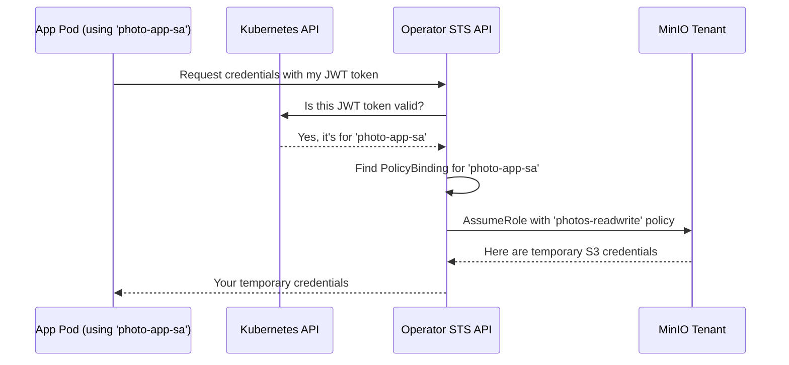

# Chapter 4: PolicyBinding Custom Resource (CR)

In the [previous chapter](03_operator_controller_.md), we learned how the [Operator Controller](03_operator_controller_.md) acts as the brain, turning our `Tenant` blueprints into a real, running storage service. Now that our MinIO `Tenant` is up and running, we face a new challenge: how do we let our applications use it safely?

### The Goal: Secure, Automated Access for Your Apps

Imagine you have a photo-sharing application running in a Kubernetes Pod. This application needs to upload new pictures to a MinIO bucket called `photos`.

The worst way to do this would be to copy the powerful, root admin password for your MinIO `Tenant` and paste it directly into your application's configuration. This is a major security risk! If your application code is ever exposed, your entire storage system is compromised.

What we need is a secure, automated way to give our application *only* the permissions it needs, for *only* as long as it needs them. We need a rule that says: "This specific photo-sharing application is allowed to read and write to the `photos` bucket, and nothing else."

This is exactly what the `PolicyBinding` Custom Resource is for.

### What is a PolicyBinding?

A `PolicyBinding` is a security rule that connects a Kubernetes identity (specifically, a `ServiceAccount`) to a set of MinIO access policies.

Think of it as a keycard access rule for a building:
*   **The Identity:** The employee's ID card (`ServiceAccount`).
*   **The Permissions:** The access level programmed onto the card, like "Allowed on Floor 3" (a MinIO policy).
*   **The Binding:** The rule itself, which links that specific ID card to that specific access level.

The `PolicyBinding` states: "Any pod using the 'photo-app' `ServiceAccount` (the identity) is allowed to have 'read-write' access (the policy) to the 'photos' bucket". The Operator's internal Security Token Service (which we'll cover later) enforces these rules and hands out temporary keycards.

### Creating a Secure Binding: A Walkthrough

Let's set up a `PolicyBinding` for our photo-sharing app.

#### Step 1: The Identity (`ServiceAccount`)

First, our application needs an identity within Kubernetes. This is done with a `ServiceAccount`. It's like issuing an official ID card to our application Pod.

Here’s a simple `ServiceAccount` definition.

```yaml
# file: photo-app-identity.yaml
apiVersion: v1
kind: ServiceAccount
metadata:
  name: photo-app-sa
  namespace: my-apps
```
This YAML creates an identity named `photo-app-sa` in the `my-apps` namespace. Any pod that uses this `ServiceAccount` will carry this ID.

#### Step 2: The Permissions (MinIO Policies)

Next, we need to define the permissions inside our MinIO `Tenant`. For this example, let's assume an administrator has already created a MinIO policy named `photos-readwrite` that grants permission to read and write objects in the `photos` bucket.

#### Step 3: The Binding (`PolicyBinding`)

Now we connect the identity to the permissions. We create a `PolicyBinding` resource that links our `photo-app-sa` `ServiceAccount` to the `photos-readwrite` MinIO policy.

```yaml
# file: photo-app-binding.yaml
apiVersion: sts.min.io/v1beta1
kind: PolicyBinding
metadata:
  name: photo-app-access-rule
  namespace: minio-tenant # This must be in the same namespace as your Tenant
spec:
  application:
    namespace: my-apps
    serviceaccount: photo-app-sa
  policies:
    - photos-readwrite
```
Let's break down the `spec`:
*   `application`: This section identifies the application.
    *   `namespace: my-apps`: The namespace where the application's `ServiceAccount` lives.
    *   `serviceaccount: photo-app-sa`: The name of the `ServiceAccount` we created in Step 1.
*   `policies`: This is a list of MinIO policy names that this application is allowed to use. We're giving it the `photos-readwrite` policy.

When you apply this YAML file with `kubectl apply`, you've told the MinIO Operator about this new security rule.

### Under the Hood: From JWT to S3 Credentials

So, what happens when our photo app, running with its `ServiceAccount`, actually tries to access MinIO? It doesn't use the `PolicyBinding` directly. Instead, it uses it to get temporary credentials.

1.  **Request Access:** The application pod, using a special sidecar or library, sends its Kubernetes `ServiceAccount` token (a JWT) to a special endpoint provided by the MinIO Operator.
2.  **Verify Identity:** The Operator receives this token and asks the main Kubernetes API: "Is this a valid token for the `photo-app-sa` in the `my-apps` namespace?"
3.  **Find the Rule:** Once Kubernetes confirms the identity, the Operator looks for any `PolicyBinding` that matches this `ServiceAccount`. It finds our `photo-app-access-rule`.
4.  **Generate Temporary Credentials:** The Operator sees that the rule grants the `photos-readwrite` policy. It then connects to the MinIO `Tenant` and says: "Please generate a temporary access key and secret that have the `photos-readwrite` policy permissions."
5.  **Grant Access:** The MinIO `Tenant` creates a short-lived set of credentials and returns them to the Operator, which then passes them back to the application.
6.  **Connect to S3:** The application can now use these temporary credentials to securely upload photos to the `photos` bucket. These credentials will expire automatically, ensuring long-term security.

Here is a simplified diagram of that flow:



#### A Glimpse at the Code

The `PolicyBinding` is defined as a Custom Resource Definition (CRD), just like our `Tenant`. The schema for it is defined in a YAML file.

```yaml
# File: resources/base/crds/sts.min.io_policybindings.yaml

# ... metadata ...
spec:
  group: sts.min.io
  names:
    kind: PolicyBinding
  # ... other fields ...
  versions:
  - name: v1beta1
    schema:
      openAPIV3Schema:
        properties:
          spec:
            properties:
              application: # Identifies the ServiceAccount
                type: object
              policies: # Lists the MinIO policies
                type: array
```
This CRD definition tells Kubernetes about the structure of a `PolicyBinding` object, ensuring our YAML is valid.

This YAML structure maps directly to a Go struct inside the Operator's code.

```go
// File: pkg/apis/sts.min.io/v1beta1/types.go

// PolicyBindingSpec defines the configuration of a MinIO PolicyBinding object.
type PolicyBindingSpec struct {
	// The Application Property identifies the namespace and service account
	Application *Application `json:"application"`

	// The policies to be applied
	Policies []string `json:"policies"`
}

// Application defines the `Namespace` and `ServiceAccount` to authorize
type Application struct {
	Namespace      string `json:"namespace"`
	ServiceAccount string `json:"serviceaccount"`
}
```
When a request comes into the Operator's STS API, the handler logic uses this structure. It validates the incoming token and then queries Kubernetes for a matching `PolicyBinding`.

```go
// File: pkg/controller/sts_handlers.go (simplified)

func (c *Controller) AssumeRoleWithWebIdentityHandler(w http.ResponseWriter, r *http.Request) {
	// 1. Validate the incoming JWT token from the application
	saAuthResult, err := c.ValidateServiceAccountJWT(&ctx, accessToken)
	// ... handle errors ...

	saNamespace := chunks[0] // e.g., "my-apps"
	saName := chunks[1]      // e.g., "photo-app-sa"

	// 2. List all PolicyBindings and find a match
	pbs, err := c.minioClientSet.StsV1beta1().PolicyBindings(tenantNamespace).List(...)
	for _, pb := range pbs.Items {
		if pb.Spec.Application.Namespace == saNamespace && pb.Spec.Application.ServiceAccount == saName {
			// Found a matching rule!
			policyBindings = append(policyBindings, pb)
		}
	}
	// ...
}
```
This code snippet shows the core logic: after validating the application's identity, the controller fetches the `PolicyBinding` rules to determine what level of access to grant.

### Conclusion

The `PolicyBinding` CR is a powerful security abstraction that bridges the gap between Kubernetes identities and MinIO permissions. It allows you to manage application access in a declarative, secure, and Kubernetes-native way, completely eliminating the need to hardcode sensitive credentials in your application code.

The magic of validating tokens and issuing temporary credentials is all handled by a specific component within the Operator. In the next chapter, we will take a closer look at this crucial component: the [Security Token Service (STS) API](05_security_token_service__sts__api_.md).

---

Generated by [AI Codebase Knowledge Builder](https://github.com/The-Pocket/Tutorial-Codebase-Knowledge)