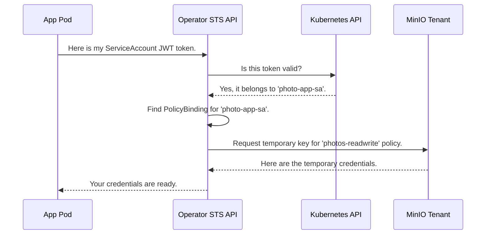

# Chapter 5: Security Token Service (STS) API

In the [previous chapter](04_policybinding_custom_resource__cr__.md), we created a `PolicyBinding` resource. We made a security rule that says, "the photo-sharing app is allowed to access the `photos` bucket." But a rule on its own doesn't grant access. How does our application actually use this rule to get the credentials it needs?

### The Goal: A Security Desk for Your Applications

Imagine your `PolicyBinding` is an entry on a visitor list at an office building. The list says, "Jane Doe from the 'photo-app' company is approved for access to Floor 3." Jane (your application pod) still needs to get a keycard. She can't just walk up to the door on Floor 3 and show them the visitor list.

She needs to go to the security desk in the lobby. She presents her government-issued ID (her Kubernetes `ServiceAccount` token). The guard at the desk checks her ID, looks her up on the visitor list, sees she's approved, and then issues her a temporary keycard that only works for Floor 3 and expires at the end of the day.

The Security Token Service (STS) API is this automated security desk. It's an internal API endpoint run by the MinIO Operator itself. Its entire job is to check an application's identity, look up its permissions in a `PolicyBinding`, and issue temporary, limited-access S3 credentials.

### How an Application Uses the STS API

The process of getting credentials is a simple, secure, and fully automated HTTP request. Here's what happens from the application's point of view:

1.  **Get Identity Token:** The application, running inside a pod, has access to its unique Kubernetes `ServiceAccount` token (a JWT). This is its official ID.
2.  **Make a Request:** It makes an HTTP POST request to the Operator's STS API endpoint. This request includes its identity token.
3.  **Receive Credentials:** If the token is valid and a matching `PolicyBinding` exists, the STS API returns a set of temporary S3 credentials (an access key, a secret key, and a session token).
4.  **Access S3:** The application can now use these credentials to talk directly to the MinIO `Tenant` and upload its photos.

Let's look at what that HTTP request might look like using a tool like `curl`.

```sh
# The application sends its identity token to the STS API
curl -X POST https://sts.minio-operator.svc:4223/sts/minio-tenant \
  -d "Action=AssumeRoleWithWebIdentity" \
  -d "Version=2011-06-15" \
  -d "WebIdentityToken=<A_VERY_LONG_JWT_TOKEN_FROM_THE_POD>"
```
*   `https://sts.minio-operator.svc:4223/sts/minio-tenant`: This is the internal address for the STS API. `minio-tenant` is the namespace where our MinIO `Tenant` lives.
*   `Action=AssumeRoleWithWebIdentity`: This tells the STS API what we want to do.
*   `WebIdentityToken`: This is where the application puts its unique `ServiceAccount` token.

The STS API will respond with the temporary credentials in an XML format, ready for the application to use.

### Under the Hood: From Request to Credentials

What happens inside the Operator when it receives this request? It acts as a trusted middleman between your application, Kubernetes, and your MinIO `Tenant`.

1.  **Receive Request:** The STS API receives the `AssumeRoleWithWebIdentity` request from the application pod.
2.  **Validate Identity:** It takes the JWT token from the request and asks the main Kubernetes API: "Is this a real token? Who does it belong to?"
3.  **Identity Confirmed:** The Kubernetes API validates the token and confirms, "Yes, this token is valid and belongs to the `photo-app-sa` ServiceAccount in the `my-apps` namespace."
4.  **Find the Rule:** The Operator now searches for any `PolicyBinding` that applies to this specific ServiceAccount. It finds the rule we created in the last chapter.
5.  **Request Temporary Credentials:** The Operator connects to the MinIO `Tenant`'s own internal STS endpoint. It says, "Please generate a short-lived set of credentials with the `photos-readwrite` policy."
6.  **Issue Credentials:** The MinIO `Tenant` creates the temporary credentials and hands them back to the Operator.
7.  **Return to App:** The Operator's STS API sends these temporary credentials back to the application pod that made the original request.

Here is a diagram of this entire security handshake:



#### A Glimpse at the Code

Let's see how the Operator's code handles this flow.

**1. Setting up the API Endpoint**

First, the Operator needs to run an HTTP server to listen for these requests. The `configureSTSServer` function sets up the routes.

```go
// File: pkg/controller/sts.go

func configureSTSServer(c *Controller) *http.Server {
	router := mux.NewRouter()

	// When a POST request comes to /sts/{tenantNamespace},
	// call the AssumeRoleWithWebIdentityHandler function.
	router.Methods(http.MethodPost).
		Path(STSEndpoint + "/{tenantNamespace}").
		HandlerFunc(c.AssumeRoleWithWebIdentityHandler)

	// ... server configuration ...
	return s
}
```
This code registers the main handler function that does all the work. It listens on the path `/sts/` followed by the namespace of the `Tenant`.

**2. Handling the Request**

The `AssumeRoleWithWebIdentityHandler` function is the core of the STS API. It's a bit long, so let's look at the most important parts in order.

First, it gets the JWT token from the request and asks the Kubernetes API to validate it.

```go
// File: pkg/controller/sts_handlers.go (simplified)

func (c *Controller) AssumeRoleWithWebIdentityHandler(w http.ResponseWriter, r *http.Request) {
	// Get the token from the form data
	accessToken := r.Form.Get(stsWebIdentityToken)

	// Ask Kubernetes API to review and validate the token
	saAuthResult, err := c.ValidateServiceAccountJWT(&ctx, accessToken)
	if err != nil || !saAuthResult.Status.Authenticated {
		// If not valid, send an "Access Denied" error
		writeSTSErrorResponse(w, true, ErrSTSAccessDenied, ...)
		return
	}
	// ...
}
```

Next, it uses the validated identity to find a matching `PolicyBinding`.

```go
// File: pkg/controller/sts_handlers.go (simplified)

	// ... continuing the handler function

	// Get the ServiceAccount's name and namespace from the validation result
	saNamespace := chunks[0] // e.g., "my-apps"
	saName := chunks[1]      // e.g., "photo-app-sa"

	// List all PolicyBindings and find one that matches our application
	pbs, err := c.minioClientSet.StsV1beta1().PolicyBindings(tenantNamespace).List(...)
	for _, pb := range pbs.Items {
		if pb.Spec.Application.Namespace == saNamespace && pb.Spec.Application.ServiceAccount == saName {
			// We found a matching rule!
		}
	}
	// ...
```

Finally, if a rule is found, it calls the `AssumeRole` function to get credentials from the MinIO `Tenant` and sends them back to the application.

```go
// File: pkg/controller/sts_handlers.go (simplified)

	// ... after finding the policy from the binding ...

	// Ask the MinIO Tenant to generate temporary credentials
	stsCredentials, err := AssumeRole(ctx, c, &tenant, region, finalPolicy, duration)
	if err != nil {
		// If MinIO returns an error, pass it along
		writeSTSErrorResponse(w, true, ErrSTSInternalError, err)
		return
	}

	// Build the successful XML response with the new credentials
	assumeRoleResponse := &AssumeRoleWithWebIdentityResponse{
		Result: WebIdentityResult{
			Credentials: Credentials{
				AccessKey:    stsCredentials.AccessKeyID,
				SecretKey:    stsCredentials.SecretAccessKey,
				SessionToken: stsCredentials.SessionToken,
			},
		},
	}

	// Send the response back to the application
	writeSuccessResponseXML(w, xhttp.EncodeResponse(assumeRoleResponse))
}
```
This step-by-step process ensures that only authenticated applications with a valid `PolicyBinding` can ever receive credentials, providing a robust security model for your storage.

### Conclusion

The Security Token Service (STS) API is the active security agent of the MinIO Operator. It's the component that enforces the rules you declare in your `PolicyBinding` resources. By acting as a trusted intermediary, it allows your applications to securely and automatically obtain the temporary credentials they need without ever exposing long-term secrets. This API is the critical link that turns a declarative security policy into a real, functioning security mechanism.

We've now seen how applications get authorized and receive credentials. But what about protecting the data itself? The next layer of security is encryption. In the next chapter, we'll explore the [Key Encryption Service (KES) Integration](06_key_encryption_service__kes__integration_.md) to see how MinIO protects your data at rest.

---

Generated by [AI Codebase Knowledge Builder](https://github.com/The-Pocket/Tutorial-Codebase-Knowledge)