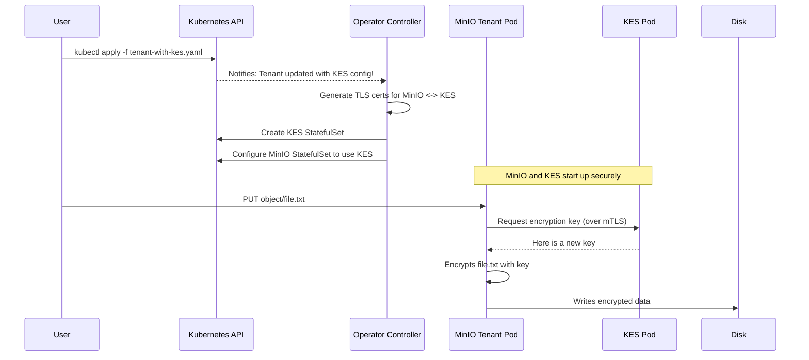

# Chapter 6: Key Encryption Service (KES) Integration

In the [previous chapter](05_security_token_service__sts__api_.md), we saw how the [Security Token Service (STS) API](05_security_token_service__sts__api_.md) acts as a security desk, granting temporary access credentials to applications. Our storage is now secure from unauthorized access. But what about the data itself, sitting on the physical hard drives?

### The Goal: A Fort Knox for Your Data

Imagine you're storing highly sensitive medical records. Even if an unauthorized person can't access your MinIO server through the network, what if they somehow gained physical access to the server's disks? They could potentially read the raw data directly from the storage volumes.

This is a serious risk for any system handling confidential information. We need a way to ensure that all data is unreadable—just a garbled mess—to anyone who looks at the raw disk. This is called **encryption at rest**.

To do this, MinIO needs a way to manage encryption keys. Storing the keys right next to the data would be like leaving the key to a safe inside the safe itself! We need a separate, highly secure service whose only job is to manage these keys.

This is where the MinIO Key Encryption Service (KES) comes in. It acts as the high-security vault manager for your MinIO `Tenant`.

### What is KES?

MinIO Key Encryption Service (KES) is a key management server that integrates with MinIO to provide server-side encryption. Think of it as a separate, hardened security building next to your main data warehouse (the MinIO Tenant).

*   **MinIO Tenant:** The data warehouse where your valuable information is stored.
*   **KES Server:** The security office that holds all the keys to the vaults inside the warehouse.

When MinIO needs to store a new piece of data, it first asks the KES server for an encryption key. KES provides a key, MinIO uses it to encrypt the data, and only then writes the encrypted data to disk. To read the data back, MinIO must again ask KES for the correct key to decrypt it.

The best part is that KES can be configured to talk to external, enterprise-grade Key Management Systems (KMS) like HashiCorp Vault, AWS KMS, or Google Cloud KMS. The Operator's KES integration makes this powerful security feature easy to set up.

### Enabling KES in Your Tenant

Let's add KES to our `Tenant` blueprint. All we need to do is add a `kes` section to our `Tenant`'s `spec`.

```yaml
# In your Tenant YAML file
spec:
  # ... other settings like image, pools, etc.

  # Enable and configure KES
  kes:
    replicas: 2
    image: "quay.io/minio/kes:v0.25.0"
    kesSecret:
      name: my-kes-configuration
```

This simple block tells the Operator everything it needs to know to get started.
*   `replicas: 2`: We want a resilient KES service with two running pods.
*   `image`: The specific software version for the KES server.
*   `kesSecret`: This is crucial. It points to a Kubernetes `Secret` that holds the configuration file for the KES server.

The Operator takes care of deploying KES as a separate `StatefulSet` and, most importantly, handles the complex TLS certificate setup required for MinIO and KES to talk to each other securely.

### Under the Hood: From Blueprint to Encrypted Data

When you apply a `Tenant` manifest with a `kes` block, the [Operator Controller](03_operator_controller_.md) performs a sophisticated sequence of actions.

1.  **Read the Blueprint**: The Operator sees you've requested KES.
2.  **Generate Certificates (The Hard Part, Automated!)**: Secure communication is non-negotiable. The Operator acts as a Certificate Authority to create the required TLS certificates:
    *   A server certificate for the KES pods, so MinIO knows it's talking to the real KES server.
    *   A client certificate for the MinIO pods, so KES knows it's talking to an authorized MinIO `Tenant`.
    This mutual TLS (mTLS) setup ensures the communication channel is completely secure.
3.  **Deploy KES**: The Operator creates a new Kubernetes `StatefulSet` for the KES pods, using the image and replica count you specified.
4.  **Configure KES**: It mounts the `kesSecret` (containing the KES configuration) and the newly generated server certificate into the KES pods.
5.  **Configure MinIO**: It configures the MinIO `Tenant` pods with the necessary environment variables to find the KES server and use their client certificate for authentication.
6.  **Encryption in Action**: Now, whenever an application saves a file to your MinIO `Tenant`, MinIO automatically contacts KES to get an encryption key, encrypts the data, and writes the protected data to disk.

Here is a diagram showing how the Operator sets this up and how data gets encrypted:



#### A Glimpse at the Code

Let's see how the Operator's Go code represents this. First, the `TenantSpec` in the main types file includes an optional pointer to a `KESConfig` struct.

```go
// File: pkg/apis/minio.min.io/v2/types.go

type TenantSpec struct {
	// ... other fields
	Pools []Pool `json:"pools"`

	// Directs the MinIO Operator to deploy KES.
	KES *KESConfig `json:"kes,omitempty"`
}
```
If the `KES` field is present in your YAML, this Go struct gets populated.

The `KESConfig` struct itself maps directly to the YAML fields we used earlier.

```go
// File: pkg/apis/minio.min.io/v2/types.go

// KESConfig defines the configuration of the MinIO Key Encryption Service
type KESConfig struct {
	Replicas int32 `json:"replicas,omitempty"`
	Image string `json:"image,omitempty"`

	// A secret containing environment variables for KES.
	Configuration *corev1.LocalObjectReference `json:"kesSecret"`
	// ... other KES settings
}
```

The Operator's main reconciliation loop checks if this `KES` object exists. If it does, it calls a dedicated function, `checkKESStatus`, to handle the deployment.

```go
// File: pkg/controller/kes.go (simplified)

func (c *Controller) checkKESStatus(ctx context.Context, tenant *miniov2.Tenant, ...) error {
    // Only proceed if KES is enabled in the Tenant spec.
	if tenant.HasKESEnabled() {
		// 1. Ensure TLS certificates for secure communication exist.
		if err := c.checkKESCertificatesStatus(ctx, tenant, ...); err != nil {
			return err
		}

		// 2. Create the network Service for KES pods.
		// ... logic to create the KES Service ...

		// 3. Create the StatefulSet for the KES pods if it doesn't exist.
		_, err := c.statefulSetLister.StatefulSets(...).Get(tenant.KESStatefulSetName())
		if k8serrors.IsNotFound(err) {
			ks := statefulsets.NewForKES(tenant, ...)
			c.kubeClientSet.AppsV1().StatefulSets(...).Create(ctx, ks, ...)
		}
	}
	return nil
}
```
This function orchestrates the entire process: creating certificates, services, and the `StatefulSet` itself.

Finally, the `NewForKES` function builds the `StatefulSet` resource, making sure to mount the necessary secrets containing the configuration and the TLS certificates.

```go
// File: pkg/resources/statefulsets/kes-statefulset.go (simplified)

func NewForKES(t *miniov2.Tenant, serviceName string) *appsv1.StatefulSet {
	// ...
	podVolumes := []corev1.Volume{
		{
			Name: t.KESVolMountName(), // e.g., "kes-config"
			VolumeSource: corev1.VolumeSource{
				Projected: &corev1.ProjectedVolumeSource{
					Sources: []corev1.VolumeProjection{
						// Mount the KES configuration from your secret
						{ Secret: &corev1.SecretProjection{ Name: t.Spec.KES.Configuration.Name, ... }},
						// Mount the auto-generated TLS certificates
						{ Secret: &corev1.SecretProjection{ Name: t.KESTLSSecretName(), ... }},
					},
				},
			},
		},
	}
	// ... build and return the rest of the StatefulSet spec ...
}
```
This shows how the Operator programmatically constructs the required Kubernetes objects, linking your configuration secret and its own auto-generated TLS secrets directly into the KES pods.

### Conclusion

The Key Encryption Service (KES) integration is a critical security feature that protects your data at rest. By simply adding a `kes` block to your `Tenant` manifest, you instruct the MinIO Operator to deploy and manage a complete key management service. The Operator abstracts away the most difficult part of the process—the secure mTLS communication setup—allowing you to easily enable enterprise-grade, server-side encryption for your object storage.

With the core components of our MinIO `Tenant` now in place, from storage pools to access control and encryption, we can look at how to extend its functionality. In the next chapter, we'll explore how to add custom tools and services to our MinIO pods using the [Sidecar Container](07_sidecar_container_.md).

---

Generated by [AI Codebase Knowledge Builder](https://github.com/The-Pocket/Tutorial-Codebase-Knowledge)