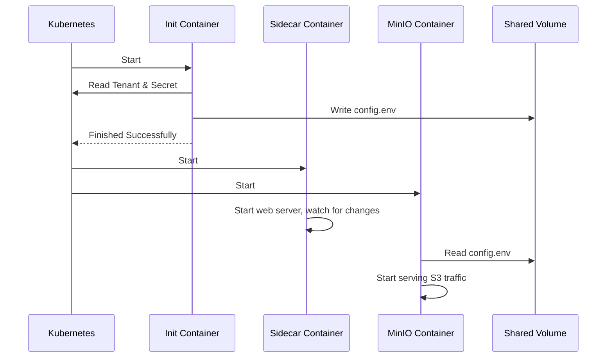

# Chapter 7: Sidecar Container

In the [previous chapter](06_key_encryption_service__kes__integration_.md), we secured our data at rest by integrating the [Key Encryption Service (KES)](06_key_encryption_service__kes__integration_.md). We've built a robust storage system with custom pools, secure access, and encryption. Now, let's pull back the curtain and meet one of the unsung heroes that makes everything run so smoothly: the Sidecar Container.

### The Goal: A Dedicated Assistant for MinIO

Imagine a world-class chef in a busy kitchen. The chef's primary job is to cook amazing food. They shouldn't be bothered with washing dishes, prepping vegetables, or taking out the trash. They have a team of assistants to handle all those supporting tasks, allowing the chef to focus purely on cooking.

The main MinIO server process is like this world-class chef. Its one and only goal is to store and retrieve data as fast and reliably as possible. To keep it clean, lean, and focused, we give it a dedicated assistant that runs right alongside it in the same Pod. This assistant is the **Sidecar Container**.

### What is the Sidecar Container?

The Sidecar is a small, helper container that runs inside every single MinIO server pod created by the Operator. It has two main responsibilities: pre-show setup and backstage management.

1.  **Pre-Show Setup (Before MinIO Starts):** Before the main MinIO server is even allowed to start, a special version of the sidecar runs as an "init container". It acts as a stagehand setting up the stage. It fetches your `Tenant` blueprint and your configuration `Secret`, validates them, and writes the final, clean configuration file for MinIO to use. If anything is wrong (like a missing password), it stops the show before it can start, preventing misconfiguration.

2.  **Backstage Management (While MinIO is Running):** Once MinIO is running, the sidecar stays active in the background. It handles tasks that would otherwise distract the main server:
    *   **Health Checks:** It provides a simple endpoint for Kubernetes readiness probes, letting the cluster know if the pod is healthy without bothering the main MinIO process.
    *   **Dynamic Configuration:** If you create a bucket and want a unique DNS address for it, MinIO sends a request to a local webhook. The sidecar intercepts this request and creates the required Kubernetes `Service` for you. This is crucial because it means the main MinIO server doesn't need risky, high-level permissions to talk to the Kubernetes API.

In short, the sidecar is a trusted helper that offloads all the Kubernetes-specific "chores" from MinIO, letting MinIO do what it does best: manage objects.

### Under the Hood: A Pod's Life

When the [Operator Controller](03_operator_controller_.md) creates a `StatefulSet` for a MinIO [Tenant Pool](02_tenant_pool_.md), it doesn't just define one container for the pod. It defines three: an init container, the sidecar container, and the main MinIO container.

Here’s how they interact when a new MinIO pod starts up:

1.  **Init Container Runs First:** Kubernetes starts the `validate-arguments` init container. This is a short-lived job.
    *   It connects to the Kubernetes API.
    *   It reads the `Tenant` CR and the configuration `Secret`.
    *   It validates that essential settings, like the root password, are present.
    *   It writes the final `config.env` file to a shared empty directory inside the pod.
    *   Once it succeeds, it shuts down. If it fails, the entire pod fails to start.
2.  **Main Containers Start Together:** Now that the stage is set, Kubernetes starts the two main containers in parallel.
    *   **MinIO Container:** It wakes up, looks for the `config.env` file in the shared directory, loads the configuration, and starts serving S3 traffic.
    *   **Sidecar Container:** It also wakes up and starts a small web server. It begins listening for readiness probes from Kubernetes and webhook requests from the MinIO container next to it. It also starts watching for any changes to the `Tenant` CR or its `Secret`.

This separation of concerns is a core principle of the Operator's design.

Here is a simplified diagram of that startup process:



### A Glimpse at the Code

Let's see how this is defined in the Operator's code.

#### 1. Adding the Sidecar to the Pod

When the Operator builds a `StatefulSet` for a MinIO pool, its Go code explicitly adds the init and sidecar containers to the pod definition.

```go
// File: pkg/resources/statefulsets/minio-statefulset.go (simplified)

func NewPool(args *NewPoolArgs) *appsv1.StatefulSet {
    // ...

    // Define the main MinIO server container
	minioContainer := poolMinioServerContainer(t, ...)

    // Define the helper sidecar container
	sidecarContainer := getSideCarContainer(t, pool)

    // Define the pre-start validation container
	initContainer := getInitContainer(t, pool)

	ss := &appsv1.StatefulSet{
		Spec: appsv1.StatefulSetSpec{
			Template: corev1.PodTemplateSpec{
				Spec: corev1.PodSpec{
					// Add the containers to the Pod specification
					InitContainers: []corev1.Container{initContainer},
					Containers:     []corev1.Container{minioContainer, sidecarContainer},
					// ...
				},
			},
		},
	}
	return ss
}
```
This shows that for every MinIO `StatefulSet` created, the pod template is built with all three containers, ensuring our helper is always present.

#### 2. The Validation Step (Init Container)

The init container's main job is validation. The code connects to Kubernetes, gets the configuration, and writes the final file.

```go
// File: sidecar/pkg/validator/validator.go (simplified)

func Validate(tenantName string) {
	// 1. Connect to Kubernetes API
	kubeClient, controllerClient := connectToK8s()
	
	// 2. Get the Tenant object and its config Secret
	tenant := controllerClient.MinioV2().Tenants(...).Get(...)
	configSecret := kubeClient.CoreV1().Secrets(...).Get(...)

	// 3. Combine them into the final configuration content
	fileContents, rootUserFound, rootPwdFound := configuration.GetFullTenantConfig(tenant, configSecret)

	// 4. If critical info is missing, exit with an error
	if !rootUserFound || !rootPwdFound {
		log.Println("Missing root credentials. MinIO won't start.")
		os.Exit(1)
	}

	// 5. Write the final config file for MinIO to use
	os.WriteFile(miniov2.CfgFile, []byte(fileContents), 0o644)
}
```
This simple but powerful check prevents a huge number of potential runtime errors.

#### 3. Handling Dynamic Requests (Bucket DNS)

When MinIO needs to create a DNS entry for a new bucket, it calls a local webhook. The sidecar is listening and handles the request.

```go
// File: sidecar/pkg/sidecar/bucket_dns_handlers.go (simplified)

// BucketSrvHandler is called when MinIO sends a webhook request.
func (c *Controller) BucketSrvHandler(w http.ResponseWriter, r *http.Request) {
	// Get the bucket and tenant name from the request URL
	namespace := vars["namespace"]
	bucket := vars["bucket"]
	tenantName := vars["name"]

    // Get the Tenant object to know its details
    tenant, _ := c.controllerClient.MinioV2().Tenants(namespace).Get(...)

	// Create a new Kubernetes Service object for this bucket
	service := services.ServiceForBucket(tenant, bucket)

	// Tell the Kubernetes API to create the Service
	_, err = c.kubeClient.CoreV1().Services(namespace).Create(r.Context(), service, ...)
	if err != nil {
		// Handle errors...
	}
}
```
This code perfectly demonstrates the sidecar's role as a proxy. It receives a simple request from MinIO and translates it into a complex, authenticated action against the Kubernetes API.

### Conclusion

The Sidecar Container is a prime example of the operator pattern's power. It encapsulates complexity, separates concerns, and enhances security. By acting as a dedicated assistant, it allows the main MinIO process to remain simple, fast, and secure, focusing solely on its core mission of object storage.

Congratulations! You have completed the tour of the MinIO Operator's core concepts. From the high-level `Tenant` blueprint to the inner workings of the sidecar, you now have a foundational understanding of how the Operator builds and manages enterprise-grade object storage on Kubernetes.

---

Generated by [AI Codebase Knowledge Builder](https://github.com/The-Pocket/Tutorial-Codebase-Knowledge)